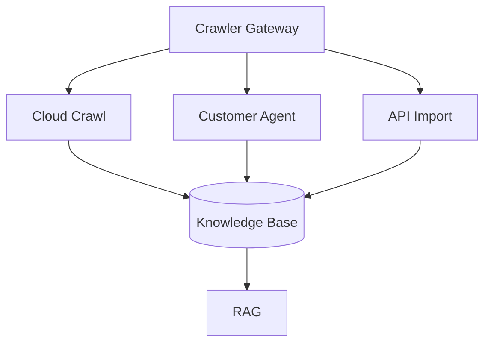
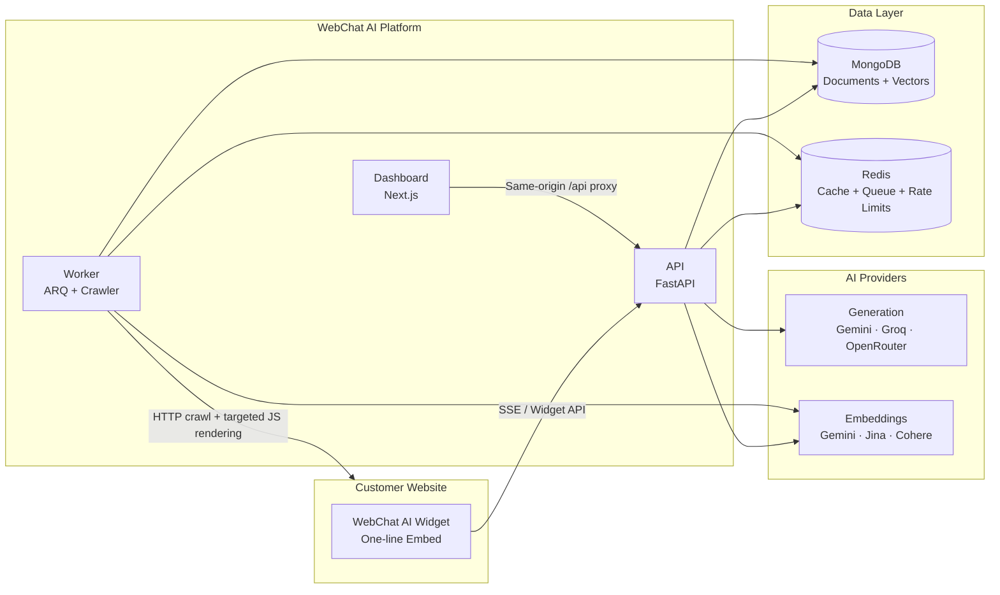

# 🤖 WebChat AI

### Turn any website into a source-grounded AI assistant.

WebChat AI is a production-ready, multi-tenant AI SaaS platform that turns
website content into an intelligent conversational knowledge base.

Crawl a website, build a retrieval-augmented knowledge base, and give visitors
accurate streaming answers with citations — all through a lightweight,
embeddable chat widget.

<p align="center">
  <strong>🌐 Website → 🕷️ Crawl → 🧠 RAG → 💬 AI Assistant</strong>
</p>

---

## 🚀 Live Product

**Dashboard:**
https://webchat-ai-dashboard.vercel.app

Create an account, crawl a website, configure an AI assistant, and embed it
into your website.

---

## ✨ Why WebChat AI?

Most AI chatbots require manually maintained knowledge bases.

WebChat AI takes a different approach:

> **Your website becomes the knowledge base.**

The platform automatically crawls your website, extracts useful content,
creates embeddings, indexes the content, and uses hybrid retrieval to ground
AI responses in the source material.

### What you get

| Capability                  | Description                                                         |
| --------------------------- | ------------------------------------------------------------------- |
| 🕷️ Smart Website Crawling   | HTTP-first crawling with targeted JavaScript rendering fallback     |
| 🧠 Source-Grounded RAG      | Hybrid vector + keyword retrieval with RRF fusion                   |
| 📚 Automatic Knowledge Base | Website pages are cleaned, chunked, embedded, and indexed           |
| 💬 Streaming AI Chat        | Real-time responses using Server-Sent Events                        |
| 🔗 Source Citations         | Answers can reference the original website content                  |
| 🏢 Multi-Tenant SaaS        | Isolated organizations, users, knowledge bases, and usage           |
| 🎨 Embeddable Widget        | Add the assistant to a website with a simple script                 |
| 💳 Billing & Usage          | Plans, subscriptions, usage metering, and token budgets             |
| 🔐 Security First           | SSRF protection, CSRF, rate limiting, tenant isolation, and more    |
| 📊 Admin & Observability    | Metrics, structured logs, health checks, and administrative tooling |

---

## 🎯 Built For

WebChat AI can be used for:

- 🎓 Universities and educational institutions
- 📚 Documentation websites
- 💻 SaaS products
- 🛒 E-commerce websites
- 🏢 Business websites
- 🛠️ Customer support portals
- 📖 Knowledge bases
- 🧑‍💻 Product documentation
- 🌐 Service-based websites

---

# ⚡ How It Works

At a high level:

```text
┌─────────────────────┐
│      Your Website   │
└──────────┬──────────┘
           │
           ▼
┌─────────────────────┐
│   Smart Crawler     │
│ HTTP-first + JS     │
│ fallback            │
└──────────┬──────────┘
           │
           ▼
┌─────────────────────┐
│ Clean + Chunk       │
│ Website content     │
└──────────┬──────────┘
           │
           ▼
┌─────────────────────┐
│ Embedding Provider  │
│ Gemini / Jina /     │
│ Cohere              │
└──────────┬──────────┘
           │
           ▼
┌─────────────────────┐
│ MongoDB Knowledge   │
│ Base + Vectors      │
└──────────┬──────────┘
           │
           ▼
┌─────────────────────┐
│ Hybrid RAG          │
│ Vector + Keyword    │
│ + RRF + Reranking   │
└──────────┬──────────┘
           │
           ▼
┌─────────────────────┐
│ LLM Generation      │
│ Gemini / Groq /     │
│ OpenRouter          │
└──────────┬──────────┘
           │
           ▼
┌─────────────────────┐
│ Answer + Citations  │
└─────────────────────┘
```

---

# 🧠 RAG Pipeline

Every visitor question goes through a controlled retrieval and generation
pipeline:

```text
Visitor Question
       │
       ▼
Query Classification
       │
       ▼
Conversational Rewrite
       │
       ▼
Hybrid Retrieval
 ┌─────┴─────┐
 ▼           ▼
Vector     Keyword
Search     Search
 └─────┬─────┘
       ▼
    RRF Fusion
       │
       ▼
 Optional Reranking
       │
       ▼
Context Assembly
       │
       ▼
Streaming Generation
       │
       ▼
Confidence + Faithfulness Checks
       │
   ┌───┴────┐
   ▼        ▼
 Answer   Abstain
   │
   ▼
Source Citations
```

### Retrieval features

- Vector search
- Keyword retrieval
- Reciprocal Rank Fusion (RRF)
- Source diversification
- Optional reranking
- Query classification
- Conversational query rewriting
- Confidence gating
- Context budgeting
- Duplicate prevention
- Corpus-version-aware caching
- Prompt-injection detection
- Cross-tenant isolation
- Faithfulness checks
- Safe abstention when the knowledge base cannot support an answer

The system is designed to prefer:

> **"I don't have enough information to answer that."**

over generating an unsupported answer.

---

# 🕷️ Website Crawler

WebChat AI uses an **HTTP-first hybrid crawler** designed to maximize useful
website coverage while keeping crawler resource usage practical.

## Crawl pipeline

### 1. Discover

The crawler starts from configured entry points and discovers:

- Website links
- Sitemap URLs
- Priority paths
- Same-origin pages

Breadth-first traversal and page budgets prevent uncontrolled crawling.

### 2. Guard

Every destination passes SSRF and URL validation.

The crawler:

- Allows HTTP/HTTPS destinations
- Enforces same-origin crawling
- Respects `robots.txt`
- Rejects unsafe destinations
- Canonicalizes URLs
- Applies crawl limits

### 3. Fetch

The crawler is **HTTP-first**.

```text
             ┌───────────────┐
             │   Web Page    │
             └───────┬───────┘
                     │
                     ▼
              HTTP Fetch
                     │
              ┌──────┴──────┐
              │             │
          Useful HTML     JS Shell
              │             │
              ▼             ▼
           Extract       Playwright
                          Fallback
```

Static and server-rendered pages avoid launching Chromium.

JavaScript rendering is used only when the page contains strong evidence that
HTTP extraction is insufficient.

### 4. Clean and chunk

Extracted HTML is cleaned and converted into useful text.

Content is then:

- Normalized
- Deduplicated
- Chunked
- Token-budgeted
- Overlapped where appropriate
- Filtered when effectively empty

### 5. Embed

Chunks are converted into embeddings using the configured embedding provider.

The system keeps a consistent embedding space for a corpus to avoid mixing
incompatible vector representations.

### 6. Persist

Tenant-scoped documents and chunks are persisted in MongoDB together with
their embedding identity and metadata.

Failed ingestion work is retried with backoff and can be quarantined after
repeated failures.

---

# 🧭 Future Crawler Scalability & Website Access Strategy

> **Planned architecture.** This section is a **future roadmap** direction for
> crawler scalability and website access. It describes what _can be used_ and
> the planned architecture direction — **not** necessarily what is implemented
> today. The current crawler is described in the
> [Website Crawler](#-website-crawler) section.

## Current baseline

WebChat AI currently uses a **cloud-based HTTP-first hybrid crawler**:

- HTTP-first fetching
- Playwright/Chromium fallback for JavaScript-heavy pages
- Bounded retries
- `robots.txt` and sitemap handling
- SSRF protection
- Failure classification
- Graceful handling of inaccessible websites
- Crawling → extraction → chunking → embeddings → knowledge base → RAG

## Why some websites may not be crawlable

Public websites can still reject a cloud crawler for **target-side or
infrastructure reasons** such as:

- WAF / anti-bot protection (Cloudflare, Akamai, Imperva, or custom rules)
- Datacenter IP blocking
- HTTP 403 responses
- HTTP 429 rate limiting
- CAPTCHA / human verification
- Login / private content
- Unstable target servers
- JavaScript / interaction-heavy applications
- `robots.txt` restrictions

These are **crawler limitations, target-side restrictions, or infrastructure
limitations** — they are **not** crawler software bugs. Software bugs are
tracked and fixed separately through the normal test suite.

As a general example, a target such as **Indira University** may return
HTTP 403 to a cloud/datacenter crawler — a possible/observed target-side
blocking scenario where the target's WAF or firewall rejects datacenter
egress, not an indication that the crawler is broken. The exact cause is not
claimed to be conclusively proven.

See also:
[`docs/CRAWL_EGRESS_HARDENING.md`](docs/CRAWL_EGRESS_HARDENING.md)

## Future multi-mode crawling architecture

The planned architecture routes every ingestion request through a **crawler
gateway** that selects the most appropriate access mode:



### A. Cloud Crawler

- Default for normal public websites.
- Runs from WebChat AI infrastructure.
- Uses the existing HTTP-first + browser fallback strategy.

### B. Customer-side Crawler / Crawler Agent

- For enterprise customers whose WAF/firewall blocks external cloud crawlers.
- The customer runs a WebChat AI crawler agent inside their own
  infrastructure/network.
- The agent accesses the customer's website locally/internally.
- The agent securely sends extracted/indexable content to WebChat AI through
  an authenticated ingestion API.
- This avoids requiring the customer's WAF to allow WebChat AI's cloud
  crawler IP.
- Credentials/tokens must remain server-side and must never be exposed in the
  customer's frontend.

### C. API / CMS / Direct Content Import

- For customers that already have a CMS, internal API, documentation system,
  sitemap, or content pipeline.
- The customer can push content into WebChat AI through an authenticated
  ingestion API.
- WebChat AI performs chunking, embedding, indexing, and RAG processing.
- This can be preferable to crawling when structured source content is
  already available.

## Future WAF allowlisting strategy

Enterprise customers may optionally allowlist WebChat AI crawler egress IPs
in their WAF/firewall:

```text
Customer WAF
    |
    +-- WebChat AI crawler IP -> ALLOW
    |
    +-- Unknown traffic -> normal WAF policy
```

Stable/static outbound IP infrastructure may be required for reliable
allowlisting.

> **Important:** a static IP does **not** guarantee bypassing a WAF. It only
> provides a stable source IP that the customer can allowlist.

## Railway / free-plan limitation

This is an **infrastructure consideration**, not a permanent product
limitation:

- Free/shared cloud infrastructure may not provide the stable outbound IP
  characteristics required by some enterprise WAF allowlists.
- A future production crawler deployment can use infrastructure with
  controlled/static egress.
- The architecture must not be dependent on Railway Free.
- Customer-side crawler / API ingestion remains an alternative when WAF
  restrictions cannot be solved through allowlisting.

## Recommended future decision matrix

| Website / Environment           | Recommended ingestion mode                        |
| ------------------------------- | ------------------------------------------------- |
| Normal public website           | Cloud crawler                                     |
| JS-heavy public website         | Cloud crawler + browser fallback                  |
| Temporary 429/5xx               | Cloud crawler + bounded retry                     |
| WAF blocks cloud crawler        | WAF allowlisting                                  |
| Stable egress required          | Static/controlled crawler egress                  |
| Strict enterprise firewall      | Customer-side crawler agent                       |
| Private/login-only content      | Authenticated customer-controlled ingestion       |
| Existing CMS/API                | API/CMS import                                    |
| Sitemap available               | Sitemap-assisted crawling                         |
| CAPTCHA/human verification      | Customer-controlled/API ingestion where permitted |
| `robots.txt` disallows crawling | Respect restriction                               |

## Future enterprise architecture

Conceptually, the future ingestion modes feed one pipeline:

```text
Customer Website
      |
      +---------------- Cloud Crawl ----------------+
      |                                              |
      +------ Customer Crawler Agent ---------------+
      |                                              |
      +------ CMS/API Import -----------------------+
                                                     |
                                                     v
                                           WebChat AI Ingestion
                                                     |
                                                     v
                                              Chunking/Embedding
                                                     |
                                                     v
                                             Knowledge Base
                                                     |
                                                     v
                                                    RAG
                                                     |
                                                     v
                                                  Chatbot
```

The goal is:

> **Maximum accessible public-web coverage while providing enterprise
> customers with controlled alternatives when their network/security policies
> prevent cloud crawling.**

## Non-goals / security principles

WebChat AI should **not** rely on:

- Random rotating proxies
- Arbitrary third-party proxy services
- Bypassing CAPTCHA / human verification
- Bypassing customer WAF / security policies
- Disabling TLS verification
- Bypassing `robots.txt`
- Weakening SSRF protections

The preferred enterprise approach is: **controlled egress + customer
allowlisting**, **customer-side crawling**, or **authenticated content/API
ingestion**.

## Future implementation phases

**FUTURE roadmap** — these phases are not implemented today.

- **Phase A** — controlled/static crawler egress, customer WAF allowlisting
  documentation.
- **Phase B** — customer-side WebChat AI crawler agent, secure crawler
  registration/authentication, authenticated ingestion API.
- **Phase C** — CMS/API connectors, scheduled incremental sync,
  source-specific ingestion strategies.
- **Phase D** — enterprise observability, per-tenant crawl policies, crawl
  quotas, source health monitoring, incremental recrawling.

---

# 🏗️ Architecture

## Application architecture



---

# ☁️ Production Deployment

WebChat AI's current production architecture is split between **Vercel** and
**Railway**.

```text
                         Internet
                            │
              ┌─────────────┴─────────────┐
              │                           │
              ▼                           ▼
     ┌─────────────────┐        ┌─────────────────┐
     │     Vercel      │        │     Railway     │
     │                 │        │                 │
     │ Dashboard       │───────▶│ FastAPI API     │
     │ Widget          │        │ ARQ Worker       │
     └─────────────────┘        └────────┬────────┘
                                         │
                              ┌──────────┴──────────┐
                              │                     │
                              ▼                     ▼
                       ┌─────────────┐       ┌─────────────┐
                       │  MongoDB    │       │    Redis    │
                       │   Atlas     │       │   Managed   │
                       └─────────────┘       └─────────────┘
```

### Production services

| Service       | Platform        | Responsibility                                       |
| ------------- | --------------- | ---------------------------------------------------- |
| Dashboard     | Vercel          | Next.js dashboard and web application                |
| Widget        | Vercel          | Production embeddable widget bundle                  |
| API           | Railway         | FastAPI API, authentication, RAG, billing, streaming |
| Worker        | Railway         | ARQ jobs, website crawling, ingestion, embeddings    |
| Database      | Managed MongoDB | Documents, chunks, vectors, tenant data              |
| Cache / Queue | Managed Redis   | Caching, rate limits, job queue, provider health     |

### Production principles

- HTTPS everywhere
- Same-origin dashboard API proxy
- Secure authentication cookies
- Production environment validation
- Immutable deployment artifacts where applicable
- Health checks
- Structured JSON logging
- Prometheus metrics
- CI security gates
- Secret scanning
- Container security scanning

See the full production runbook:

[`docs/deployment/README.md`](docs/deployment/README.md)

---

# 🧩 Monorepo Structure

```text
webchat-AI/
│
├── apps/
│   ├── dashboard/          # Next.js dashboard + tenant application
│   └── widget/             # Framework-independent embeddable widget
│
├── backend/
│   ├── api/                # FastAPI routes and dependencies
│   ├── core/               # Configuration and application infrastructure
│   ├── repositories/       # Data access
│   ├── schemas/            # Pydantic schemas
│   ├── services/           # Business logic
│   ├── workers/            # ARQ background jobs
│   └── ...
│
├── packages/
│   └── themes/             # Shared widget themes
│
├── docs/                   # Architecture, ADRs, deployment and audits
├── docker/                 # Dockerfiles and Compose configuration
├── scripts/                # Development and operational helpers
├── tests/                  # Automated test suites
│
├── package.json
├── pnpm-workspace.yaml
├── pyproject.toml
└── uv.lock
```

Each major area contains its own README with deeper implementation details.

---

# 🛠️ Tech Stack

| Layer         | Technology                                        |
| ------------- | ------------------------------------------------- |
| Backend       | Python 3.13 · FastAPI · Pydantic v2               |
| Database      | MongoDB / Motor                                   |
| Cache & Queue | Redis · ARQ                                       |
| Generation    | Google Gemini · Groq · OpenRouter                 |
| Embeddings    | Gemini · Jina · Cohere                            |
| Dashboard     | Next.js 15 · React 19 · Tailwind CSS v4           |
| Widget        | TypeScript · Vite · Shadow DOM                    |
| Sanitization  | DOMPurify                                         |
| Markdown      | GFM-compatible rendering                          |
| Crawling      | HTTPX · BeautifulSoup · Playwright                |
| Containers    | Docker · Docker Compose                           |
| CI/CD         | GitHub Actions (CI/validation) · Vercel · Railway |
| Observability | Prometheus · Structured JSON logs                 |
| Deployment    | Vercel + Railway                                  |

---

# 💬 Embeddable Widget

WebChat AI is designed to be embedded into an existing website with minimal
integration work.

## Basic integration

```html
<script
  src="https://webchat-ai-widget.vercel.app/webchat-widget.iife.min.js"
  data-widget-id="YOUR_WIDGET_ID"
  defer
></script>
```

The widget can automatically initialize from the `data-widget-id` attribute.

For advanced usage, the Widget SDK also supports programmatic initialization,
mounting, theming, CSP configuration, and other integration options.

See:

[`apps/widget/README.md`](apps/widget/README.md)

---

# 🎨 Widget Features

The widget provides:

- Streaming AI responses
- Markdown rendering
- Tables
- Source citations
- Citation links
- Shadow DOM isolation
- Curated themes
- CSS custom-property theming
- Offline/error handling
- Responsive layout
- Accessibility-focused UI
- Safe HTML rendering
- Automatic initialization
- Framework-independent integration

---

# 🔐 Security

Security is treated as a core part of the platform rather than an afterthought.

### Authentication

- JWT authentication
- Secure refresh cookies
- `SameSite=Strict`
- CSRF protection
- Email verification
- Password reset protections
- Login lockout
- Rate limiting
- Password hashing with Argon2id

### Application security

- Tenant isolation
- SSRF protection
- Request validation
- High-risk port blocking
- Secure host validation
- Production environment validation
- Secret scanning
- PII redaction
- Prompt-injection detection
- Injection tracking
- Safe failure and abstention

### Infrastructure

- Read-only production containers where appropriate
- Temporary filesystems
- Container image scanning
- CI security gates
- Production configuration validation
- Secure CORS configuration

---

# 🏢 Multi-Tenancy

WebChat AI is designed as a multi-tenant SaaS platform.

Tenant boundaries are maintained across:

```text
User
  │
  ▼
Tenant / Workspace
  │
  ├── Websites
  │
  ├── Knowledge Base
  │     ├── Documents
  │     └── Chunks / Vectors
  │
  ├── Conversations
  │
  ├── Usage
  │
  ├── API Keys
  │
  └── Billing
```

Tenant-scoped access is enforced through the backend rather than relying only
on frontend filtering.

---

# 💳 Billing & Usage

The platform includes SaaS billing infrastructure with support for:

- Subscription plans
- Usage metering
- LLM token budgets
- Payment provider abstraction
- Razorpay
- Stripe
- Mock provider for development/testing
- Payment webhooks
- Idempotent subscription activation

Payment and billing logic is isolated from the core RAG pipeline.

---

# 🧪 Quality & Testing

The project maintains a comprehensive automated test suite covering:

- Authentication
- Account security
- Authorization
- Tenant isolation
- RAG retrieval
- Retrieval accuracy
- Embeddings
- Provider routing
- Generation fallback
- Website crawling
- SSRF protection
- Widget API
- Widget rendering
- Billing
- Observability
- Configuration
- Infrastructure behavior

Latest full backend verification:

```text
2266+ tests passing
```

Additional frontend and widget test suites are maintained separately.

## Local verification

```bash
# Backend
./scripts/check-backend.sh

# Dashboard / frontend
pnpm lint
pnpm typecheck
pnpm build
pnpm test

# Secret scanning
./scripts/check-secrets.sh
```

See:

[`tests/README.md`](tests/README.md)

---

# 🚀 Quick Start

## Prerequisites

- Node.js >= 20
- pnpm >= 9
- Python 3.13
- uv
- Docker
- Docker Compose

## 1. Clone

```bash
git clone https://github.com/riturajlabs/webchat-AI.git
cd webchat-AI
```

## 2. Configure environment

```bash
cp .env.development .env
```

The development environment is configured for the local Docker services.

## 3. Start the stack

```bash
docker compose \
  --env-file .env.development \
  -f docker/compose.yml \
  up --build
```

## 4. Install frontend dependencies

```bash
pnpm install
```

## 5. Start the dashboard

```bash
pnpm dev:dashboard
```

Dashboard:

```text
http://localhost:3000
```

The backend and worker can also be started using the repository's development
scripts.

See:

- [`backend/README.md`](backend/README.md)
- [`apps/dashboard/README.md`](apps/dashboard/README.md)
- [`docker/README.md`](docker/README.md)

---

# ⚙️ Configuration

Environment variables are documented in:

```text
.env.example
```

Important production configuration includes:

```text
ENVIRONMENT
DEBUG
JWT_SECRET
CORS_ORIGINS
ALLOWED_HOSTS
PUBLIC_BASE_URL
NEXT_PUBLIC_API_URL
NEXT_PUBLIC_BACKEND_API_URL
VITE_WIDGET_API_BASE_URL
GENERATION_PROVIDER_ORDER
EMBEDDING_PROVIDER_ORDER
EMBEDDING_DIMENSIONS
CRAWL_HTTP_FIRST
CRAWL_MAX_CONCURRENT
EMBEDDING_MAX_CONCURRENT_BATCHES
```

Production configuration validation intentionally fails fast on unsafe
configuration such as weak secrets, loopback production origins, missing
provider credentials, or unsupported mock payment configuration.

---

# 📚 Documentation

| Document                                                   | Purpose                       |
| ---------------------------------------------------------- | ----------------------------- |
| [`docs/README.md`](docs/README.md)                         | Documentation index           |
| [`docs/deployment/README.md`](docs/deployment/README.md)   | Production deployment runbook |
| [`backend/README.md`](backend/README.md)                   | Backend architecture and API  |
| [`apps/dashboard/README.md`](apps/dashboard/README.md)     | Dashboard development         |
| [`apps/widget/README.md`](apps/widget/README.md)           | Widget SDK                    |
| [`packages/themes/README.md`](packages/themes/README.md)   | Widget themes                 |
| [`docker/README.md`](docker/README.md)                     | Containers and Compose        |
| [`tests/README.md`](tests/README.md)                       | Testing strategy              |
| [`scripts/README.md`](scripts/README.md)                   | Development and operations    |
| [`00-AI-Development-Rules.md`](00-AI-Development-Rules.md) | AI development rules          |

The `docs/` directory also contains architecture decision records (ADRs),
implementation documentation, deployment material, and historical audit
reports.

---

# 🗺️ Roadmap

The platform is continuously evolving.

Potential future areas include:

- Advanced analytics
- Additional AI providers
- Additional embedding providers
- More crawling strategies
- Improved retrieval evaluation
- Additional integrations
- Expanded widget customization
- More enterprise controls

---

# 🤝 Contributing

Contributions are welcome when they align with the project's architecture,
security model, and Definition of Done.

Before submitting changes:

```bash
./scripts/check-backend.sh
pnpm lint
pnpm typecheck
pnpm build
pnpm test
./scripts/check-secrets.sh
```

Please read the repository development rules before making architectural or
cross-cutting changes.

For security vulnerabilities, avoid opening a public issue. Use the project's
private security reporting channel instead.

---

# 📄 License

**Proprietary — All Rights Reserved.**

See the repository license information for usage and distribution terms.

---

<p align="center">
  <strong>WebChat AI</strong>
  <br />
  Turn any website into an AI-powered knowledge assistant.
</p>
