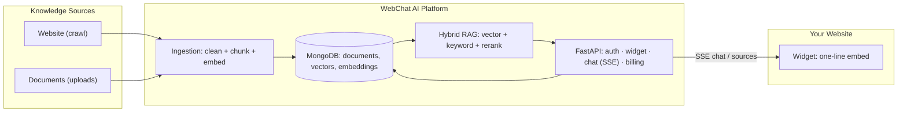

# WebChat AI

**Multi-source AI assistants for your website, your documents, or both.**

WebChat AI is a production-grade, multi-tenant AI SaaS platform. You point it at
a **website**, upload **documents**, or both; it ingests the content into a
retrieval-augmented knowledge base and gives your visitors a streaming,
source-grounded AI assistant — embedded on your site with a one-line script.

It is built for engineering rigor: tenant isolation at the data layer,
fail-fast production configuration, hermetic tests, a source-grounded RAG
pipeline with abstention instead of hallucination, provider fallback chains
with circuit breakers, and a lightweight (<100 KB gzip) embeddable widget.

---

## Live product

- **Dashboard:** <https://webchat-ai-dashboard.vercel.app> — sign up, connect a
  knowledge source, configure and embed an assistant, monitor usage and
  billing.
- **Widget bundle:** served from
  <https://webchat-ai-widget.vercel.app/webchat-widget.iife.min.js> (the embed
  snippet the dashboard gives you references the right asset automatically).
- **API:** FastAPI backend on Railway at
  <https://webchat-ai-production-7e84.up.railway.app> (see the
  [deployment runbook](docs/deployment/README.md)).

---

## Quick start (local Docker stack)

Prereqs: Node.js ≥ 20, pnpm ≥ 9, Python 3.13, `uv`, and Docker.

```bash
git clone https://github.com/riturajlabs/webchat-AI.git
cd webchat-AI

# 1. Create the dev env file (development defaults point at the Docker
#    MongoDB/Redis/Mailpit services) and install dependencies.
cp .env.example .env.development
pnpm install
uv sync

# 2. Start the full local stack: MongoDB, Redis, Mailpit, API (:8000),
#    Worker, Dashboard (:3000), Widget (:8080).
scripts/docker-up.sh          # == docker compose --env-file .env.development -f docker/compose.yml up --build
```

Open <http://localhost:3000>, register, and confirm your email (the code lands
in Mailpit at <http://localhost:8025>).

Host-run development (backend/worker via uv, frontends via pnpm) is documented
in [backend/README.md](backend/README.md) and
[apps/dashboard/README.md](apps/dashboard/README.md).

---

## Why WebChat AI

- **Your content becomes the knowledge base.** No hand-maintained FAQ
  datasets. The crawler ingests your website; the uploader ingests your
  PDFs/DOCX/Markdown/TXT; the same pipeline chunks, embeds and indexes both.
- **Upload-only assistants.** Build a chatbot purely from document uploads
  (`files` mode) without any website URL, or mix website + documents in one
  knowledge base (`mixed` mode).
- **Answers you can trust.** Retrieval first, generation second. Answers that
  lack retrieval support abstain ("I don't have enough information to answer
  that") instead of inventing facts, and come with a "Learn more" source panel
  so visitors can verify.
- **No vendor lock-in.** Generation (Gemini, Groq, OpenRouter) and embeddings
  (Gemini, Jina, Cohere) run behind ordered fallback chains with per-provider
  circuit breakers.
- **A widget you can ship on any site.** Framework-independent custom element,
  closed shadow DOM, dynamic branding, curated themes, streaming SSE, and a
  hard <100 KB gzip budget.

---

## Key features

### Knowledge

- **Three source modes:** `website`, `files` (upload-only), `mixed`
  (website + documents in one knowledge base).
- **HTTP-first smart crawler:** respects `robots.txt` and sitemaps, applies
  SSRF guards and per-job page budgets, and falls back to Playwright/Chromium
  rendering only for JS-heavy pages. Crawl progress streams to the dashboard
  over SSE.
- **Document uploads:** `.txt`, `.md`, `.pdf`, `.docx` (with magic-byte
  checks), up to 10 MB per file, 5 files per batch, and 10 MB total per upload
  request — stored in MongoDB GridFS and put through the same chunk/embed
  pipeline as crawled pages. Per-document status and retry controls live in the
  dashboard.
- **Per-tenant document quotas:** Free 10, Plus 50, Pro 200, Enterprise
  unlimited.

### AI / RAG

- **Hybrid retrieval:** MongoDB `$vectorSearch` merged with keyword (BM25)
  results by reciprocal-rank fusion, optional cross-encoder reranking, source
  diversification, and corpus-identity locking so a corpus never mixes
  embedding spaces.
- **Streaming answers** over Server-Sent Events with a "Learn more" source
  panel (the SSE `sources` event) attached to each answer.
- **Controlled pipeline:** query classification, conversational-query
  rewriting, context budgeting, confidence gating, and faithfulness checks;
  unsupported questions abstain.
- **Provider resilience:** ordered `GENERATION_PROVIDER_ORDER` /
  `EMBEDDING_PROVIDER_ORDER` fallbacks, per-provider circuit breakers, and an
  optional adaptive router (`AI_PROVIDER_ROUTING_MODE`).

### Widget

- **One-line embed** that auto-upgrades from `data-widget-id` — no `init()`
  call required.
- **Dynamic branding:** custom `bot_name`, `avatar_url`/`logo_url` with a
  documented precedence chain, header/launcher styling, and curated theme
  presets.
- **Safe rendering:** markdown (GFM tables, fenced code) sanitized with
  DOMPurify inside a **closed shadow root**.
- **Accessible & responsive:** WCAG 2.2 AA targeting, keyboard operable,
  `prefers-reduced-motion` aware, mobile-first.
- **Resilient UX:** offline banner with message retention, typed error
  taxonomy, retry with re-send, per-session token refresh, and per-visitor
  rate limits.

### Dashboard

- Next.js tenant console: knowledge sources and uploads, widget appearance
  builder with live test harness, conversations, analytics, billing, and API
  keys.
- Super-admin console for platform operators (tenants, users, revenue, crawl
  jobs, audit).

### Platform

- **Multi-tenancy** enforced at the data layer — every query is tenant-scoped,
  never filtered only in the UI.
- **SaaS billing:** Stripe / Razorpay / mock providers, plans, usage metering,
  LLM token budgets, payment webhooks.
- **Security:** SSRF protection, prompt-injection detection, PII redaction,
  CSRF, rate limiting, login lockout, Argon2id password hashing, secret
  scanning, container image scanning (Trivy), and fail-fast production config
  validation.
- **Observability:** Prometheus metrics (`/metrics`), structured JSON logs,
  health probes, request IDs.

---

## How it works



1. **Connect:** create a knowledge base from a website (`website`/`mixed`) or
   from documents only (`files`). A URL is required only for `website`/`mixed`.
2. **Ingest:** the worker crawls pages or processes uploaded files, cleans and
   chunks the content, embeds it with the corpus's locked embedding provider,
   and stores tenant-scoped documents + vectors.
3. **Ask:** the widget mints an anonymous session token, streams
   question → hybrid retrieval → grounded generation over SSE, and renders the
   answer with a "Learn more" source panel.
4. **Monitor:** the dashboard shows per-document status, conversations,
   analytics, usage, and billing.

Read more in the [RAG pipeline](backend/README.md#rag-chat-pipeline) section of
the backend README.

---

## Widget integration

The Dashboard → Widget page gives you a ready-to-paste snippet. The same
contract works with your own ID:

```html
<script
  src="https://webchat-ai-widget.vercel.app/webchat-widget.iife.min.js"
  data-widget-id="YOUR_WIDGET_ID"
  defer
></script>
```

Attributes:

| Attribute           | Required | Purpose                                                                                             |
| ------------------- | -------- | --------------------------------------------------------------------------------------------------- |
| `data-widget-id`    | yes      | Public widget identifier (Dashboard → Widget page).                                                 |
| `data-api-base-url` | no       | Override the API origin. The SDK appends `/api/widget/v1`. Defaults to the bundle's build-time API. |

Public config fields (returned by `/api/widget/v1/config/{widget_id}`) include
`bot_name`, `welcome_message`, `suggested_questions`, `primary_color`,
`theme`, `avatar_url`, `logo_url`, `launcher_size`, `width`, `height`, and
more. Branding precedence: `avatar_url` → customer-set `logo_url` → built-in
official logo → launcher glyph.

Extensive SDK, theming, orientation, and CSP documentation lives in
[apps/widget/README.md](apps/widget/README.md).

---

## Tech stack

| Layer           | Technology                                           |
| --------------- | ---------------------------------------------------- |
| Backend         | Python 3.13 · FastAPI · Pydantic v2 · `uv`           |
| Data            | MongoDB / Motor (`$vectorSearch`) · Redis            |
| Queue / Workers | ARQ background worker (crawler, embeddings, email)   |
| Generation      | Google Gemini · Groq · OpenRouter                    |
| Embeddings      | Gemini · Jina · Cohere                               |
| Dashboard       | Next.js 15 · React 19 · TypeScript · Tailwind CSS v4 |
| Widget          | TypeScript · Vite · Shadow DOM · DOMPurify           |
| Crawling        | HTTPX · BeautifulSoup · Playwright (JS fallback)     |
| Billing         | Stripe · Razorpay · mock                             |
| Containers      | Docker · Docker Compose                              |
| CI/CD           | GitHub Actions (CI) · Vercel · Railway               |
| Observability   | Prometheus · structured JSON logs · health probes    |

---

## Repository structure

```text
webchat-ai/
├── apps/
│   ├── dashboard/            # Next.js tenant dashboard + marketing/docs site
│   └── widget/               # Framework-independent embeddable widget SDK
├── backend/                  # FastAPI (api, core, models, schemas, services,
│   │                         #  repositories, workers, migrations, prompts)
├── packages/themes/          # Shared widget theme presets + resolve engine
├── docs/                     # Design docs, ADRs, deployment runbook, audits
├── docker/                   # Dockerfiles, compose, nginx, Prometheus
├── scripts/                  # Dev/ops/verification helpers (`scripts/README.md`)
├── tests/                    # Automated test suites (`tests/README.md`)
├── .github/workflows/        # CI + CD pipelines
├── package.json / pnpm-workspace.yaml
└── pyproject.toml / uv.lock
```

---

## Configuration & environment

All backend settings live in `backend/core/config.py` (pydantic-settings) and
every variable is documented in [`.env.example`](.env.example). Everything is
env-driven; secrets are injected via environment, never committed.

Production templates: `.env.production.example` (full production posture) and
`.env.production.sandbox.example` (safe local production-style smoke test).

Config fails fast: in production, loopback hosts, weak `JWT_SECRET`, mock
payments, unauthenticated MongoDB/Redis, and missing AI provider keys all raise
at boot rather than start an unsafe service.

Key highlights: `GENERATION_PROVIDER_ORDER`, `EMBEDDING_PROVIDER_ORDER`,
`EMBEDDING_DIMENSIONS`, `CRAWL_MAX_PAGES`, `RATE_LIMIT_ENABLED`,
`PAYMENT_PROVIDER`, `SUPER_ADMIN_EMAILS`.

---

## API surface

All routes live under `/api` unless noted:

- **REST** — `auth`, `websites`, `knowledge` (documents + uploads), `chat`,
  `conversations`, `analytics`, `billing`, `api_keys`, `feedback`, `admin`
  (super-admin).
- **Public widget contract** — `/api/widget/v1/config`, `/sessions`,
  `/chat` (SSE), `/feedback`.
- **Streaming** — SSE for chat answers (and for crawl progress).
- **Observability** — `GET /metrics` (Prometheus, no `/api` prefix);
  `GET /api/health/live` (liveness) and `GET /api/health/ready`
  (fail-closed: checks MongoDB + Redis).

Full router table and the RAG pipeline wiring: [backend/README.md](backend/README.md).

---

## Testing

The suite is hermetic (MongoDB stubbed, deterministic mock AI providers) and
gated in CI — 2,582 backend pytest tests, 900+ frontend vitest tests
(dashboard/widget/themes), plus Playwright widget E2E against the real stack.

```bash
./scripts/check-backend.sh        # ruff + mypy + full pytest (backend gate)
pnpm lint && pnpm typecheck && pnpm test   # frontends
./scripts/check-secrets.sh        # secret scan before every commit
```

See [tests/README.md](tests/README.md) for the layer map and Definition of Done.

---

## Security

- Tenant isolation at the data layer (tenant-scoped repositories/indexes).
- SSRF-proof crawler (loopback/private IPs blocked, same-origin only).
- JWT + HttpOnly refresh cookie (`SameSite=Strict`), CSRF protection,
  Argon2id password hashing, login lockout, per-endpoint rate limits.
- Prompt-injection detection, PII redaction, HTML sanitization, input
  validation at every layer.
- Fail-fast production config, secret scanning, Trivy container scanning,
  read-only production containers, hardened Dockerfile/compose posture.

---

## Deployment

Production runs **Dashboard** and **Widget** on Vercel, and the **API** and
**Worker** on Railway, backed by managed MongoDB Atlas and Redis. GitHub
Actions runs CI (lint, typecheck, tests, migrations on a real MongoDB, Docker
build + Trivy scan, widget E2E). Docker images remain the CI/security gate and
an optional self-hosting path.

See the [deployment runbook](docs/deployment/README.md) for platform
split, environment contracts, health probes, and the Docker Compose
self-hosting alternative.

---

## Status & roadmap

- **Status:** production architecture live (Vercel + Railway); CI/CD green.
- **Ingestion roadmap:** the cloud crawler is today's default. Future
  directions (documented in the repo's audits) include a customer-side crawler
  agent for WAF-blocked sites and authenticated API/CMS content import.
- See [docs/OPTIMIZATION_ROADMAP.md](docs/OPTIMIZATION_ROADMAP.md) for the
  full roadmap, and [docs/README.md](docs/README.md) for the documentation
  index.

---

## Documentation

| Document                                                 | Purpose                               |
| -------------------------------------------------------- | ------------------------------------- |
| [docs/README.md](docs/README.md)                         | Documentation index                   |
| [backend/README.md](backend/README.md)                   | Backend architecture + RAG            |
| [apps/dashboard/README.md](apps/dashboard/README.md)     | Dashboard development                 |
| [apps/widget/README.md](apps/widget/README.md)           | Widget SDK + integration              |
| [docs/deployment/README.md](docs/deployment/README.md)   | Production deployment runbook         |
| [docker/README.md](docker/README.md)                     | Containers and Compose                |
| [tests/README.md](tests/README.md)                       | Testing strategy + Definition of Done |
| [scripts/README.md](scripts/README.md)                   | Development / ops helpers             |
| [packages/themes/README.md](packages/themes/README.md)   | Widget theme presets                  |
| [00-AI-Development-Rules.md](00-AI-Development-Rules.md) | Mandatory rules for AI coding agents  |

---

## Contributing

Contributions are welcome when they fit the architecture, security model, and
Definition of Done. Before submitting:

```bash
./scripts/check-backend.sh
pnpm lint && pnpm typecheck && pnpm build && pnpm test
./scripts/check-secrets.sh
```

Read [00-AI-Development-Rules.md](00-AI-Development-Rules.md) before making
architectural or cross-cutting changes. For security vulnerabilities, use the
project's private security channel rather than opening a public issue.

---

## License

**Proprietary — All Rights Reserved.**

---

WebChat AI — turn any website, any document set, or both into an AI-powered
knowledge assistant.
