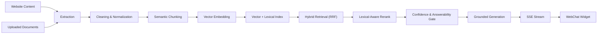
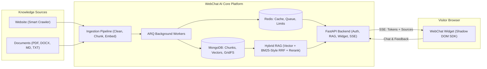

# WebChat AI

### Grounded AI assistants for websites, documents, or both.

[](https://github.com/riturajlabs/webchat-AI/actions/workflows/ci.yml)
[](LICENSE)
[](https://www.python.org/)
[](https://www.typescriptlang.org/)
[](https://nextjs.org/)

WebChat AI is a production-oriented, multi-tenant AI platform that turns websites, uploaded documents, or combined knowledge bases into interactive, streaming chat assistants. Built on a hybrid retrieval-augmented generation (RAG) engine with strict factual grounding and confidence-based abstention, WebChat AI delivers verifiable, source-backed answers through an embeddable, closed Shadow DOM widget.

[🚀 Live Dashboard](https://webchat-ai-dashboard.vercel.app) · [🎬 Product Demo](#-product-demo) · [📚 Documentation](docs/README.md) · [💻 GitHub](https://github.com/riturajlabs/webchat-AI) · [⚡ Quick Start](#-quick-start-local-docker-stack)

---

> 🌐 **Website RAG** &nbsp;·&nbsp; 📄 **Document RAG** &nbsp;·&nbsp; 🔀 **Mixed Knowledge** &nbsp;·&nbsp; 🧠 **Hybrid Retrieval (RRF)** &nbsp;·&nbsp; ⚡ **Streaming SSE** &nbsp;·&nbsp; 🧩 **Embeddable Widget** &nbsp;·&nbsp; 🏢 **Multi-Tenant** &nbsp;·&nbsp; 🛡️ **Tenant Isolation**

---

## 🖼️ Product Preview


_WebChat AI modern landing page featuring multi-mode knowledge onboarding and live assistant previews._

---

## 🎬 Product Demo

Experience the end-to-end workflow of WebChat AI — from workspace registration and multi-source knowledge ingestion to widget customization, live conversation testing, and production analytics:

[](./assets/demo/app-demo.mp4)

▶ **[Watch the full product walkthrough (MP4, ~31.6 MB)](./assets/demo/app-demo.mp4)**

---

## 💡 What is WebChat AI?

Most chatbot solutions fall into two extremes: rigid rule-based systems requiring tedious manual FAQ entry, or unconstrained LLM wrappers that fabricate answers and lack source attribution.

WebChat AI solves this by uniting automated knowledge ingestion with an enterprise-ready hybrid RAG pipeline. It converts raw content into structured, tenant-isolated knowledge representations ready for real-time visitor queries:

```text
[ Target Website URL ]  ──► Smart Crawler (HTTP-First + Playwright) ──┐
                                                                      ├──► Clean & Chunk ──► Vector + Lexical Index ──► Grounded RAG ──► Streaming Widget
[ Documents (.pdf, ...) ] ──► GridFS Parser (Magic Bytes + Text)   ──┘
```

The platform supports three distinct operational modes:

1. **Website Mode (`website`):** Provide a domain URL. The crawler navigates sitemaps, respects `robots.txt`, falls back to headless browser rendering for client-rendered JavaScript applications, and indexes your public web documentation or marketing pages.
2. **Document Mode (`files`):** Create an assistant purely from uploaded `.pdf`, `.docx`, `.md`, and `.txt` files without requiring a public website domain.
3. **Mixed Mode (`mixed`):** Combine crawled web pages with uploaded document files into a single, unified knowledge corpus.

### Key Engineering Principles

- **Strict Factual Grounding:** Answers are conditioned strictly on retrieved evidence passages. When evidence is missing or ambiguous, the assistant abstains deterministically rather than generating unsupported answers.
- **Verifiable Source Metadata:** Assistant responses stream alongside a native Sources panel detailing the exact URLs and document filenames consulted.
- **Provider Resilience:** Automated failover across Google Gemini, Groq, and OpenRouter for generation, and Gemini, Jina AI, and Cohere for vector embeddings, safeguarded by circuit breakers.
- **Host-Isolated Widget:** Framework-agnostic custom element packaged inside a closed Shadow DOM (≤100 KB gzip build budget gate), preventing CSS collisions on WordPress, Webflow, Shopify, or React applications.
- **Data-Layer Multi-Tenancy:** Isolation is enforced at the database and repository query layer — tenants can never query, read, or mutate another organization's vectors or conversations.

---

## 🌟 Why WebChat AI?

| Challenge with Generic Chatbots        | WebChat AI Production Solution                                                                          |
| :------------------------------------- | :------------------------------------------------------------------------------------------------------ |
| **Manual Knowledge Maintenance**       | Automatically crawls entire websites and indexes uploaded files (`.pdf`, `.docx`, `.md`, `.txt`).       |
| **Hallucination & Fabricated Answers** | Retrieval-grounded RAG with relevance-confidence checks and factual abstention when evidence is absent. |
| **Unverifiable Claims**                | Native Sources panel surfaces exact document filenames and page URLs behind every answer.               |
| **Single-Provider Outages**            | Dynamic fallback chains for LLMs (Gemini → Groq → OpenRouter) and embeddings with circuit breakers.     |
| **CSS Conflicts on Host Sites**        | Closed Shadow DOM architecture ensures zero stylesheet leakage into or out of the embed widget.         |
| **Data Leakage Across Tenants**        | Strict multi-tenancy enforced at the database query level, vector pre-filtering, and Redis keyspaces.   |
| **No Public Website Available**        | Dedicated Document Mode allows instant assistant creation directly from uploaded company files.         |

---

## ✨ Core Capabilities

### 🌐 Website Knowledge

- **Automated URL Ingestion:** Deep crawling across internal domain links with sitemap discovery and strict `robots.txt` compliance.
- **HTTP-First Architecture:** Rapid HTTP extraction using HTTPX and BeautifulSoup, falling back to Playwright/Chromium only when client-side JavaScript rendering is detected.
- **SSRF & Egress Hardening:** Pre-resolves DNS records to block loopback addresses, RFC-1918 private subnets, cloud metadata endpoints, and non-whitelisted protocols.

### 📄 Document Knowledge

- **Multi-Format Parsing:** Ingests `.pdf`, `.docx`, `.md`, and `.txt` documents up to 10 MB per file (max 5 files per batch).
- **Security & Integrity:** Validates magic bytes (`%PDF-`, `PK\x03\x04`), enforces maximum page limits (100 pages per PDF), checks for password protection, and sanitizes file content.
- **Durable Storage:** Binary attachments are securely stored in MongoDB GridFS buckets (`knowledge_files`) with tenant-scoped lifecycle management.

### 🔀 Mixed Knowledge

- **Unified Knowledge Corpus:** Seamlessly merges crawled web pages with uploaded documents under the same tenant website record.
- **Harmonized Downstream RAG:** Identical chunking, embedding, retrieval, and reranking pipelines apply across all ingested source types.

### 🧠 Hybrid RAG Architecture

- **Dual Retrieval (RRF):** Merges semantic vector search (MongoDB `$vectorSearch`) with lexical keyword matching (TF-IDF token scoring with length normalization) via Reciprocal Rank Fusion ($k=60$).
- **Lexical-Aware Reranking:** Embedding-based reranker rescores top candidates using cosine similarity, lexical presence, and source diversification limits to prevent single-page dominance.
- **Confidence & Answerability Gating:** Pre-generation arithmetic computes relevance confidence and question intent (closed vs. open), triggering early abstention when context is inadequate.
- **Conversational Query Rewriting:** Lightweight, deterministic detection of pronouns and continuation phrases in follow-up queries, prepending recent user context without extra LLM roundtrips.

### ⚡ Streaming Assistant UX

- **Real-Time Token Streaming:** Server-Sent Events (SSE) stream tokens with smooth typing indicators and layout-stable Markdown rendering.
- **Native Sources Presentation:** Emits source metadata over a dedicated SSE `sources` event, rendered in the widget's native Sources deck with expandable card details.
- **Early Stream Interruption:** Detects client disconnections to stop generation at chunk boundaries, saving tokens and omitting incomplete responses from persistence.

### 🎨 Embeddable Widget SDK

- **Zero-Config Script Embed:** Single `<script>` tag auto-initializes via `data-widget-id`.
- **Closed Shadow DOM:** Complete style and DOM isolation prevents collisions with host page stylesheets and scripts.
- **Bundle Budget Gate:** Hard limit of ≤100 KB gzip enforced during CI builds (warns at >90 KB).
- **Accessible & Responsive:** WCAG 2.2 AA compliant, keyboard navigable, mobile responsive, and respects `prefers-reduced-motion`.

### 📊 Multi-Tenant Console & Management

- **Next.js 15 App Router:** Modern tenant interface for knowledge administration, chunk inspection, and live widget customization.
- **Widget Styling Studio:** Real-time preview with theme presets, customizable greetings, avatars, suggested questions, and accent colors.
- **Analytics & Observability:** Granular visibility into conversation volume, token usage, response latency breakdowns, answer resolution rates, and estimated LLM costs.
- **Multi-Currency Billing:** Pluggable subscription tiers (Free, Plus, Pro, Enterprise) powered by Stripe, Razorpay, or local mock billing.

---

## 📸 Product Walkthrough

### 1. User Registration & Onboarding

Sign up and manage your workspace with Argon2id password hashing, email verification flows, and session management.


### 2. Multi-Tenant Assistant Dashboard

Monitor assistant onboarding milestones, total indexed chunks, connected sources, and active visitor conversations from a unified workspace view.


### 3. Flexible Knowledge Source Setup

Connect knowledge using **Website**, **Documents** (upload-only), or **Website + Docs** (mixed) modes.


### 4. Knowledge Base & Ingestion Management

Track real-time chunking states, document embedding progress, character counts, and granular retry controls for failed pages.


### 5. Real-Time Widget Customization & Theming

Customize launcher styles, greeting headers, suggested starter prompts, and curated color palettes (Classic, WhatsApp Classic, iOS Native, Enterprise Slate) with live mobile and desktop previews.


### 6. Interactive Testing & Origin Protection

Test live streaming answers, inspect source cards, and verify domain origin restrictions inside an isolated test harness.


### 7. Production Analytics & Cost Tracking

Gain full visibility into visitor conversation volume, message counts, token utilization, TTFT / latency distributions, and estimated LLM expenses.


---

## 🔄 How Knowledge Becomes Answers



### What Happens When a Visitor Asks a Question?

1. **Visitor Submits Message:** A visitor enters a question inside the embeddable WebChat widget.
2. **Origin & Rate Verification:** The API validates the request origin against the tenant's allowlist and checks multi-tiered rate limits (IP, visitor, session).
3. **Conversational Query Rewriting:** Prior turns in the session are evaluated; if the query contains pronouns or continuation markers ("what about pricing?"), a standalone retrieval query is constructed without adding LLM latency.
4. **Dual Retrieval:**
   - **Vector Search:** Computes query embedding and runs a tenant-filtered `$vectorSearch` against MongoDB Atlas.
   - **Lexical Keyword Search:** Tokenizes query terms, removes stop words, normalizes spelling variants, and scores candidate chunks via IDF-weighted token frequency.
5. **Reciprocal Rank Fusion (RRF):** Fuses vector and keyword rankings into a single candidate list using RRF ($k=60$).
6. **Lexical-Aware Reranking:** Re-scores top candidates using cosine similarity, lexical overlap, and per-source chunk limits (max 2 chunks per source) for topical diversity.
7. **Confidence & Answerability Scoring:** Evaluates relevance confidence and verifies whether distinguishing entity terms are present. If evidence is insufficient, the assistant immediately issues a deterministic abstention response.
8. **Grounded Generation & Failover:** Assembles evidence context into system prompts and invokes the primary generation provider (Google Gemini), failing over to Groq or OpenRouter if circuit breakers trigger.
9. **Real-Time Token Streaming (SSE):** Generates tokens incrementally and streams them to the client over Server-Sent Events alongside Markdown formatting.
10. **Native Sources Deck:** Dispatches a dedicated `sources` event containing title, URL, and document metadata rendered inside the widget's Sources panel.
11. **Telemetry & Usage Persistence:** Records token consumption, per-stage latencies (embedding, retrieval, reranking, generation, TTFT), and session history for tenant analytics.

---

## 🏛️ System Architecture



---

## 📦 Widget Integration

Integrating WebChat AI onto any webpage requires a single script tag:

```html
<script
  src="https://webchat-ai-widget.vercel.app/webchat-widget.iife.min.js"
  data-widget-id="YOUR_WIDGET_ID"
  defer
></script>
```

### Script Attributes

| Attribute           | Required | Description                                                          |
| :------------------ | :------: | :------------------------------------------------------------------- |
| `data-widget-id`    | **Yes**  | Public widget identifier provisioned from your dashboard.            |
| `data-api-base-url` |    No    | Overrides the backend API endpoint (defaults to the production API). |

### Customization & Branding Precedence

The widget loads configuration from `/api/widget/v1/config/{widget_id}` (cached in Redis). Chatbot visual identity resolves using a strict, deterministic precedence chain:

1. **Custom Chatbot Avatar:** `avatar_url` configured in widget settings.
2. **Custom Organization Logo:** `logo_url` configured in widget settings (only when not falling back to the target website favicon).
3. **Official WebChat AI Logo:** Built-in default brand mark bundled as an offline data URI.
4. **Bot Glyph SVG:** Defensive last-resort SVG glyph preventing broken image placeholders.

_Website logos and favicons remain isolated on website surfaces and do not override chatbot branding._

- **Theme Presets:** Curated palettes including Classic, WhatsApp Classic, iOS Native, and Enterprise Slate.
- **Controls:** Configurable bot name, launcher glyph, header styling, greeting message, and suggested starter prompts.
- **Budget Enforced:** Gzipped bundle size is strictly governed by a build-time gate (≤100 KB hard limit, warning at >90 KB).

For deep integration and CSP guidelines, refer to the [Widget SDK README](apps/widget/README.md).

---

## 🔒 Security Architecture

WebChat AI enforces layered security boundaries across data access, network operations, and client execution:

- **Data-Layer Multi-Tenancy:** All database queries, GridFS operations, and vector searches explicitly require and filter by `tenant_id`. Cross-tenant data access is impossible at the query level.
- **SSRF & Crawler Defense:** The ingestion crawler resolves target hostnames prior to connection, rejecting loopback addresses (127.0.0.0/8), private subnets (RFC-1918), link-local addresses, and cloud metadata endpoints (169.254.169.254). Crawls are strictly pinned to the target origin.
- **Authentication & Sessions:** Access tokens are delivered as short-lived JWTs. Refresh tokens are stored in `HttpOnly`, `SameSite=Strict`, secure cookies with Argon2id password hashing and account lockout protection.
- **Origin Protection:** Public widget sessions and chat streams enforce domain allowlist checks against the HTTP `Origin` header.
- **Input Sanitization & Prompt Defense:** User messages are scanned for prompt-injection markers; outputs are sanitized via DOMPurify inside the closed shadow root, and common PII patterns are redacted before logging.
- **Container Hardening:** Non-root execution, read-only root filesystems on API and worker containers, dropped Linux capabilities, and automated Trivy vulnerability scanning in CI.

---

## 🛠️ Tech Stack

| Layer                  | Technologies                                                                     |
| :--------------------- | :------------------------------------------------------------------------------- |
| **Backend API**        | Python 3.13 · FastAPI · Pydantic v2 · `uv`                                       |
| **Database & Vectors** | MongoDB Atlas / Motor (`$vectorSearch`, GridFS) · Redis 7                        |
| **Background Workers** | ARQ (async Redis queue for crawling, document processing, email)                 |
| **LLM Generation**     | Google Gemini · Groq · OpenRouter (fallback chain with circuit breakers)         |
| **Vector Embeddings**  | Google Gemini · Jina AI · Cohere (locked corpus provider)                        |
| **Dashboard UI**       | Next.js 15 · React 19 · TypeScript 5.9 · Tailwind CSS v4                         |
| **Widget SDK**         | TypeScript 5 · Vite · Closed Shadow DOM · DOMPurify (≤100 KB gzip)               |
| **Web Crawling**       | HTTPX · BeautifulSoup4 · Playwright (Chromium fallback)                          |
| **SaaS Billing**       | Stripe · Razorpay · Mock provider                                                |
| **Containerization**   | Docker · Docker Compose (multi-stage non-root images)                            |
| **CI / CD**            | GitHub Actions · Vercel (Frontends) · Railway (API & Worker)                     |
| **Observability**      | Prometheus (`/metrics`) · Structured JSON logging · Fail-closed readiness probes |

---

## 📁 Repository Structure

```text
webchat-ai/
├── apps/
│   ├── dashboard/            # Next.js 15 tenant console & marketing site
│   └── widget/               # Embeddable widget SDK (Shadow DOM, Vite)
├── assets/
│   ├── demo/                 # Walkthrough video (app-demo.mp4)
│   └── screenshots/          # Application walkthrough and preview images
├── backend/                  # FastAPI service (API routes, RAG, auth, models, worker)
├── packages/
│   └── themes/               # Shared widget theme presets & token resolver
├── docs/                     # Architecture Decision Records (ADRs), specs & runbooks
│   └── deployment/           # Production rollout & infrastructure guide
├── docker/                   # Dockerfiles, Compose specs, Nginx & Prometheus configs
├── scripts/                  # Development, validation & deployment tooling
├── tests/                    # Backend pytest suites & Playwright E2E tests
├── .github/workflows/        # Automated CI/CD pipelines (test, lint, scan, deploy)
├── package.json              # Monorepo workspaces (pnpm)
├── pyproject.toml            # Python packaging & dependencies (uv)
└── LICENSE                   # Proprietary software license notice
```

---

## ⚡ Quick Start (Local Docker Stack)

### Prerequisites

- **Node.js:** ≥ 20.0.0
- **pnpm:** ≥ 9.0.0
- **Python:** 3.13 with `uv`
- **Docker:** Docker Desktop or Docker Engine with Docker Compose

### Launching the Stack

```bash
# 1. Clone the repository
git clone https://github.com/riturajlabs/webchat-AI.git
cd webchat-AI

# 2. Setup development environment and install dependencies
cp .env.example .env.development
pnpm install
uv sync

# 3. Start MongoDB, Redis, Mailpit, API (:8000), Worker, Dashboard (:3000), and Widget (:8080)
scripts/docker-up.sh
```

Once running, access the local services:

- **Tenant Dashboard:** <http://localhost:3000>
- **Backend API Docs:** <http://localhost:8000/docs>
- **Local Mailpit (Verification Emails):** <http://localhost:8025>

_For host-based development without Docker, consult [backend/README.md](backend/README.md) and [apps/dashboard/README.md](apps/dashboard/README.md)._

---

## ⚙️ Configuration & Environment

Configuration is governed by Pydantic Settings in `backend/core/config.py`. Environment variables are declared in [`.env.example`](.env.example).

Production templates:

- [`.env.production.example`](.env.production.example): Full hardened production posture.
- [`.env.production.sandbox.example`](.env.production.sandbox.example): Safe local production-simulation environment.

### Fail-Fast Production Enforcement

When running in production mode (`ENVIRONMENT=production`), the application validates security invariants at boot and refuses to start if:

- Insecure or wildcard CORS origins are configured.
- Weak or default `JWT_SECRET` keys are detected.
- Mock payment providers are enabled.
- Unauthenticated MongoDB or Redis connections are specified.
- Required AI provider credentials are missing.

---

## 🔌 API Surface

All API routes are mounted under `/api` (except Prometheus metrics at `/metrics`):

| Domain                  | Key Endpoints                                                                                                                                                                                 | Description                                                                                 |
| :---------------------- | :-------------------------------------------------------------------------------------------------------------------------------------------------------------------------------------------- | :------------------------------------------------------------------------------------------ |
| **Authentication**      | `POST /api/auth/register`<br>`POST /api/auth/login`<br>`POST /api/auth/refresh`<br>`POST /api/auth/verify-email`                                                                              | Tenant registration, secure session management, and credential verification.                |
| **Knowledge Sources**   | `GET /api/websites`<br>`POST /api/websites`<br>`GET /api/knowledge/websites/{id}/documents`<br>`POST /api/knowledge/websites/{id}/documents/upload`<br>`DELETE /api/knowledge/documents/{id}` | Website management, multi-format file uploads (PDF, DOCX, MD, TXT), and document lifecycle. |
| **Conversations**       | `POST /api/chat/stream`<br>`GET /api/conversations`<br>`GET /api/conversations/{id}`                                                                                                          | Authenticated dashboard chat streaming (SSE) and conversation history inspection.           |
| **Public Widget**       | `GET /api/widget/v1/config/{id}`<br>`POST /api/widget/v1/sessions`<br>`POST /api/widget/v1/chat`<br>`POST /api/widget/v1/feedback`                                                            | Public widget config loading, token issuance, streaming assistant responses, and feedback.  |
| **Analytics & Billing** | `GET /api/analytics/overview`<br>`GET /api/billing/subscription`<br>`POST /api/billing/checkout`                                                                                              | Workspace metrics, token usage, latency breakdowns, and subscription management.            |
| **Observability**       | `GET /metrics`<br>`GET /api/health/live`<br>`GET /api/health/ready`                                                                                                                           | Prometheus metrics scrape target, liveness probe, and fail-closed readiness checks.         |

Detailed endpoint schemas and route tables are documented in [backend/README.md](backend/README.md).

---

## 🧪 Testing & Quality Gates

The test suite is hermetic, fast, and gated in CI across every pull request:

- **2,582 Backend Pytest Tests:** Hermetic unit and integration test suite with stubbed databases, isolated environment fixtures, and deterministic mock AI provider chains.
- **925 Frontend Vitest Tests:** Rigorous component and logic testing across Dashboard (502 tests), Widget SDK (384 tests), and Theme tokens (39 tests).
- **Playwright End-to-End Tests:** Browser-driven verification of widget embedding, SSE streaming, origin rejection, and mobile interaction.

```bash
# Run backend validation suite (Ruff lint + Mypy typecheck + Pytest)
./scripts/check-backend.sh

# Run frontend quality gates (Lint + Typecheck + Test suites)
pnpm lint && pnpm typecheck && pnpm test

# Run secret scanning
./scripts/check-secrets.sh
```

For complete testing architecture, refer to [tests/README.md](tests/README.md).

---

## 🚀 Production Deployment

WebChat AI is designed to operate across managed cloud infrastructure:

- **Frontends:** Dashboard and Widget SDK hosted on **Vercel**.
- **Backend & Workers:** FastAPI API and ARQ Worker services hosted on **Railway**.
- **Data Stores:** Managed **MongoDB Atlas** (with Vector Search) and **Redis**.
- **Self-Hosting Alternative:** Complete production-ready multi-container Docker Compose configuration documented in [docker/README.md](docker/README.md).

Step-by-step rollout and rollback procedures are outlined in the [Production Deployment Runbook](docs/deployment/README.md).

---

## ⚙️ Production Characteristics

- **Multi-Tenant Architecture:** Enforced at the repository and query level; zero cross-tenant data bleed.
- **Asynchronous Ingestion:** Background ARQ workers process large crawling and embedding jobs without blocking HTTP request threads.
- **Provider Fallback Chains:** Automated circuit-breaker failover across LLM and embedding providers.
- **Adaptive Context Optimization:** Context token budgeting dynamically tailors prompt payload size based on query complexity.
- **Fail-Fast Validation:** Enforces strict environment contracts and refuses boot on insecure configuration.
- **Multi-Tier Rate Limiting:** Layered protections across IP addresses, visitor sessions, and authenticated tenants.
- **Closed Shadow DOM:** Eliminates stylesheet and script bleeding on host pages.
- **Build Budget Enforcement:** Enforces widget bundle limits (≤100 KB gzip) in continuous integration.
- **Production Observability:** Native Prometheus metrics (`/metrics`), structured JSON logging with secret redaction, and fail-closed readiness probes.

---

## 📋 Current Scope

### Supported Today

- Website crawling with sitemap discovery, `robots.txt` compliance, and headless browser fallback.
- Document parsing for `.pdf`, `.docx`, `.md`, and `.txt` files via MongoDB GridFS.
- Mixed knowledge bases combining web URLs and uploaded files in a single assistant.
- Hybrid retrieval (Reciprocal Rank Fusion) combining vector search with lexical keyword matching.
- Lexical-aware reranking with source diversification.
- Factual grounding with pre-generation confidence scoring and deterministic abstention.
- Real-time token streaming over Server-Sent Events (SSE).
- Embeddable widget SDK with closed Shadow DOM and dynamic branding resolution.
- Next.js 15 tenant management console with live widget studio, knowledge base explorer, and analytics.
- Multi-currency SaaS billing integration (Stripe, Razorpay, and mock).

---

## 📈 Strategic Roadmap

Documented in detail in [docs/OPTIMIZATION_ROADMAP.md](docs/OPTIMIZATION_ROADMAP.md):

- [ ] **Customer-Side Crawler Agent:** Standalone egress crawler agent for sites behind strict enterprise WAFs or intranet firewalls.
- [ ] **Direct CMS & Notion Connectors:** Native API ingestion for Notion, Confluence, WordPress, and Zendesk Help Centers.
- [ ] **Extended Document Formats:** Native parsing support for structured spreadsheets (`.csv`, `.xlsx`) and presentations (`.pptx`).
- [ ] **Multimodal Retrieval:** Image and diagram extraction from ingested PDF documents for visual question answering.
- [ ] **Voice Interface:** Low-latency WebRTC and speech-to-text integration for real-time audio interaction.
- [ ] **Enterprise RBAC:** Granular role-based access control with custom permission sets and audit logging.

---

## 📖 Documentation Index

| Document                                                     | Description                                               |
| :----------------------------------------------------------- | :-------------------------------------------------------- |
| [docs/README.md](docs/README.md)                             | Platform documentation root & index                       |
| [backend/README.md](backend/README.md)                       | Backend architecture, RAG pipeline, and API router tables |
| [apps/dashboard/README.md](apps/dashboard/README.md)         | Next.js tenant console and marketing app guide            |
| [apps/widget/README.md](apps/widget/README.md)               | Embeddable widget SDK, theming, and CSP guide             |
| [docs/deployment/README.md](docs/deployment/README.md)       | Production deployment runbook, rollout, and health probes |
| [packages/themes/README.md](packages/themes/README.md)       | Widget preset themes and semantic color resolution        |
| [docker/README.md](docker/README.md)                         | Container architecture and Docker Compose operations      |
| [tests/README.md](tests/README.md)                           | Automated testing strategy and Definition of Done         |
| [scripts/README.md](scripts/README.md)                       | Development and operational tooling scripts               |
| [docs/OPTIMIZATION_ROADMAP.md](docs/OPTIMIZATION_ROADMAP.md) | Forward-looking architectural optimization roadmap        |
| [00-AI-Development-Rules.md](00-AI-Development-Rules.md)     | Mandatory coding and safety rules for AI agents           |

---

## 🤝 Contributing

Contributions that adhere to the established architecture, security invariants, and Definition of Done are welcomed.

Before submitting changes:

```bash
# 1. Run backend verification
./scripts/check-backend.sh

# 2. Run frontend quality gates
pnpm lint && pnpm typecheck && pnpm build && pnpm test

# 3. Verify no secrets are tracked
./scripts/check-secrets.sh
```

Please review [00-AI-Development-Rules.md](00-AI-Development-Rules.md) prior to submitting pull requests. For security concerns, please report via private security channels.

---

## 📄 License

**Proprietary — All Rights Reserved.**

See the full [LICENSE](LICENSE) file for terms and conditions.

---

## 👨‍💻 Author

**Ritu Raj** (`riturajlabs`)

- **GitHub:** [riturajlabs](https://github.com/riturajlabs)
- **LinkedIn:** [riturajlabs](https://www.linkedin.com/in/riturajlabs/)
- **Portfolio:** [riturajlabs.vercel.app](https://riturajlabs.vercel.app/)

---

Built with Python, FastAPI, Next.js, React, MongoDB, Redis, and modern AI infrastructure.

© 2026 Ritu Raj. All rights reserved.
