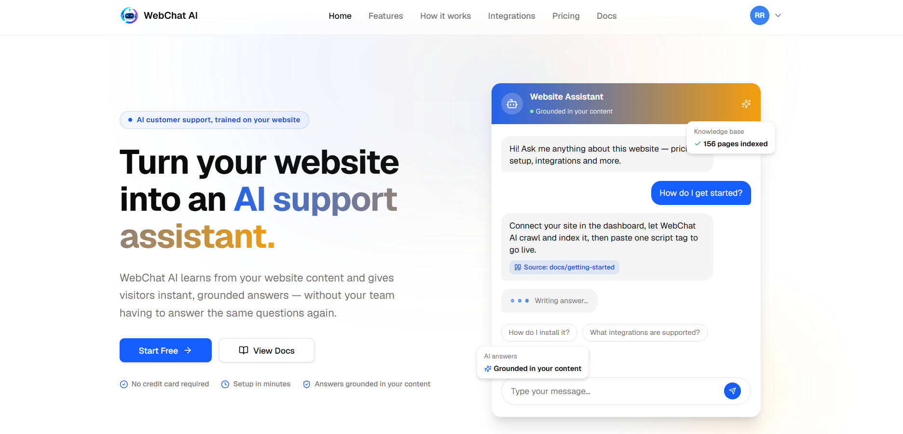
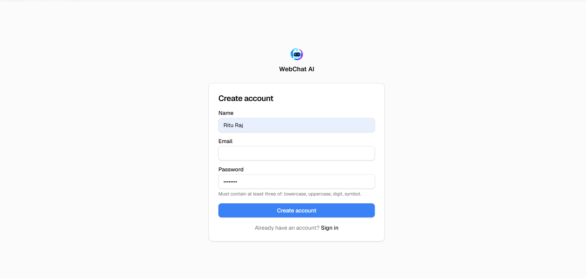
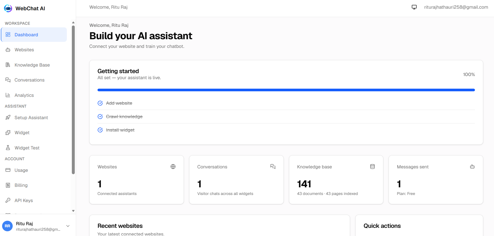
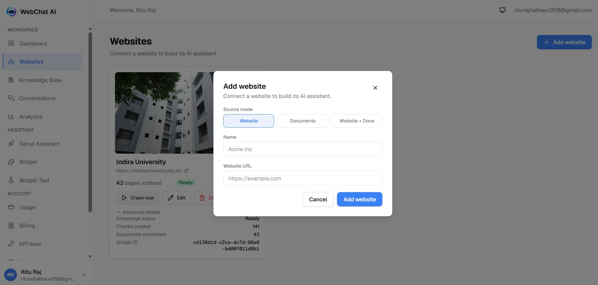
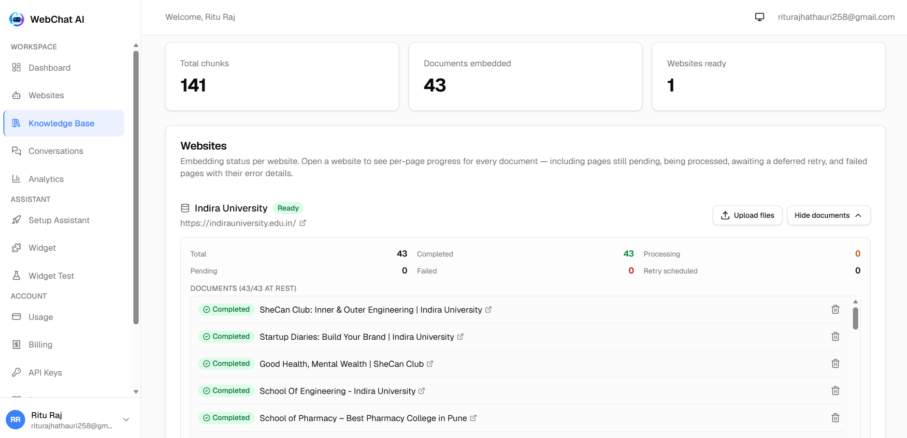
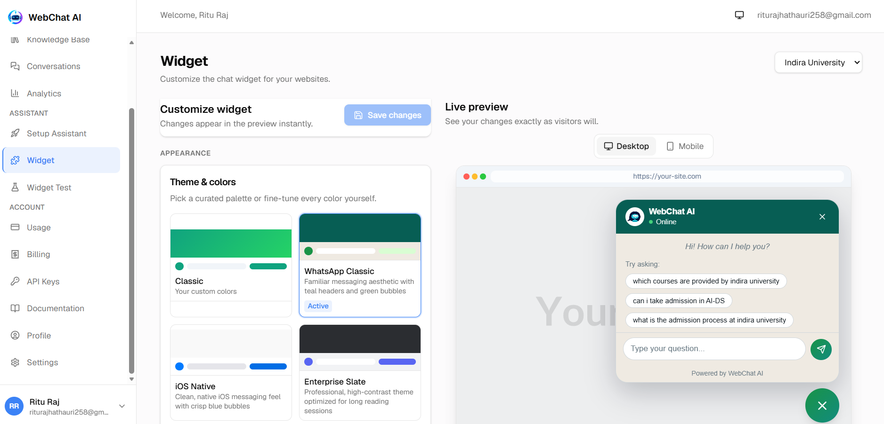
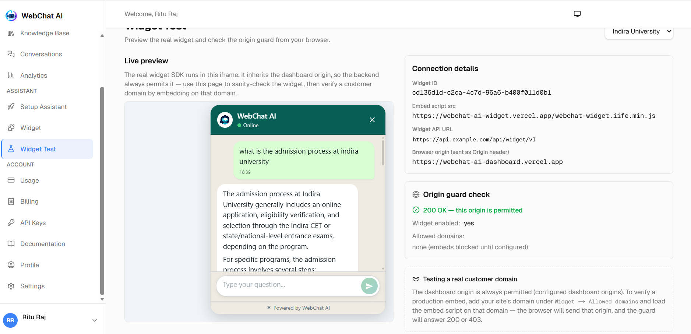
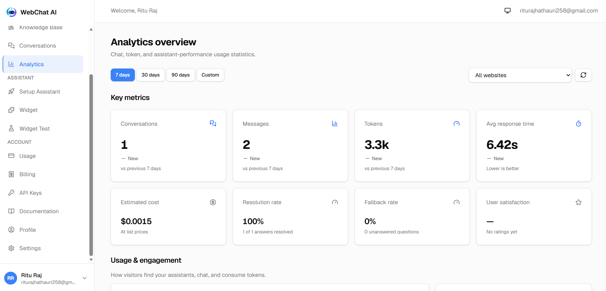
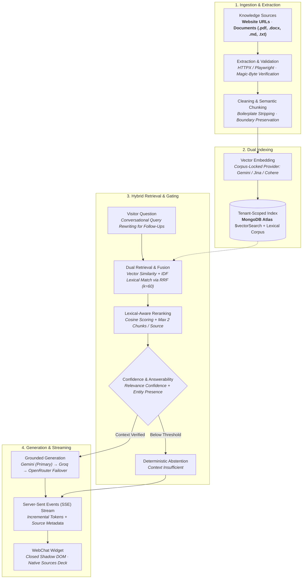
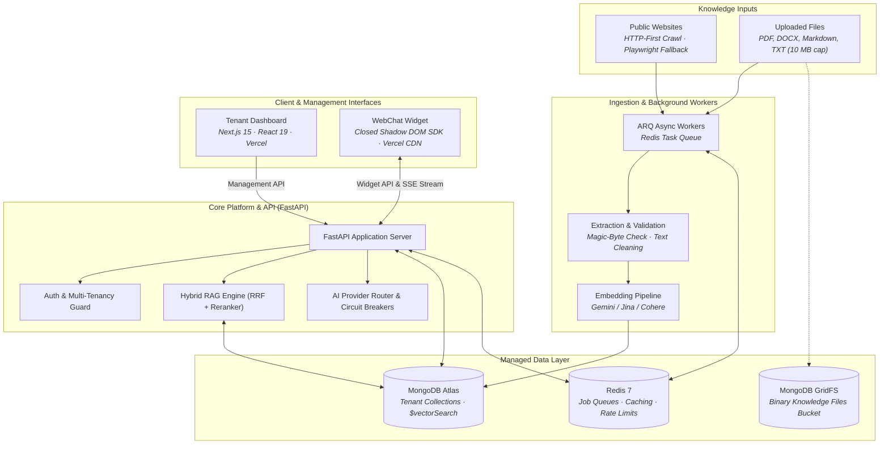

<a id="webchat-ai"></a>
<div align="center">


# WebChat AI

<p>
  <strong>Grounded AI assistants for websites, documents, or both.</strong>
</p>

<p>
  Build source-backed AI assistants from your website, documents, or both —
  then deploy them as an embeddable, streaming chat widget.
</p>

<p>
  <a href="https://webchat-ai-dashboard.vercel.app"><strong>🚀 Live Dashboard</strong></a> &nbsp;•&nbsp;
  <a href="#product-demo"><strong>🎬 Product Demo</strong></a> &nbsp;•&nbsp;
  <a href="docs/README.md"><strong>📚 Documentation</strong></a> &nbsp;•&nbsp;
  <a href="https://github.com/riturajlabs/webchat-AI"><strong>💻 GitHub</strong></a> &nbsp;•&nbsp;
  <a href="#quick-start"><strong>⚡ Quick Start</strong></a>
</p>

<p>
  <a href="https://github.com/riturajlabs/webchat-AI/actions/workflows/ci.yml"></a>
  <a href="LICENSE"></a>
  <a href="https://www.python.org/"></a>
  <a href="https://www.typescriptlang.org/"></a>
  <a href="https://nextjs.org/"></a>
</p>

<br />

<table align="center">
  <tr>
    <td align="center" width="130">🌐<br /><strong>Website RAG</strong></td>
    <td align="center" width="130">📄<br /><strong>Document RAG</strong></td>
    <td align="center" width="130">🔀<br /><strong>Mixed Knowledge</strong></td>
    <td align="center" width="130">🧠<br /><strong>Hybrid Retrieval</strong></td>
  </tr>
  <tr>
    <td align="center" width="130">⚡<br /><strong>SSE Streaming</strong></td>
    <td align="center" width="130">🧩<br /><strong>Embeddable Widget</strong></td>
    <td align="center" width="130">🏢<br /><strong>Multi-Tenant</strong></td>
    <td align="center" width="130">🛡️<br /><strong>Tenant Isolation</strong></td>
  </tr>
</table>

</div>

---

<div align="center">

### 📊 Project at a Glance

| Metric / Dimension            | Current Verified Specification                                                                           |
| :---------------------------- | :------------------------------------------------------------------------------------------------------- |
| **Automated Test Suites**     | **3,507 total tests** (2,582 backend pytest · 925 frontend Vitest · Playwright E2E)                      |
| **Widget Build Budget Gate**  | **≤100 KB gzip** hard gate enforced in CI (warning at >90 KB)                                            |
| **Supported Ingestion Modes** | **3 modes:** `website` (crawl) · `files` (upload-only) · `mixed` (unified corpus)                        |
| **Supported File Formats**    | **4 formats:** `.pdf` (up to 100 pages), `.docx`, `.md`, `.txt` (10 MB per file cap)                     |
| **Hybrid Retrieval Fusion**   | Reciprocal Rank Fusion (**RRF**, $k=60$) combining vector and lexical rankings                           |
| **Production Architecture**   | **Vercel** (Dashboard & Widget) + **Railway** (FastAPI API & ARQ Worker) + **MongoDB Atlas** + **Redis** |

</div>

---

<a id="product-demo"></a>
<div align="center">

## 🎬 See WebChat AI in Action

<p>Experience the complete end-to-end workflow of WebChat AI — from workspace registration and multi-source knowledge ingestion to widget customization, live conversation testing, and production analytics:</p>

<a href="./assets/demo/app-demo.mp4">
  
</a>

<p>
  <a href="./assets/demo/app-demo.mp4"><strong>▶ Watch the full product walkthrough (MP4, ~31.6 MB)</strong></a>
</p>
<p><em>WebChat AI modern landing page featuring multi-mode knowledge onboarding and live assistant previews.</em></p>

</div>

---

<a id="explore"></a>

## 🧭 Explore

| Product Overview                               | Engineering & Architecture                              | Operations & Reference                             |
| :--------------------------------------------- | :------------------------------------------------------ | :------------------------------------------------- |
| 💡 [What is WebChat AI?](#what-is-webchat-ai)  | 🔄 [Knowledge Pipeline](#how-knowledge-becomes-answers) | ⚡ [Quick Start](#quick-start)                     |
| 📚 [Knowledge Sources](#knowledge-sources)     | 🏛️ [System Architecture](#system-architecture)          | ⚙️ [Configuration](#configuration--environment)    |
| 🌟 [Why WebChat AI?](#why-webchat-ai)          | 🧠 [Engineering Highlights](#engineering-highlights)    | 🔌 [API Surface](#api-surface)                     |
| ✨ [Core Capabilities](#core-capabilities)     | 🔒 [Security Architecture](#security-architecture)      | 🧪 [Testing & Quality](#testing--quality-gates)    |
| 📸 [Product Walkthrough](#product-walkthrough) | 📦 [Widget Integration](#widget-integration)            | 🚀 [Production Deployment](#production-deployment) |
| 📋 [Current Scope](#current-scope)             | 🛠️ [Tech Stack](#tech-stack)                            | 📖 [Documentation Index](#documentation-index)     |
| 📈 [Strategic Roadmap](#strategic-roadmap)     | 📁 [Repository Structure](#repository-structure)        | 🤝 [Contributing](#contributing)                   |

---

<a id="what-is-webchat-ai"></a>

## 💡 What is WebChat AI?

WebChat AI is a multi-tenant RAG platform for building AI assistants from website content, uploaded documents, or a combination of both.

Most chatbot implementations either require manual FAQ authoring or function as unconstrained LLM wrappers that fabricate answers and lack source attribution. WebChat AI solves this by coupling automated multi-source ingestion with an enterprise-ready hybrid retrieval-augmented generation (RAG) pipeline:

```text
[ Target Website URL ]  ──► Smart Crawler (HTTP-First + Playwright) ──┐
                                                                      ├──► Clean & Chunk ──► Vector + Lexical Index ──► Grounded RAG ──► Streaming Widget
[ Documents (.pdf, ...) ] ──► GridFS Parser (Magic Bytes + Text)   ──┘
```

The system orchestrates content extraction, semantic chunking, dual indexing (dense vector embeddings and sparse lexical tokens), Reciprocal Rank Fusion (RRF), lexical-aware reranking, pre-generation confidence checks, and real-time Server-Sent Events (SSE) streaming with verifiable source attribution.

---

<a id="knowledge-sources"></a>

## 📚 Knowledge Sources

WebChat AI supports three distinct knowledge ingestion modes designed for operational flexibility:

| Mode          | Knowledge Source                                    | Website Domain Required | Primary Use Case                                       |
| :------------ | :-------------------------------------------------- | :---------------------: | :----------------------------------------------------- |
| **`website`** | Website crawl via HTTP-first + browser rendering    |         **Yes**         | Public documentation, knowledge bases, marketing sites |
| **`files`**   | Uploaded documents (`.pdf`, `.docx`, `.md`, `.txt`) |         **No**          | Internal documentation, manuals, policy archives       |
| **`mixed`**   | Crawled website pages + uploaded documents          |         **Yes**         | Web portals supplemented with offline PDFs and manuals |

- **🌐 Website Knowledge:** Deep crawling with sitemap discovery, `robots.txt` compliance, SSRF egress guards, and automatic Playwright/Chromium fallback for client-rendered JavaScript applications.
- **📄 Document Knowledge:** Parses `.pdf`, `.docx`, `.md`, and `.txt` files up to 10 MB per file (max 5 files per upload batch, max 100 pages per PDF), validated by magic bytes and stored in MongoDB GridFS.
- **🔀 Mixed Knowledge:** Combines crawled web pages and uploaded document attachments into a single, unified tenant corpus evaluated by the same downstream RAG pipeline.

---

<a id="why-webchat-ai"></a>

## 🌟 Why WebChat AI?

| Challenge with Generic Chatbots  | WebChat AI Production Solution                                                                                                         |
| :------------------------------- | :------------------------------------------------------------------------------------------------------------------------------------- |
| **Manual Knowledge Maintenance** | Automatically crawls entire websites and indexes uploaded files (`.pdf`, `.docx`, `.md`, `.txt`).                                      |
| **Unsupported AI Responses**     | Retrieval-grounded responses with relevance and answerability checks, including deterministic abstention when evidence is unavailable. |
| **Unverifiable Claims**          | Native Sources panel surfaces exact document filenames and page URLs behind every response.                                            |
| **Single-Provider Outages**      | Dynamic fallback chains for LLMs (Gemini → Groq → OpenRouter) and embeddings with circuit breakers.                                    |
| **CSS Conflicts on Host Sites**  | Closed Shadow DOM architecture isolates widget styling from host application stylesheets.                                              |
| **Data Leakage Across Tenants**  | Strict multi-tenancy enforced at the database query level, vector pre-filtering, and Redis keyspaces.                                  |
| **No Public Website Available**  | Dedicated Document Mode allows assistant creation directly from uploaded company files.                                                |

---

<a id="core-capabilities"></a>

## ✨ Core Capabilities

### Capabilities Matrix

| Area                      | Implementation Details                                                  | Key Characteristics                                      |
| :------------------------ | :---------------------------------------------------------------------- | :------------------------------------------------------- |
| **Website Ingestion**     | HTTP-first crawler (HTTPX + BS4) with Playwright/Chromium fallback      | Respects `robots.txt`, sitemaps; SSRF egress protection  |
| **Document Ingestion**    | Multi-format parser (`.pdf`, `.docx`, `.md`, `.txt`) via MongoDB GridFS | Magic-byte validation, 10 MB per file, 100 pages per PDF |
| **Unified Corpus**        | Seamless combination of web pages and uploaded files (`mixed` mode)     | Single tenant-scoped RAG index across all source types   |
| **Dual Retrieval**        | MongoDB Atlas `$vectorSearch` + IDF-weighted lexical scoring            | Combined using Reciprocal Rank Fusion (RRF, $k=60$)      |
| **Reranking & Diversity** | Embedding-based reranker with lexical awareness                         | Cosine similarity scoring with max 2 chunks per source   |
| **Factual Grounding**     | Pre-generation confidence calculation + entity answerability check      | Deterministic abstention when evidence is insufficient   |
| **Streaming UX**          | Server-Sent Events (SSE) with layout-stable Markdown                    | Real-time token streaming with native Sources card deck  |
| **Embeddable Widget**     | Framework-agnostic custom element with closed Shadow DOM                | Enforced budget gate (≤100 KB gzip), style isolation     |
| **Tenant Console**        | Next.js 15 App Router + React 19 + Tailwind CSS v4                      | Live widget studio, knowledge explorer, cost analytics   |
| **SaaS Billing**          | Pluggable billing engine supporting Stripe, Razorpay, and mock          | Tiered quotas, automated metering, and usage tracking    |

### Feature Breakdown

#### 🌐 Website Knowledge

- **Automated URL Ingestion:** Deep crawling across internal domain links with sitemap discovery and strict `robots.txt` compliance.
- **HTTP-First Architecture:** Rapid HTTP extraction using HTTPX and BeautifulSoup, falling back to Playwright/Chromium only when client-side JavaScript rendering is detected.
- **SSRF & Egress Hardening:** Pre-resolves DNS records to block loopback addresses, RFC-1918 private subnets, cloud metadata endpoints, and non-whitelisted protocols.

#### 📄 Document Knowledge

- **Multi-Format Parsing:** Ingests `.pdf`, `.docx`, `.md`, and `.txt` documents up to 10 MB per file (max 5 files per batch).
- **Integrity Verification:** Validates magic bytes (`%PDF-`, `PK\x03\x04`), enforces maximum page limits (100 pages per PDF), checks for password protection, and sanitizes file content.
- **Durable Storage:** Binary attachments are stored in MongoDB GridFS buckets (`knowledge_files`) with tenant-scoped lifecycle management.

#### 🔀 Mixed Knowledge

- **Unified Knowledge Corpus:** Merges crawled web pages with uploaded documents under the same tenant website record.
- **Harmonized Downstream RAG:** Identical chunking, embedding, retrieval, and reranking pipelines apply across all ingested source types.

#### 🧠 Hybrid RAG Architecture

- **Dual Retrieval (RRF):** Merges semantic vector search (MongoDB `$vectorSearch`) with lexical keyword matching (TF-IDF token scoring with length normalization) via Reciprocal Rank Fusion ($k=60$).
- **Lexical-Aware Reranking:** Embedding-based reranker rescores top candidates using cosine similarity, lexical presence, and source diversification limits to prevent single-page dominance.
- **Confidence & Answerability Gating:** Pre-generation arithmetic computes relevance confidence and question intent (closed vs. open), triggering early abstention when context is inadequate.
- **Conversational Query Rewriting:** Lightweight, deterministic detection of pronouns and continuation phrases in follow-up queries, prepending recent user context without extra LLM roundtrips.

#### ⚡ Streaming Assistant UX

- **Real-Time Token Streaming:** Server-Sent Events (SSE) stream tokens with typing indicators and layout-stable Markdown rendering.
- **Native Sources Presentation:** Emits source metadata over a dedicated SSE `sources` event, rendered in the widget's native Sources deck with expandable card details.
- **Early Stream Interruption:** Detects client disconnections to stop generation at chunk boundaries, saving tokens and omitting incomplete responses from persistence.

#### 🎨 Embeddable Widget SDK

- **Zero-Config Script Embed:** Single `<script>` tag auto-initializes via `data-widget-id`.
- **Closed Shadow DOM:** Style and DOM isolation prevents collisions with host page stylesheets and scripts.
- **Bundle Budget Gate:** Hard limit of ≤100 KB gzip enforced during CI builds (warns at >90 KB).
- **Accessible & Responsive:** WCAG 2.2 AA compliant, keyboard navigable, mobile responsive, and respects `prefers-reduced-motion`.

#### 📊 Multi-Tenant Console & Management

- **Next.js 15 App Router:** Modern tenant interface for knowledge administration, chunk inspection, and live widget customization.
- **Widget Styling Studio:** Real-time preview with theme presets, customizable greetings, avatars, suggested questions, and accent colors.
- **Analytics & Observability:** Granular visibility into conversation volume, token usage, response latency breakdowns, answer resolution rates, and estimated LLM costs.
- **Multi-Currency Billing:** Pluggable subscription tiers (Free, Plus, Pro, Enterprise) powered by Stripe, Razorpay, or local mock billing.

---

<a id="product-walkthrough"></a>

## 📸 Product Walkthrough

<div align="center">

### 01 — User Registration & Onboarding

<p>Sign up and manage your workspace with Argon2id password hashing, email verification flows, and session management.</p>


<br /><br />

### 02 — Multi-Tenant Assistant Dashboard

<p>Monitor assistant onboarding milestones, total indexed chunks, connected sources, and active visitor conversations from a unified workspace view.</p>


<br /><br />

### 03 — Flexible Knowledge Source Setup

<p>Connect knowledge using <strong>Website</strong>, <strong>Documents</strong> (upload-only), or <strong>Website + Docs</strong> (mixed) modes.</p>


<br /><br />

### 04 — Knowledge Base & Ingestion Management

<p>Track real-time chunking states, document embedding progress, character counts, and granular retry controls for failed pages.</p>


<br /><br />

### 05 — Real-Time Widget Customization & Theming

<p>Customize launcher styles, greeting headers, suggested starter prompts, and curated color palettes (Classic, WhatsApp Classic, iOS Native, Enterprise Slate) with live mobile and desktop previews.</p>


<br /><br />

### 06 — Interactive Testing & Origin Protection

<p>Test live streaming answers, inspect source cards, and verify domain origin restrictions inside an isolated test harness.</p>


<br /><br />

### 07 — Production Analytics & Cost Tracking

<p>Gain full visibility into visitor conversation volume, message counts, token utilization, TTFT / latency distributions, and estimated LLM expenses.</p>


</div>

---

<a id="how-knowledge-becomes-answers"></a>

## 🔄 How Knowledge Becomes Answers



### High-Level Request Flow

```text
Visitor Question ──► Origin & Rate Checks ──► Query Rewriting ──► Hybrid Retrieval (Vector + Lexical)
                                                                            │
Visitor Widget ◄── SSE Stream (Tokens + Sources) ◄── Grounded LLM ◄── Confidence Gate (RRF + Rerank)
```

<details>
<summary><strong>🔍 Detailed visitor request lifecycle (11 steps)</strong></summary>

<br />

1. **Visitor Submits Message:** A visitor enters a question inside the embeddable WebChat widget.
2. **Origin & Rate Verification:** The API validates the request origin against the tenant's allowlist and checks multi-tiered rate limits (IP, visitor, session).
3. **Conversational Query Rewriting:** Prior turns in the session are evaluated; if the query contains pronouns or continuation markers ("what about pricing?"), a standalone retrieval query is constructed without adding LLM latency.
4. **Dual Retrieval:**
   - **Vector Search:** Computes query embedding and runs a tenant-filtered `$vectorSearch` against MongoDB Atlas.
   - **Lexical Keyword Search:** Tokenizes query terms, removes stop words, normalizes spelling variants, and scores candidate chunks via IDF-weighted token frequency.
5. **Reciprocal Rank Fusion (RRF):** Fuses vector and keyword rankings into a single candidate list using RRF ($k=60$).
6. **Lexical-Aware Reranking:** Re-scores top candidates using cosine similarity, lexical overlap, and per-source chunk limits (max 2 chunks per source) for topical diversity.
7. **Confidence & Answerability Scoring:** Evaluates relevance confidence (`0.50*mean + 0.30*hit_ratio + 0.20*peak`) and verifies whether distinguishing entity terms are present. If evidence is insufficient, the assistant immediately issues a deterministic abstention response.
8. **Grounded Generation & Failover:** Assembles evidence context into system prompts and invokes the primary generation provider (Google Gemini), failing over to Groq or OpenRouter if circuit breakers trigger.
9. **Real-Time Token Streaming (SSE):** Generates tokens incrementally and streams them to the client over Server-Sent Events alongside Markdown formatting.
10. **Native Sources Deck:** Dispatches a dedicated `sources` event containing title, URL, and document metadata rendered inside the widget's Sources panel.
11. **Telemetry & Usage Persistence:** Records token consumption, per-stage latencies (embedding, retrieval, reranking, generation, TTFT), and session history for tenant analytics.

</details>

---

<a id="system-architecture"></a>

## 🏛️ System Architecture



### Architecture at a Glance

| Layer                     | Responsibility                                             | Core Technology                                                 |
| :------------------------ | :--------------------------------------------------------- | :-------------------------------------------------------------- |
| **Knowledge Ingestion**   | Crawling websites and parsing document attachments         | HTTPX, BeautifulSoup4, Playwright, pypdf, python-docx           |
| **Background Processing** | Async queue orchestration and embedding generation         | ARQ, Redis, asyncio worker pool                                 |
| **Storage Layer**         | Relational metadata, chunks, vectors, and binary files     | MongoDB Atlas (`$vectorSearch`), MongoDB GridFS                 |
| **Caching & Queues**      | Rate limits, session tracking, and background jobs         | Managed Redis 7 (RESP / TLS)                                    |
| **Retrieval & RAG**       | Vector search, lexical matching, RRF fusion, and reranking | Atlas Vector Search, Reciprocal Rank Fusion, Embedding Reranker |
| **Backend API**           | Auth, knowledge management, chat SSE, and billing          | Python 3.13, FastAPI, Pydantic v2                               |
| **Visitor Widget**        | Embeddable chat UI with closed Shadow DOM                  | TypeScript, Vite, DOMPurify, CSS Variables (≤100 KB gzip)       |
| **Tenant Console**        | Marketing, tenant dashboard, knowledge explorer, analytics | Next.js 15, React 19, TypeScript, Tailwind CSS v4               |

---

<a id="engineering-highlights"></a>

## 🧠 Engineering Highlights

| Engineering Challenge    | Architectural Approach & Implementation                                                                   |
| :----------------------- | :-------------------------------------------------------------------------------------------------------- |
| **Dynamic Websites**     | HTTP-first extraction with automatic fallback to headless Chromium (Playwright) for JS-rendered apps.     |
| **Retrieval Quality**    | Dense vector search combined with IDF-weighted lexical matching via Reciprocal Rank Fusion (RRF, $k=60$). |
| **Context Reliability**  | Relevance-confidence arithmetic and entity answerability gating with deterministic abstention.            |
| **Provider Failures**    | Dynamic failover chains across LLM (Gemini → Groq → OpenRouter) and embeddings with circuit breakers.     |
| **Background Ingestion** | Asynchronous ARQ task workers backed by Redis queues prevent blocking HTTP request loops.                 |
| **Multi-Tenancy**        | Database queries, vector searches, and GridFS buckets strictly isolated by `tenant_id` pre-filters.       |
| **Widget Style Leakage** | Encapsulated in a closed Shadow DOM; immune to host CSS pollution on Webflow, WordPress, or Shopify.      |
| **File Persistence**     | Binary documents validated with magic bytes and persisted reliably in MongoDB GridFS.                     |
| **Streaming UX**         | Server-Sent Events (SSE) stream tokens with incremental Markdown reconciliation and native Sources deck.  |

---

<a id="security-architecture"></a>

## 🔒 Security Architecture

### Security Enforcement Flow

```text
Incoming Request ──► Origin Allowlist ──► Auth / Session Guard ──► Rate Limiter ──► Tenant Scoping ──► Sanitized SSE
```

| Security Boundary                | Protection & Enforcement Mechanism                                                                                    |
| :------------------------------- | :-------------------------------------------------------------------------------------------------------------------- |
| **Tenant Data Isolation**        | Tenant-scoped queries and repository constraints; vector pre-filtering prevents cross-tenant access.                  |
| **Crawler & Network Egress**     | Pre-resolves DNS; blocks loopback (127.0.0.0/8), RFC-1918 private subnets, and metadata IPs (169.254.169.254).        |
| **Authentication & Sessions**    | Short-lived JWT access tokens paired with `HttpOnly`, `SameSite=Strict`, secure refresh cookies and Argon2id hashing. |
| **Widget Origin Access**         | Domain allowlist verification enforced on public session creation and chat streaming requests.                        |
| **Input & Content Sanitization** | DOMPurify sanitization in closed Shadow DOM; prompt-injection detection; regex-based PII redaction in logs.           |
| **Container Hardening**          | Non-root container execution, read-only root filesystems on API/worker, and dropped Linux capabilities (`ALL`).       |
| **CI Vulnerability Scanning**    | Automated Trivy container vulnerability checks and custom secret scanning in GitHub Actions pipelines.                |

---

<a id="widget-integration"></a>

## 📦 Widget Integration

Integrating WebChat AI onto any webpage requires a single script tag:

```html
<script
  src="https://webchat-ai-widget.vercel.app/webchat-widget.iife.min.js"
  data-widget-id="YOUR_WIDGET_ID"
  defer
></script>
```

### Integration Flow

| Step  | Action              | Description                                                                         |
| :---: | :------------------ | :---------------------------------------------------------------------------------- |
| **1** | Provision Widget    | Create a website source in the dashboard to generate a unique `data-widget-id`.     |
| **2** | Add Embed Script    | Insert the one-line `<script>` tag into your site's HTML header or footer.          |
| **3** | Fetch Public Config | Widget queries `GET /api/widget/v1/config/{widget_id}` (cached in Redis).           |
| **4** | Mint Session Token  | Issues short-lived visitor session token via `POST /api/widget/v1/sessions`.        |
| **5** | Stream Answers      | Connects to `POST /api/widget/v1/chat` over Server-Sent Events with native sources. |

### Script Attributes

| Attribute           | Required | Description                                                          |
| :------------------ | :------: | :------------------------------------------------------------------- |
| `data-widget-id`    | **Yes**  | Public widget identifier provisioned from your dashboard.            |
| `data-api-base-url` |    No    | Overrides the backend API endpoint (defaults to the production API). |

### Customization & Branding Precedence

The widget loads configuration from `/api/widget/v1/config/{widget_id}` (cached in Redis). Chatbot visual identity resolves using a strict, deterministic precedence chain:

```text
1. Custom Chatbot Avatar (avatar_url)
         │
         ▼
2. Custom Organization Logo (logo_url, non-website fallback)
         │
         ▼
3. Official WebChat AI Logo (bundled offline data URI)
         │
         ▼
4. Defensive Bot Glyph (SVG fallback)
```

_Website logos and favicons remain isolated on website surfaces and do not override chatbot branding._

- **Theme Presets:** Curated palettes including Classic, WhatsApp Classic, iOS Native, and Enterprise Slate.
- **Controls:** Configurable bot name, launcher glyph, header styling, greeting message, and suggested starter prompts.
- **Budget Enforced:** Gzipped bundle size is strictly governed by a build-time gate (≤100 KB hard limit, warning at >90 KB).

For deep integration and CSP guidelines, refer to the [Widget SDK README](apps/widget/README.md).

---

<a id="tech-stack"></a>

## 🛠️ Tech Stack

### Stack Summary

```text
Backend:        Python 3.13 · FastAPI · Pydantic v2 · uv
AI & Vectors:   Gemini · Groq · OpenRouter · Jina AI · Cohere · MongoDB Atlas Vector Search
Frontend:       Next.js 15 · React 19 · TypeScript 5.9 · Tailwind CSS v4
Widget:         TypeScript 5 · Vite · Closed Shadow DOM · DOMPurify (≤100 KB gzip)
Infrastructure: Docker Compose · Railway · Vercel · Redis 7 · MongoDB Atlas
```

### Detailed Technologies

| Layer                  | Technologies                                                                     |
| :--------------------- | :------------------------------------------------------------------------------- |
| **Backend API**        | Python 3.13 · FastAPI · Pydantic v2 · `uv`                                       |
| **Database & Vectors** | MongoDB Atlas / Motor (`$vectorSearch`, GridFS) · Redis 7                        |
| **Background Workers** | ARQ (async Redis queue for crawling, document processing, email)                 |
| **LLM Generation**     | Google Gemini · Groq · OpenRouter (fallback chain with circuit breakers)         |
| **Vector Embeddings**  | Google Gemini · Jina AI · Cohere (locked corpus provider)                        |
| **Dashboard UI**       | Next.js 15 · React 19 · TypeScript 5.9 · Tailwind CSS v4                         |
| **Widget SDK**         | TypeScript 5 · Vite · Closed Shadow DOM · DOMPurify (≤100 KB gzip)               |
| **Web Crawling**       | HTTPX · BeautifulSoup4 · Playwright (Chromium fallback)                          |
| **SaaS Billing**       | Stripe · Razorpay · Mock provider                                                |
| **Containerization**   | Docker · Docker Compose (multi-stage non-root images)                            |
| **CI / CD**            | GitHub Actions · Vercel (Frontends) · Railway (API & Worker)                     |
| **Observability**      | Prometheus (`/metrics`) · Structured JSON logging · Fail-closed readiness probes |

---

<a id="repository-structure"></a>

## 📁 Repository Structure

```text
webchat-ai/
├── apps/
│   ├── dashboard/            # Next.js 15 tenant console & marketing site
│   └── widget/               # Embeddable widget SDK (Shadow DOM, Vite)
├── assets/
│   ├── demo/                 # Walkthrough video (app-demo.mp4)
│   └── screenshots/          # Application walkthrough and preview images
├── backend/                  # FastAPI service (API routes, RAG, auth, models, worker)
├── packages/
│   └── themes/               # Shared widget theme presets & token resolver
├── docs/                     # Architecture Decision Records (ADRs), specs & runbooks
│   └── deployment/           # Production rollout & infrastructure guide
├── docker/                   # Dockerfiles, Compose specs, Nginx & Prometheus configs
├── scripts/                  # Development, validation & deployment tooling
├── tests/                    # Backend pytest suites & Playwright E2E tests
├── .github/workflows/        # Automated CI/CD pipelines (test, lint, scan, deploy)
├── package.json              # Monorepo workspaces (pnpm)
├── pyproject.toml            # Python packaging & dependencies (uv)
└── LICENSE                   # Proprietary software license notice
```

---

<a id="quick-start"></a>

## ⚡ Quick Start (Local Docker Stack)

### Prerequisites

- **Node.js:** ≥ 20.0.0
- **pnpm:** ≥ 9.0.0
- **Python:** 3.13 with `uv`
- **Docker:** Docker Desktop or Docker Engine with Docker Compose

### Step-by-Step Setup

1. **Clone the repository:**

   ```bash
   git clone https://github.com/riturajlabs/webchat-AI.git
   cd webchat-AI
   ```

2. **Configure environment & install dependencies:**

   ```bash
   cp .env.example .env.development
   pnpm install
   uv sync
   ```

3. **Start services with Docker Compose:**

   ```bash
   # Starts MongoDB, Redis, Mailpit, API (:8000), Worker, Dashboard (:3000), and Widget (:8080)
   scripts/docker-up.sh
   ```

4. **Access local services:**
   - **Tenant Dashboard:** <http://localhost:3000>
   - **Backend API Docs:** <http://localhost:8000/docs>
   - **Local Mailpit (Verification Emails):** <http://localhost:8025>

_For host-based development without Docker, consult [backend/README.md](backend/README.md) and [apps/dashboard/README.md](apps/dashboard/README.md)._

---

<a id="configuration--environment"></a>

## ⚙️ Configuration & Environment

Configuration is governed by Pydantic Settings in `backend/core/config.py`. Environment variables are declared in [`.env.example`](.env.example).

Production templates:

- [`.env.production.example`](.env.production.example): Full hardened production posture.
- [`.env.production.sandbox.example`](.env.production.sandbox.example): Safe local production-simulation environment.

### Fail-Fast Production Enforcement

When running in production mode (`ENVIRONMENT=production`), the application validates security invariants at boot and refuses to start if:

- Insecure or wildcard CORS origins are configured.
- Weak or default `JWT_SECRET` keys are detected.
- Mock payment providers are enabled.
- Unauthenticated MongoDB or Redis connections are specified.
- Required AI provider credentials are missing.

---

<a id="api-surface"></a>

## 🔌 API Surface

All API routes are mounted under `/api` (except Prometheus metrics at `/metrics`):

| Domain                  | Key Endpoints                                                                                                                                                                                 | Description                                                                                 |
| :---------------------- | :-------------------------------------------------------------------------------------------------------------------------------------------------------------------------------------------- | :------------------------------------------------------------------------------------------ |
| **Authentication**      | `POST /api/auth/register`<br>`POST /api/auth/login`<br>`POST /api/auth/refresh`<br>`POST /api/auth/verify-email`                                                                              | Tenant registration, session management, and credential verification.                       |
| **Knowledge Sources**   | `GET /api/websites`<br>`POST /api/websites`<br>`GET /api/knowledge/websites/{id}/documents`<br>`POST /api/knowledge/websites/{id}/documents/upload`<br>`DELETE /api/knowledge/documents/{id}` | Website management, multi-format file uploads (PDF, DOCX, MD, TXT), and document lifecycle. |
| **Conversations**       | `POST /api/chat/stream`<br>`GET /api/conversations`<br>`GET /api/conversations/{id}`                                                                                                          | Authenticated dashboard chat streaming (SSE) and conversation history inspection.           |
| **Public Widget**       | `GET /api/widget/v1/config/{id}`<br>`POST /api/widget/v1/sessions`<br>`POST /api/widget/v1/chat`<br>`POST /api/widget/v1/feedback`                                                            | Public widget config loading, token issuance, streaming assistant responses, and feedback.  |
| **Analytics & Billing** | `GET /api/analytics/overview`<br>`GET /api/billing/subscription`<br>`POST /api/billing/checkout`                                                                                              | Workspace metrics, token usage, latency breakdowns, and subscription management.            |
| **Observability**       | `GET /metrics`<br>`GET /api/health/live`<br>`GET /api/health/ready`                                                                                                                           | Prometheus metrics scrape target, liveness probe, and fail-closed readiness checks.         |

Detailed endpoint schemas and route tables are documented in [backend/README.md](backend/README.md).

---

<a id="testing--quality-gates"></a>

## 🧪 Testing & Quality Gates

The repository maintains automated backend, frontend, accessibility, theme, and end-to-end test suites with CI quality gates:

| Layer          |   Test Count    | Tooling & Target                | Scope & Guarantees                                                          |
| :------------- | :-------------: | :------------------------------ | :-------------------------------------------------------------------------- |
| **Backend**    | **2,582 tests** | `pytest` + `pytest-asyncio`     | Hermetic unit & integration tests; stubbed MongoDB; deterministic AI mocks. |
| **Dashboard**  |  **502 tests**  | `Vitest` + Testing Library      | UI components, auth guards, hooks, forms, and admin views.                  |
| **Widget SDK** |  **384 tests**  | `Vitest` + `jsdom` + `axe-core` | Mounting, Shadow DOM styles, Markdown rendering, accessibility (WCAG AA).   |
| **Themes**     |  **39 tests**   | `Vitest`                        | Theme presets, semantic token resolution, and color contrast calculations.  |
| **End-to-End** |  **Automated**  | `Playwright`                    | Real browser testing of widget embeds, streaming SSE, origin guard checks.  |

```bash
# 1. Run backend validation suite (Ruff lint + Mypy typecheck + Pytest)
./scripts/check-backend.sh

# 2. Run frontend quality gates (Lint + Typecheck + Test suites)
pnpm lint && pnpm typecheck && pnpm test

# 3. Run secret scanning
./scripts/check-secrets.sh
```

For complete testing architecture, refer to [tests/README.md](tests/README.md).

---

<a id="production-deployment"></a>

## 🚀 Production Deployment

WebChat AI is designed to operate across managed cloud infrastructure:

- **Frontends:** Dashboard and Widget SDK hosted on **Vercel**.
- **Backend & Workers:** FastAPI API and ARQ Worker services hosted on **Railway**.
- **Data Stores:** Managed **MongoDB Atlas** (with Vector Search) and **Redis**.
- **Self-Hosting Alternative:** Complete production-ready multi-container Docker Compose configuration documented in [docker/README.md](docker/README.md).

Step-by-step rollout and rollback procedures are outlined in the [Production Deployment Runbook](docs/deployment/README.md).

---

<a id="production-characteristics"></a>

## ⚙️ Production Characteristics

| Characteristic        | Architectural Implementation                                                                    |
| :-------------------- | :---------------------------------------------------------------------------------------------- |
| **Multi-Tenancy**     | Tenant-scoped repository and database query boundaries; vector search pre-filtering.            |
| **Async Ingestion**   | Background ARQ workers process large crawls and embeddings without blocking API threads.        |
| **Provider Fallback** | Automated circuit-breaker failover chains across LLM and vector embedding providers.            |
| **Adaptive Context**  | Token-budgeting module dynamically adjusts prompt context size based on query complexity.       |
| **Fail-Fast Boot**    | Rejects startup in production when environment variables violate security invariants.           |
| **Rate Limiting**     | Multi-tier Redis sliding-window limiters across IP, visitor session, and tenant accounts.       |
| **Style Isolation**   | Closed Shadow DOM SDK completely prevents style bleeding on host websites.                      |
| **Bundle Budget**     | Enforces widget bundle limits (≤100 KB gzip) in continuous integration build gates.             |
| **Observability**     | Native Prometheus metrics (`/metrics`), structured JSON logs, and fail-closed readiness probes. |

---

<a id="current-scope"></a>

## 📋 Current Scope

### Supported Today

- [x] Website crawling with sitemap discovery, `robots.txt` compliance, and headless browser fallback.
- [x] Document parsing for `.pdf`, `.docx`, `.md`, and `.txt` files via MongoDB GridFS.
- [x] Mixed knowledge bases combining web URLs and uploaded files in a single assistant.
- [x] Hybrid retrieval (Reciprocal Rank Fusion) combining vector search with lexical keyword matching.
- [x] Lexical-aware reranking with source diversification.
- [x] Factual grounding with pre-generation confidence scoring and deterministic abstention.
- [x] Real-time token streaming over Server-Sent Events (SSE).
- [x] Embeddable widget SDK with closed Shadow DOM and dynamic branding resolution.
- [x] Next.js 15 tenant management console with live widget studio, knowledge base explorer, and analytics.
- [x] Multi-currency SaaS billing integration (Stripe, Razorpay, and mock).

---

<a id="strategic-roadmap"></a>

## 📈 Strategic Roadmap

<details>
<summary><strong>🔍 Click to expand forward-looking strategic roadmap</strong></summary>

<br />

Documented in detail in [docs/OPTIMIZATION_ROADMAP.md](docs/OPTIMIZATION_ROADMAP.md):

- [ ] **Customer-Side Crawler Agent:** Standalone egress crawler agent for sites behind strict enterprise WAFs or intranet firewalls.
- [ ] **Direct CMS & Notion Connectors:** Native API ingestion for Notion, Confluence, WordPress, and Zendesk Help Centers.
- [ ] **Extended Document Formats:** Native parsing support for structured spreadsheets (`.csv`, `.xlsx`) and presentations (`.pptx`).
- [ ] **Multimodal Retrieval:** Image and diagram extraction from ingested PDF documents for visual question answering.
- [ ] **Voice Interface:** Low-latency WebRTC and speech-to-text integration for real-time audio interaction.
- [ ] **Enterprise RBAC:** Granular role-based access control with custom permission sets and audit logging.

</details>

---

<a id="documentation-index"></a>

## 📖 Documentation Index

| Document                                                     | Description                                               |
| :----------------------------------------------------------- | :-------------------------------------------------------- |
| [docs/README.md](docs/README.md)                             | Platform documentation root & index                       |
| [backend/README.md](backend/README.md)                       | Backend architecture, RAG pipeline, and API router tables |
| [apps/dashboard/README.md](apps/dashboard/README.md)         | Next.js tenant console and marketing app guide            |
| [apps/widget/README.md](apps/widget/README.md)               | Embeddable widget SDK, theming, and CSP guide             |
| [docs/deployment/README.md](docs/deployment/README.md)       | Production deployment runbook, rollout, and health probes |
| [packages/themes/README.md](packages/themes/README.md)       | Widget preset themes and semantic color resolution        |
| [docker/README.md](docker/README.md)                         | Container architecture and Docker Compose operations      |
| [tests/README.md](tests/README.md)                           | Automated testing strategy and Definition of Done         |
| [scripts/README.md](scripts/README.md)                       | Development and operational tooling scripts               |
| [docs/OPTIMIZATION_ROADMAP.md](docs/OPTIMIZATION_ROADMAP.md) | Forward-looking architectural optimization roadmap        |
| [00-AI-Development-Rules.md](00-AI-Development-Rules.md)     | Mandatory coding and safety rules for AI agents           |

---

<a id="contributing"></a>

## 🤝 Contributing

Contributions that adhere to the established architecture, security invariants, and Definition of Done are welcomed.

Before submitting changes:

```bash
# 1. Run backend verification
./scripts/check-backend.sh

# 2. Run frontend quality gates
pnpm lint && pnpm typecheck && pnpm build && pnpm test

# 3. Verify no secrets are tracked
./scripts/check-secrets.sh
```

Please review [00-AI-Development-Rules.md](00-AI-Development-Rules.md) prior to submitting pull requests. For security concerns, please report via private security channels.

---

<div align="center">

## 🚀 Build with WebChat AI

<p>
Build a grounded AI assistant from your website,
your documents, or both.
</p>

<p>
<a href="https://webchat-ai-dashboard.vercel.app">
<strong>Open Dashboard</strong>
</a>
&nbsp; · &nbsp;
<a href="docs/README.md">
<strong>Read Documentation</strong>
</a>
&nbsp; · &nbsp;
<a href="https://github.com/riturajlabs/webchat-AI">
<strong>View Source</strong>
</a>
</p>

</div>

---

<div align="center">


<h3>WebChat AI</h3>

<p>
Grounded AI assistants for websites, documents, or both.
</p>

<p>
<a href="https://webchat-ai-dashboard.vercel.app">Dashboard</a>
&nbsp;·&nbsp;
<a href="docs/README.md">Documentation</a>
&nbsp;·&nbsp;
<a href="https://github.com/riturajlabs/webchat-AI">GitHub</a>
&nbsp;·&nbsp;
<a href="https://www.linkedin.com/in/riturajlabs/">LinkedIn</a>
&nbsp;·&nbsp;
<a href="https://riturajlabs.vercel.app/">Portfolio</a>
</p>

<p>
<sub>
Built with Python · FastAPI · Next.js · React · MongoDB · Redis
</sub>
</p>

<p>
<sub>
© 2026 Ritu Raj · Proprietary — All Rights Reserved · <a href="LICENSE">License</a>
</sub>
</p>

<p>
<a href="#webchat-ai">↑ Back to top</a>
</p>

</div>
