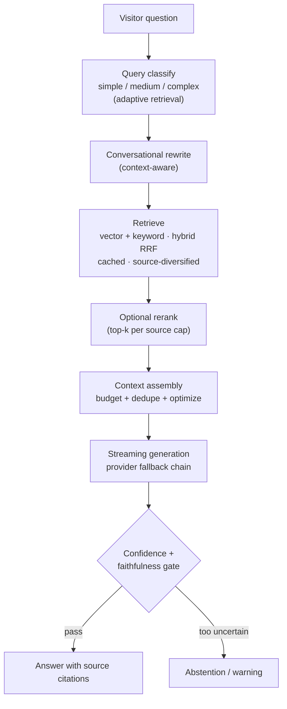

# 🤖 WebChat AI

**Turn any website into a source-grounded AI assistant.**

A multi-tenant AI SaaS platform that lets anyone deploy a website-specific chat
assistant in minutes — no code beyond a single `<script>` tag. WebChat AI
crawls a website into a retrieval-augmented knowledge base, then answers your
visitors' questions with **citations back to the source material**.

```
Zero-code embed                       Every answer cites its sources
────────────────────                  ─────────────────────────────
<script src="https://cdn.example.com"
  data-widget-id="your_widget_id"     > Sources: docs/quickstart.md
  defer></script>                       FAQ · pricing · setup guide
```

## What it does

|                            |                                                                                                                                                                                                                                                       |
| -------------------------- | ----------------------------------------------------------------------------------------------------------------------------------------------------------------------------------------------------------------------------------------------------- |
| ⚡ **Website ingest**      | Crawls your site (**robots-aware, sitemap + priority paths, same-origin + SSRF guarded, HTTP-first with JS-rendering fallback**), cleans it, chunks it, and embeds it into a knowledge base.                                                          |
| 🎯 **Source-grounded RAG** | Hybrid retrieval (vector `$vectorSearch` + keyword, fused via RRF), optional reranking, adaptive query classification, confidence gating, and post-generation faithfulness checks — answers come with sources, or the assistant says it can't answer. |
| 🔌 **Zero-config widget**  | A embeddable SDK with a closed shadow root, 10 curated themes, Markdown rendering (incl. tables and citations), streaming answers, offline handling, and WCAG 2.2 AA accessibility.                                                                   |
| 🏢 **Multi-tenant SaaS**   | Tenant-isolated workspaces, plans/billing (Stripe, Razorpay, or mock), usage metering and **LLM token budgets**, developer API keys, and a super-admin console.                                                                                       |
| 🔒 **Security-first**      | JWT + refresh cookies (`SameSite=Strict`), CSRF, Argon2, email verification, login lockout, rate limiting, prompt-injection guards, and PII redaction — with a 2266+ test backend suite and CI/CD security gates.                                     |

## Architecture

```mermaid
flowchart LR
  subgraph Web["Customer website"]
    WIDGET["WebChat widget<br/>(one-line embed)"]
  end

  subgraph Platform["WebChat AI platform"]
    DASH["Dashboard<br/>Next.js · :3000"]
    API["API<br/>FastAPI · :8000"]
    WORKER["Worker<br/>ARQ + Playwright crawl"]
    MONGO[("MongoDB Atlas<br/>documents + vectors")]
    REDIS[("Redis<br/>cache · rate limit · job queue")]
  end

  subgraph AI["AI providers"]
    GEN["Generation<br/>Gemini · Groq · OpenRouter"]
    EMB["Embeddings<br/>Gemini · Jina · Cohere"]
  end

  WIDGET -->|"/api/widget/v1 · SSE"| API
  DASH -->|"/api/* same-origin proxy"| API
  API --> MONGO
  API --> REDIS
  WORKER --> MONGO
  WORKER --> REDIS
  WORKER -->|"crawl + render"| Web
  API --> GEN
  API --> EMB
  WORKER --> EMB

  style MONGO fill:#0b3d2e
  style REDIS fill:#3d200b
```



## How an answer is produced



### The website crawler, step by step

1. **Discover** — start page, sitemap, and links. BFS with a page budget, boosts
   for `CRAWL_PRIORITY_URL_PATHS`, respects `robots.txt` and stays same-origin.
2. **Guard** — SSRF guard validates every destination; only HTTP(S) origins pass.
3. **Fetch** — HTTP-first; pages that need JS rendering fall back to Playwright
   (Chromium, with or without sandbox per env).
4. **Clean + chunk** — HTML is extracted and cleaned, then split into chunks by
   token budget with overlap; near-empty pages are dropped.
5. **Embed** — chunks become vectors via a **single locked embedding provider**
   (switching embedding spaces mid-corpus would corrupt `$vectorSearch`).
6. **Persist** — tenant-scoped documents/chunks with their embedding identity,
   retried with backoff; documents that exhaust retries are quarantined.

## Monorepo layout

```
├── apps/
│   ├── dashboard/       Next.js 15 dashboard, marketing site + tenant admin
│   └── widget/          Framework-independent embeddable widget SDK
├── backend/             FastAPI (API, services, repositories, ARQ worker, AI clients)
├── packages/themes/     Shared widget theme presets + resolve engine
├── docs/                Design docs, ADRs, deployment guide, audit reports
├── docker/              Dockerfiles + compose (dev and production)
├── scripts/             Dev / ops / verification helpers
└── tests/               Backend pytest suites + widget E2E
```

Each area has its own README — see the [documentation map](#documentation).

## Tech stack

| Layer     | Technology                                                                                                                                                                                             |
| --------- | ------------------------------------------------------------------------------------------------------------------------------------------------------------------------------------------------------ |
| Backend   | Python 3.13 · FastAPI · Pydantic v2 · Motor (MongoDB) · Redis · ARQ                                                                                                                                    |
| AI        | Google Gemini (default), Groq, OpenRouter for generation — built on shared OpenAI-compatible streaming helpers; Gemini / Jina / Cohere for embeddings; adaptive routing with health + circuit breakers |
| Dashboard | Next.js 15 (App Router, Turbopack) · React 19 · Tailwind CSS v4 · TanStack Query                                                                                                                       |
| Widget    | TypeScript · Vite (ESM/UMD/IIFE) · DOMPurify · Shadow DOM · `--wc-*` CSS theming                                                                                                                       |
| Infra     | Docker Compose · GitHub Actions CI/CD · GHCR · Prometheus + alert rules                                                                                                                                |

## Quick start (local development)

**Prerequisites:** Node.js ≥ 20, pnpm ≥ 9, Python 3.13 (via `uv`), Docker + Compose.

```bash
# 1. Environment (a ready-made dev file ships with the repo)
cp .env.development .env

# 2. Full stack — MongoDB, Redis, Mailpit, API, Worker, Dashboard, Widget
docker compose --env-file .env.development -f docker/compose.yml up --build
#    (or: scripts/docker-up.sh)

# 3. Frontend deps + dashboard dev server
pnpm install
pnpm dev:dashboard            # open http://localhost:3000

# 4. Backend without Docker: scripts/setup.sh then scripts/dev-api.sh
```

Environment note: `.env.development` points at the Docker `mongo`/`redis`/
`mailpit` services (`ENVIRONMENT=development`); `.env.production` is for local
production testing against managed services (`LOCAL_PRODUCTION_TEST=true`).
`.env.example` documents the full variable reference. `backend/core/config.py`
**fails fast** at boot on weak production values (loopback hosts, short
`JWT_SECRET`, missing AI keys, mock payments) unless the local-production-test
flag is set.

## Production deployment

- **Path:** Docker Compose running immutable `sha-<git-sha>` GHCR images,
  shipped by GitHub Actions (CI validate → publish → Trivy gate → manual deploy).
- **Services:** `api`, `worker`, `dashboard`, `widget`; managed MongoDB Atlas +
  Redis; one-shot migrations before rollout; documented rollback.
- **Observability:** JSON logs with `request_id`/`tenant_id`, `/metrics`
  (Prometheus), and validated alert rules.
- **Links:** full guide in [`docs/deployment/README.md`](docs/deployment/README.md);
  container/image reference in [`docker/README.md`](docker/README.md).

The API's default fallback origin for the dashboard proxy targets a Railway
deployment; in real deploys you set your own public origins
(`NEXT_PUBLIC_API_URL`, `NEXT_PUBLIC_BACKEND_API_URL`,
`VITE_WIDGET_API_BASE_URL`) at build time (see the dashboard & widget READMEs).

## Embedding the widget

Production flows get a ready-to-paste snippet from the dashboard. The same embed
works from any host that can serve the IIFE bundle:

```html
<script
  src="https://cdn.example.com/webchat-widget.iife.min.js"
  data-widget-id="your_widget_id"
  data-api-base-url="https://api.example.com"   <!-- optional override -->
  defer
></script>
```

The widget **auto-upgrades** from `data-widget-id` — no `init()` call needed.
Defaults fall back to the build-time `VITE_WIDGET_API_BASE_URL`, then
same-origin `/api/widget/v1`. See the
[Widget SDK README](apps/widget/README.md) for programmatic `init()`/`mount()`
use, theming (`--wc-*`), CSP requirements, and accessibility.

## Verification

```bash
./scripts/check-backend.sh         # ruff + mypy + pytest (backend gate)
pnpm lint && pnpm typecheck && pnpm build && pnpm test   # frontends
./scripts/check-secrets.sh         # secret scanner — run before committing
```

Backend: 2266+ tests across auth, security, RAG, crawler, embeddings, provider
routing, widget API, tenant isolation, billing and observability (as measured on
the last full run). See [`tests/README.md`](tests/README.md) for the area map
and the Definition of Done.

## Documentation

- [`docs/README.md`](docs/README.md) — index of canonical docs (PRD, TRD, app
  flows, schema, implementation plan, **ADR-001…ADR-009**) and historical
  audit reports
- [`docs/deployment/README.md`](docs/deployment/README.md) — production runbook
- [`backend/README.md`](backend/README.md) — API, RAG pipeline, worker, config
- [`00-AI-Development-Rules.md`](00-AI-Development-Rules.md) — mandatory rules
  for AI coding agents in this repo

## Contributing

Work proceeds with a Definition of Done that is documented in
[`tests/README.md`](tests/README.md) and enforced locally via the scripted gates
above and in CI. For security concerns, do **not** open a public issue — reach
out privately (security reporting channel to be provided).

## License

Proprietary. All rights reserved.
