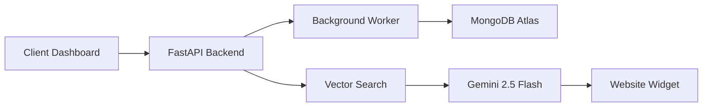
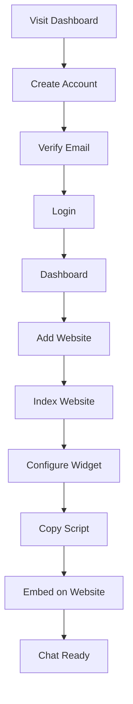
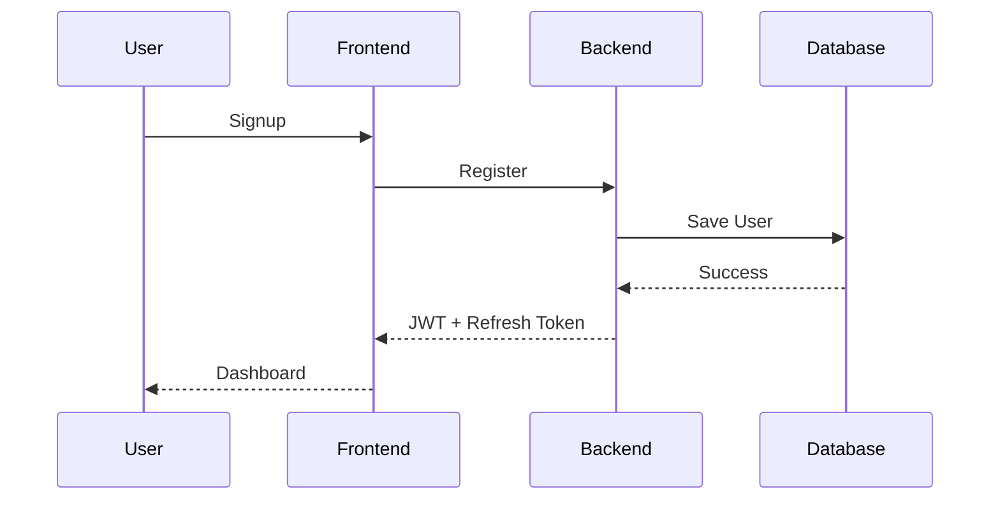
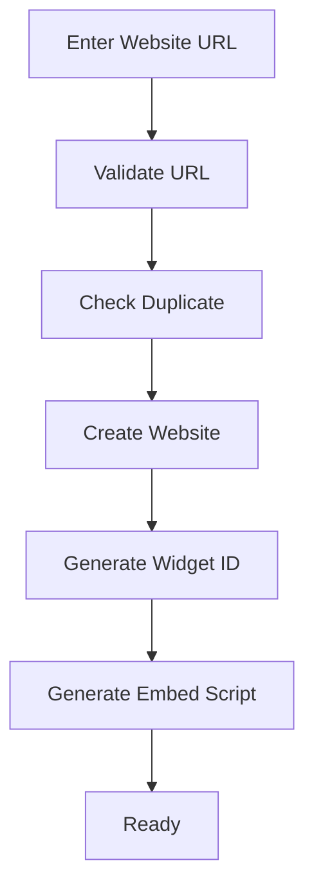
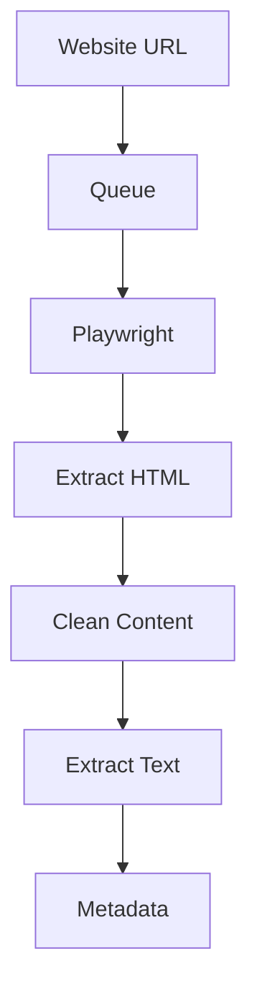
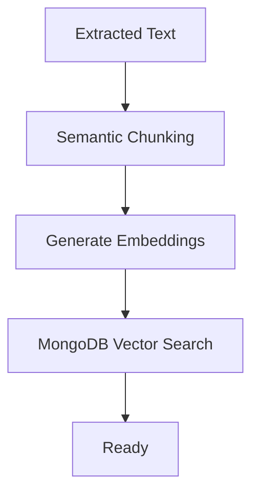
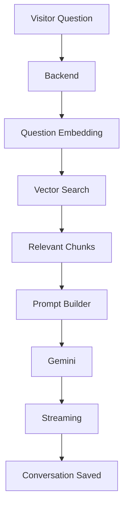
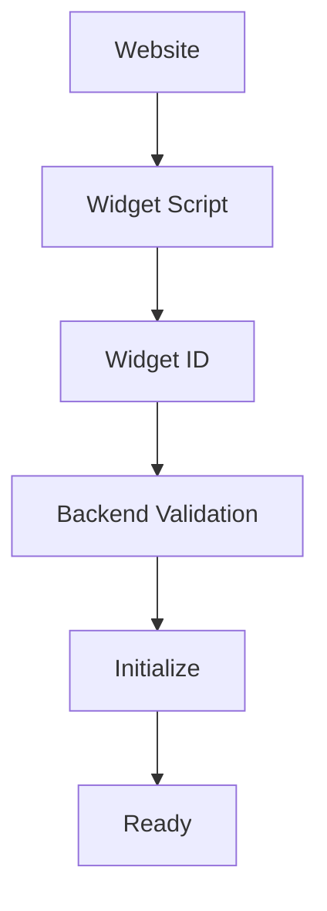

# WebChat AI - Application Flow Document

**Version:** 1.0  
**Project Name:** WebChat AI  
**Document Type:** Application Flow  
**Author:** Ritu Raj  
**Status:** Draft  
**Last Updated:** August 2026

---

# 1. Purpose

This document defines how users, backend services, AI pipeline, and data interact throughout the application.

Every flow described here should be followed exactly during implementation.

---

# 2. System Overview



---

# 3. User Journey



---

# 4. Authentication Flow

## Steps

1. User opens dashboard.
2. User signs up.
3. Email verification is completed.
4. Password is securely hashed.
5. JWT Access Token generated.
6. Refresh Token generated.
7. User redirected to dashboard.



---

# 5. Website Registration Flow

## Steps

1. User clicks Add Website.
2. URL validation.
3. Check duplicate website.
4. Verify ownership (Future).
5. Save website.
6. Create Widget ID.
7. Generate Embed Script.



---

# 6. Website Crawling Flow

## Steps

1. User clicks Index Website.
2. Crawl Job created.
3. Job added to Redis Queue.
4. Worker starts crawling.
5. Dynamic pages rendered.
6. HTML cleaned.
7. Main content extracted.
8. Metadata generated.



---

# 7. Knowledge Base Flow

## Steps

1. Extract text.
2. Semantic chunking.
3. Generate embeddings.
4. Save vectors.
5. Mark website Ready.



---

# 8. Chat Flow

## Steps

1. Visitor opens widget.
2. Sends message.
3. Backend validates request.
4. Question embedding generated.
5. Vector search.
6. Retrieve relevant chunks.
7. Build prompt.
8. Gemini generates answer.
9. Stream response.
10. Save conversation.



---

# 9. Widget Flow

## Steps

1. Website loads.
2. Widget script loads.
3. Widget verifies Widget ID.
4. Backend validates tenant.
5. Widget initializes.
6. Chat becomes available.



---

# 10. Dashboard Flow

```mermaid
flowchart LR

Dashboard --> Websites
Dashboard --> Analytics
Dashboard --> Conversations
Dashboard --> Widget
Dashboard --> Settings
Dashboard --> API Keys
Dashboard --> Profile
```

---

# 11. Analytics Flow

Visitor Chat

↓

Conversation Saved

↓

Analytics Updated

↓

Dashboard Charts Updated

Metrics

- Total Chats
- Active Visitors
- Response Time
- Popular Questions
- Crawl Status
- Token Usage (Future)

---

# 12. Error Handling Flow

```mermaid
flowchart TD

Request
|
v
Validate
|
v
Valid?
| \
Yes No
|    \
v     Error Response
Process
|
v
Success
```

Common Errors

- Invalid URL
- Crawl Failed
- Embedding Failed
- AI Timeout
- Invalid Widget
- Unauthorized
- Rate Limit Exceeded

---

# 13. Retry Flow

The system should automatically retry:

- Website Crawl
- Embedding Generation
- AI API Failure
- Database Connection

Maximum Retry Count

- 3 Attempts

If all retries fail

↓

Job marked as Failed

↓

User notified

---

# 14. Security Flow

Every request follows:

```mermaid
flowchart TD

Request

↓

Authentication

↓

Authorization

↓

Tenant Validation

↓

Input Validation

↓

Rate Limit

↓

Business Logic

↓

Response
```

No request should bypass validation.

---

# 15. Multi-Tenant Flow

```mermaid
flowchart LR

Tenant A

↓

Knowledge A

↓

Chat A

Tenant B

↓

Knowledge B

↓

Chat B
```

Rules

- Tenant A must never access Tenant B data.
- Every database query must include `tenant_id`.
- Widget requests must validate both `widget_id` and `tenant_id`.

---

# 16. AI Decision Flow

```mermaid
flowchart TD

Question

↓

Retrieve Context

↓

Context Found?

Yes --> Gemini Generates Answer

No --> Return "Information not available in the knowledge base."
```

The AI must never answer without retrieved context.

---

# 17. Website Re-index Flow

1. User clicks Re-index.
2. New crawl job created.
3. Changed pages detected.
4. Old chunks replaced.
5. New embeddings generated.
6. Index updated.
7. Website status becomes Ready.

---

# 18. Logout Flow

```mermaid
flowchart TD

Logout

↓

Invalidate Refresh Token

↓

Clear Cookies

↓

Redirect to Login
```

---

# 19. Overall End-to-End Flow

```mermaid
flowchart TD

Signup

↓

Login

↓

Dashboard

↓

Add Website

↓

Crawl Website

↓

Extract Content

↓

Chunk Content

↓

Generate Embeddings

↓

Store Vectors

↓

Generate Widget

↓

Embed Script

↓

Visitor Opens Website

↓

Chat Starts

↓

Vector Search

↓

Gemini Response

↓

Analytics Updated
```

---

# 20. Flow Rules for AI Development

The AI coding agent must ensure:

- Every flow is completed before the next starts.
- Long-running tasks execute asynchronously.
- All failures return meaningful error messages.
- Security validation occurs before business logic.
- Every database operation is tenant-aware.
- Conversations are persisted after each successful response.
- AI responses are generated only from retrieved knowledge.
- Every important action is logged for debugging and auditing.

---

# End of Application Flow