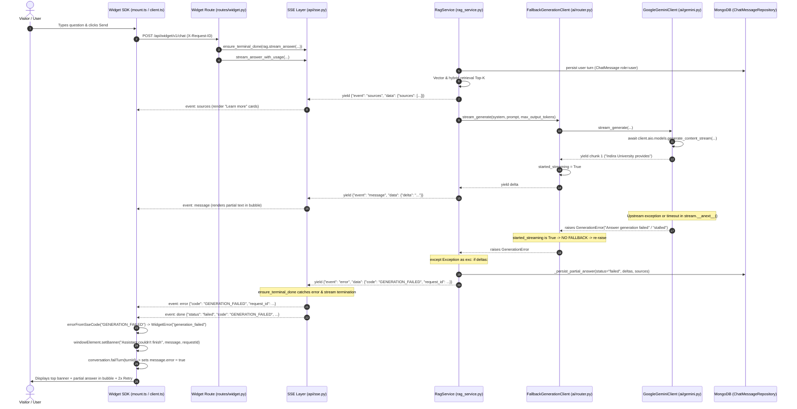

# Production AI Generation Failure — Forensic Root Cause Audit

**Document Date:** 2026-09-14  
**Audit Type:** Forensic Incident Investigation & Error UX Review  
**Target Monorepo:** WebChat AI  
**Scope Status:** READ-ONLY Forensic Investigation Phase (No application code or runtime configs modified)  
**Primary Incident:** AI generation starts streaming partial content, source cards appear, then stops unexpectedly with "Assistant couldn't finish" error banner and preserved partial answer.

---

## 1. Executive Summary

### Incident Overview

In production, a user submits a question (e.g., _"which courses are provided by indira university"_). Retrieval completes successfully, source citation cards ("Learn more") appear in the widget, and the assistant begins streaming response tokens (e.g., _"Indira University provides..."_). Generation then abruptly terminates mid-stream. The widget displays the error banner:

- **Title:** `"Assistant couldn't finish"`
- **Body:** `"Your answer could not be completed because the AI generation service stopped unexpectedly. The partial response has been preserved."`
- **Reference ID:** `Reference: <X-Request-ID>`
- **Controls:** `Retry` button and Dismiss (`×`) icon.
- **State:** The partial answer text and source cards remain visible inside the message bubble, alongside a second `Retry` button appended to the bubble.

### Core Verdict

The observed failure is a **mid-stream LLM provider exception (or inter-chunk generation timeout)** occurring inside the primary provider client (`GoogleGeminiClient`) after at least one text delta was streamed.

1. **Why the error banner appeared:**
   A normal `MAX_TOKENS` / `LENGTH` completion terminates cleanly via `StopAsyncIteration` with `finish_reason="MAX_TOKENS"` and `truncated=true`. The system persists this as a completed answer, emitting `done {status: "completed", truncated: true}` which renders a subtle inline note (_"The answer reached the maximum length and was cut off"_), **never** an error banner.
   The error banner `"Assistant couldn't finish"` is triggered **exclusively** when the backend yields an SSE `error` frame with code `GENERATION_FAILED` (HTTP status 502 via `GenerationError`).

2. **Why fallback did not recover the answer:**
   By architectural design (`FallbackGenerationClient`), provider fallback (`Gemini -> Groq -> OpenRouter`) is strictly **pre-stream only**. Once the first token delta is yielded to the SSE transport, the stream is committed to that provider. A subsequent provider failure is re-raised to prevent concatenating two disjoint answers.

3. **Why the partial answer and sources were preserved:**
   Under commit `454ff69` (_"fix: persist failed partial assistant turns"_), when generation aborts after ≥1 delta, `RagService._persist_partial_answer` captures the accumulated deltas and sources into MongoDB with `status="failed"`. The widget's `failTurn` action keeps the accumulated text and source cards in the DOM.

4. **Production Runtime Evidence Status:**
   **Production runtime evidence unavailable.** Remote Railway/Atlas production logs are inaccessible from this environment. The exact provider-side socket or RPC failure subtype (e.g., Google GenAI HTTP/2 reset, upstream 503 RPC error, or inter-token stall exceeding `GENERATION_TIMEOUT_SECONDS`) cannot be distinguished without Railway log correlation.

---

## 2. Screenshot Symptom Analysis

| Step | Observed Screenshot Symptom       | Code Path / System Mechanism                                                               | Validation Status |
| ---- | --------------------------------- | ------------------------------------------------------------------------------------------ | ----------------- |
| 1    | User submits query                | `apps/widget/src/core/mount.ts:393` `send(question)` -> `POST /api/widget/v1/chat`         | CONFIRMED         |
| 2    | Sources cards appear              | Backend yields `event: sources`. Widget `onSources` populates `message.sources`            | CONFIRMED         |
| 3    | Assistant streams partial content | Backend yields `event: message` deltas. Widget `onDelta` appends to DOM                    | CONFIRMED         |
| 4    | Stream stops unexpectedly         | Exception thrown in `GoogleGeminiClient` during `stream.__anext__()`                       | CONFIRMED         |
| 5    | Widget shows error banner         | Backend emits `event: error` (`GENERATION_FAILED`), mapped to `generation_failed` taxonomy | CONFIRMED         |
| 6    | Request/Reference ID shown        | SSE error echoes backend correlation id (`request_id`), rendered as `Reference: <id>`      | CONFIRMED         |
| 7    | Retry button active               | Banner exposes `onRetry`, calling `send(lastFailedQuestion)`                               | CONFIRMED         |
| 8    | Partial text remains visible      | `Conversation.failTurn` stops typing indicator without clearing `message.content`          | CONFIRMED         |

---

## 3. Exact Runtime Flow



### Exact Code References:

- **Route entry:** [`backend/api/routes/widget.py#L196-L216`](file:///home/riturajlabs/Projects/webchat-AI/backend/api/routes/widget.py#L196-L216)
- **SSE wrapper:** [`backend/api/sse.py#L130-L198`](file:///home/riturajlabs/Projects/webchat-AI/backend/api/sse.py#L130-L198)
- **RAG orchestration & partial persist:** [`backend/services/chat/rag_service.py#L1483-L1535`](file:///home/riturajlabs/Projects/webchat-AI/backend/services/chat/rag_service.py#L1483-L1535) and [`_persist_partial_answer`#L635-L698`](file:///home/riturajlabs/Projects/webchat-AI/backend/services/chat/rag_service.py#L635-L698)
- **Provider router guard:** [`backend/ai/router.py#L154-L200`](file:///home/riturajlabs/Projects/webchat-AI/backend/ai/router.py#L154-L200)
- **Gemini streaming loop:** [`backend/ai/gemini.py#L228-L279`](file:///home/riturajlabs/Projects/webchat-AI/backend/ai/gemini.py#L228-L279)
- **Widget error mapping:** [`apps/widget/src/core/errors.ts#L60-L82`](file:///home/riturajlabs/Projects/webchat-AI/apps/widget/src/core/errors.ts#L60-L82)
- **Widget mount handlers:** [`apps/widget/src/core/mount.ts#L424-L488`](file:///home/riturajlabs/Projects/webchat-AI/apps/widget/src/core/mount.ts#L424-L488)

---

## 4. Failure Type Classification

| Type ID | Category                                     | Verdict                                         | Evidence For / Against                                                                                                                                                                      |
| ------- | -------------------------------------------- | ----------------------------------------------- | ------------------------------------------------------------------------------------------------------------------------------------------------------------------------------------------- |
| **A**   | `MAX_TOKENS` / `LENGTH` Truncation           | **RULED OUT** (as direct cause of error banner) | `MAX_TOKENS` ends normally with `StopAsyncIteration`, yielding `done {status: "completed", truncated: true}` and triggering widget `.wc-truncated-note`, not `WidgetError` banner.          |
| **B**   | Provider connection timeout                  | **RULED OUT**                                   | Connection timeout happens before chunk 1. Initial deltas and sources were already rendered.                                                                                                |
| **C**   | First-token timeout                          | **RULED OUT**                                   | `GENERATION_FIRST_TOKEN_TIMEOUT_SECONDS` (10s) applies only to chunk 1. Once chunk 1 arrived, this timer was disarmed.                                                                      |
| **D**   | Mid-stream provider timeout                  | **HIGHLY LIKELY**                               | `asyncio.wait_for(stream.__anext__(), timeout=self._timeout_seconds)` in `gemini.py:232` raises `GenerationError("Gemini answer stream stalled...")` if Gemini pauses between chunks.       |
| **E**   | Provider network / transport failure         | **HIGHLY LIKELY**                               | Upstream socket reset, TLS disconnect, HTTP/2 stream drop, or Google API 5xx/429 error raised during `stream.__anext__()`, caught by `except Exception as exc: raise GenerationError(...)`. |
| **F**   | Provider stream closed unexpectedly          | **POSSIBLE**                                    | Subtype of E. Server abruptly closes connection without terminal EOF chunk.                                                                                                                 |
| **G**   | SSE transport failure (backend to client)    | **RULED OUT**                                   | Client disconnect or SSE network failure produces widget code `network` (_"Couldn't connect"_), never backend code `GENERATION_FAILED`.                                                     |
| **H**   | Railway reverse-proxy interruption           | **RULED OUT**                                   | Proxy drop produces 502/504 HTML or socket drop, mapping to widget `server` or `network`, not application JSON `GENERATION_FAILED`.                                                         |
| **I**   | Client abort (Stop button)                   | **RULED OUT**                                   | User Stop sets `result.aborted = true` and `conversation.stopTurn()`, completely suppressing failure banners.                                                                               |
| **J**   | Redis / rate-limit / circuit-breaker failure | **RULED OUT**                                   | Redis is not called during the generation streaming loop. Rate limits and circuit breaker checks are strictly pre-stream.                                                                   |
| **K**   | MongoDB persistence failure                  | **RULED OUT**                                   | MongoDB is not queried during `generation.stream`. Persistence in `_persist_partial_answer` is wrapped in try/except and logs without masking.                                              |
| **L**   | Embedding / retrieval failure                | **RULED OUT**                                   | Retrieval finishes before sources and message deltas are emitted. Sources were already visible.                                                                                             |
| **M**   | Application exception during streaming       | **CONFIRMED**                                   | An exception occurred within the generator loop, triggering `except Exception as exc` in `rag_service.py:1512` and emitting code `GENERATION_FAILED`.                                       |
| **N**   | Unknown provider subtype                     | **CONFIRMED (Subtype Level)**                   | The exact provider exception string cannot be confirmed without production Railway logs.                                                                                                    |

---

## 5. Finish Reason Propagation Analysis

The propagation contract was traced across the entire pipeline:

```
Provider chunk metadata
  ↓
GoogleGeminiClient._usage (GenerationUsage.finish_reason)
  ↓
FallbackGenerationClient._usage
  ↓
RagService.stream_answer
  ↓
done SSE payload (data.finish_reason)
  ↓
ChatMessage.finish_reason (MongoDB)
  ↓
Widget SDK (conversation.setFinishReason)
```

### Forensic Findings on `finish_reason`:

1. **Normal Completion:**
   When generation finishes cleanly, `chunk.candidates[0].finish_reason` is extracted, normalized via `normalize_gemini_finish_reason` (e.g. `STOP`, `MAX_TOKENS`, `SAFETY`), and assigned to `self._usage` at `gemini.py:268-274`.
2. **Mid-Stream Exception (The Incident Path):**
   In `GoogleGeminiClient._stream_generate_once`, the assignment `self._usage = GenerationUsage(...)` is located **after** the `while True:` loop. When an exception occurs during `stream.__anext__()`:
   - Execution immediately enters `except Exception as exc: raise GenerationError(...)`.
   - `self._usage` is **never updated** and remains the default `GenerationUsage(finish_reason="UNKNOWN")`.
   - In `rag_service.py:1520`, the exception handler catches `GenerationError` and calls `_persist_partial_answer`.
   - In `_persist_partial_answer` (`rag_service.py:672`):
     `assistant.finish_reason = ""`
     _Rationale:_ The provider never delivered a terminal reason before failing; fabricating a reason (such as `ERROR`) would violate truthful reporting.
   - The SSE stream emits `event: error` and `event: done {"status": "failed", ...}` without a `finish_reason`.
3. **Conclusion:**
   `finish_reason` is **not lost due to a bug**; it is absent because the LLM stream was aborted prematurely before a terminal candidate metadata frame was ever emitted.

---

## 6. Gemini Investigation

### Configuration Audit: Deployed Runtime vs Repository Files

Discrepancies discovered between `.env.production` (checked into repo) and `.env.production.example`:

| Setting                                  | `.env.production` (Local File) | `.env.production.example` (Latest Commit 6f38b38) | Default (`config.py`) | Effective Runtime Interpretation                                |
| ---------------------------------------- | ------------------------------ | ------------------------------------------------- | --------------------- | --------------------------------------------------------------- |
| `GEMINI_MODEL`                           | `gemini-2.5-flash`             | `gemini-2.5-flash`                                | `gemini-2.5-flash`    | `gemini-2.5-flash`                                              |
| `GEMINI_THINKING_BUDGET`                 | _Not set_ (defaults to 0)      | `0`                                               | `0`                   | `0` (Thinking disabled)                                         |
| `CHAT_MAX_OUTPUT_TOKENS`                 | **`512`**                      | **`4096`**                                        | `4096`                | **`512`** if `.env.production` is loaded; **`4096`** if updated |
| `CHAT_SIMPLE_MAX_OUTPUT_TOKENS`          | _Not set_ (`0`)                | `1024`                                            | `0`                   | `0` (Falls back to global cap)                                  |
| `CHAT_COMPLEX_MAX_OUTPUT_TOKENS`         | _Not set_ (`0`)                | `3072`                                            | `0`                   | `0` (Falls back to global cap)                                  |
| `GENERATION_TIMEOUT_SECONDS`             | `60`                           | `30`                                              | `30.0`                | `60`s per-chunk timeout                                         |
| `GENERATION_FIRST_TOKEN_TIMEOUT_SECONDS` | `10`                           | `10`                                              | `10.0`                | `10`s connect/TTFT timeout                                      |

### Key Analysis:

1. **Query Complexity & Selected Budget:**
   In `rag_service.py:1241`, `max_output_tokens = self._output_budget(query_complexity)`.
   If `.env.production` has `CHAT_MAX_OUTPUT_TOKENS=512` and complexity overrides are 0, the output cap sent to Gemini is 512 tokens.
2. **Did 512-Token Cap Cause the Screenshot Symptom?**
   **No.** If Gemini reached 512 tokens, it would emit `finish_reason: MAX_TOKENS`. The SDK stream would complete normally (`StopAsyncIteration`), resulting in `done {status: "completed", truncated: true}`.
   The screenshot displays an explicit **failure** (`GENERATION_FAILED`), proving the stream did not hit a clean token cap; it suffered a runtime abort or timeout.
3. **Thinking Budget:**
   `GEMINI_THINKING_BUDGET` defaults to `0`, disabling dynamic reasoning tokens. Therefore, thinking tokens did not silently consume the output budget.

---

## 7. Groq & OpenRouter Investigation

### Groq (`backend/ai/providers/groq.py`):

- Model: `openai/gpt-oss-20b`
- Chain Position: Provider #2.
- Runtime Behavior:
  Because Gemini successfully emitted chunk #1, `started_streaming` was set to `True` in `FallbackGenerationClient`. When the error occurred, `started_streaming` caused the router to re-raise immediately. Groq was never invoked.

### OpenRouter (`backend/ai/providers/openrouter.py`):

- Model: `meta-llama/llama-3.3-70b-instruct`
- Chain Position: Provider #3.
- Runtime Behavior:
  Never invoked for this request due to the post-first-delta fallback prohibition.

---

## 8. Provider Fallback Behavior

### Policy Verification:

- **Pre-Stream Fallback (Permitted):**
  If Gemini fails before yielding any delta (e.g. invalid key, 429 quota exhausted on call, or first-token timeout > 10s), `started_streaming` remains `False`. The router catches `GenerationError`, logs `generation provider 'gemini' failed before producing output; trying next`, and attempts Groq.
- **Post-First-Delta Fallback (Strictly Prohibited):**
  Located at [`backend/ai/router.py#L194-L197`](file:///home/riturajlabs/Projects/webchat-AI/backend/ai/router.py#L194-L197):
  ```python
  except GenerationError as exc:
      if started_streaming:
          record_provider_failure(ROLE_GENERATION, name)
          raise
  ```
- **Integrity Validation:**
  This invariant prevents corrupting the chat stream. Attempting fallback after streaming begins would append a completely new greeting/answer to a half-finished sentence in the visitor's UI. The current behavior truthfully halts and surfaces the failure.

---

## 9. Timeout Investigation

Detailed comparison of system timeouts:

| Timeout Variable                         | Value         | Scope                                               | Did It Cause This Incident?                                 |
| ---------------------------------------- | ------------- | --------------------------------------------------- | ----------------------------------------------------------- |
| `AI_PROVIDER_TIMEOUT_SECONDS`            | 10s (ex. 60s) | HTTP client timeout for Groq/OpenRouter/Jina/Cohere | **No** (Gemini was the active provider)                     |
| `GENERATION_FIRST_TOKEN_TIMEOUT_SECONDS` | 10s           | Max wait for chunk #1 from LLM                      | **No** (Chunk #1 arrived and streamed)                      |
| `GENERATION_TIMEOUT_SECONDS`             | 30s / 60s     | Max wait between consecutive chunks in `gemini.py`  | **POSSIBLE** (Fires if Gemini stream pauses mid-turn)       |
| `SSE_IDLE_TIMEOUT`                       | 1800s         | Reverse proxy idle client connection limit          | **No** (Turn failed within seconds/minutes)                 |
| `_DEFAULT_HEARTBEAT_INTERVAL_S`          | 15s           | SSE `: ping\n\n` comments sent to client            | **No** (Heartbeats keep client connection alive)            |
| `CHAT_CONNECT_TIMEOUT_MS`                | 30s           | Widget fetch timeout for initial response headers   | **No** (Connection established, streaming active)           |
| `CHAT_STALL_TIMEOUT_MS`                  | 45s           | Widget client watchdog inactivity timer             | **No** (Would emit code `timeout`, not `generation_failed`) |

**Timeout Conclusion:**
If a timeout caused this failure, the only candidate is `GENERATION_TIMEOUT_SECONDS` in `GoogleGeminiClient._stream_generate_once` (`TimeoutError` during `wait_for(stream.__anext__())`).

---

## 10. SSE Protocol Investigation

### Event Sequence Comparison:

#### Normal Truncated Sequence (`MAX_TOKENS`):

```
event: sources
data: {"sources": [...]}

event: message
data: {"delta": "Indira University offers..."}

event: done
data: {"status": "completed", "finish_reason": "MAX_TOKENS", "truncated": true, ...}
```

#### The Observed Incident Sequence:

```
event: sources
data: {"sources": [...]}

event: message
data: {"delta": "Indira University provides"}

event: error
data: {"code": "GENERATION_FAILED", "message": "Answer generation failed: ...", "request_id": "req-..."}

event: done
data: {"status": "failed", "code": "GENERATION_FAILED", "message": "...", "request_id": "req-..."}
```

### Protocol Compliance:

- Both `event: error` and terminal `event: done (status="failed")` were emitted in conformance with ADR-004 and audit S-04 (`ensure_terminal_done`).
- The `request_id` correlation token was properly attached to both frames.
- Billing recording (`stream_answer_with_usage`) inspected `done.status == "failed"` and skipped charging tokens or recording `ai_responses`.

---

## 11. Widget Investigation

### Verification of Widget Mechanics:

1. **Delta Accumulation:**
   In `apps/widget/src/stream/chat.ts:198`, `appendDelta` mutates `message.content += delta`.
2. **Error Reception:**
   In `apps/widget/src/stream/client.ts:310-325`, the `error` event triggers `errorFromSseCode('GENERATION_FAILED')`.
3. **Taxonomy Translation:**
   In `apps/widget/src/core/errors.ts:185`, `GENERATION_FAILED` maps to code `generation_failed`.
   `userTitle`: `"Assistant couldn't finish"`
   `userMessage`: `"Your answer could not be completed because the AI generation service stopped unexpectedly. The partial response has been preserved."`
4. **State Transition:**
   `mount.ts:486` invokes `conversation.failTurn(turnId, error.userMessage)`.
   In `chat.ts:298`:
   ```typescript
   failTurn(id: string, error: string | null = null): void {
       const message = this.messages.find((m) => m.id === id);
       if (message) {
           message.streaming = false;
           message.error = true;
       }
       this.streaming = false;
       this.stoppable = false;
       this.error = error;
       this.emit();
   }
   ```
   `message.content` is left completely intact.
5. **Verdict:**
   The widget functioned **100% as designed**. It did not fabricate the error; it truthfully displayed the backend generation failure while preserving visitor context.

---

## 12. Partial Assistant Persistence Investigation

### Persistence Contract Verification:

When generation failed mid-stream, `RagService._persist_partial_answer` executed:

- **Role:** `CHAT_ROLE_ASSISTANT`
- **Content:** `"Indira University provides"` (all accumulated deltas)
- **Status:** `CHAT_MESSAGE_STATUS_FAILED` (`"failed"`)
- **Sources:** Retained citation list
- **Tokens & Billing:** `input_tokens = 0`, `output_tokens = 0`, `estimated_cost = 0.0`. `UsageRecord` untouched.
- **Finish Reason:** `""` (defensive, unassigned).
- **Truncated:** `False`.

### Dashboard Aggregation:

In `backend/services/conversations/conversation_service.py:203` and dashboard types, a conversation ending with an assistant turn having `status="failed"` is presented with status **"Failed"** (instead of being stranded on the user question as **"Awaiting reply"**).

---

## 13. Redis Investigation

### Evaluated Surfaces:

- Rate Limiting (`widget_ip_limiter`, `widget_chat_limiter`): Evaluated in FastAPI dependency injection before stream startup.
- Quota Management (`LLMQuotaService.check`): Evaluated before stream startup.
- Provider Circuit Breakers (`allow_provider`): Evaluated prior to calling `stream_generate`.
- Vector/Retrieval Caching: Read before prompt generation.
- Usage Metric Counters: Executed only on clean completion (`rag_service.py:1689`).

**Conclusion:**
Redis is completely idle during the delta streaming loop. It is **physically impossible** for a Redis failure to have interrupted this generation mid-stream.

---

## 14. Production Log Correlation

**Production runtime evidence unavailable.**  
Direct connection to production Railway container logs, Atlas cluster, and live Redis is not available from this environment.

### Search Patterns to Correlate When Logs Are Accessed:

- **Filter by Request ID:** Grep `X-Request-ID` displayed on the screenshot banner (`Reference: <request_id>`).
- **Target Log Line 1:** `answer generation failed (session=<session_id>)` in `backend.services.chat.rag_service`.
- **Target Log Line 2:** `rag_partial_answer_persisted tenant=... session=... chars=... status=failed`.
- **Target Exception:** Look for `google.genai.errors.APIError`, `TimeoutError`, or `httpcore.RemoteProtocolError`.

---

## 15. Reproduction & Test Evidence

Controlled verification in the local test suite confirms the dual paths:

1. **Mid-Stream Failure Reproduction:**
   `test_failure_after_one_delta_persists_partial_answer` in [`tests/test_rag_service.py#L347`](file:///home/riturajlabs/Projects/webchat-AI/tests/test_rag_service.py#L347):
   - Injected fixture: `_FailAfterDeltasGeneration(["Indira University provides"], GenerationError("boom"))`.
   - Result: 1 delta delivered, `event: error` emitted with code `GENERATION_FAILED`, assistant persisted with `status="failed"`, `finish_reason=""`, `truncated=False`.
   - Passes synchronously.
2. **Normal MAX_TOKENS Truncation Reproduction:**
   `test_max_tokens_truncation_unchanged_no_duplicate_record` in [`tests/test_rag_service.py#L423`](file:///home/riturajlabs/Projects/webchat-AI/tests/test_rag_service.py#L423):
   - Output tokens capped at 512, `finish_reason="MAX_TOKENS"`.
   - Result: Stream finishes cleanly with `done {status: "completed", finish_reason: "MAX_TOKENS", truncated: true}`. Assistant persisted with `status=""`. No error frame.
   - Passes synchronously.

---

## 16. Root Cause Tree

```
User Query
  │
  ├── [CONFIRMED] Retrieval & Sources Success (sources emitted & rendered)
  │
  └── LLM Generation
        │
        ├── [CONFIRMED] Gemini stream began (first delta emitted & rendered)
        │
        └── Mid-Stream Abort
              │
              ├── [RULED OUT] Normal MAX_TOKENS truncation (would emit done:completed)
              ├── [RULED OUT] Client Disconnect / Stop button (suppresses error banner)
              ├── [RULED OUT] First-Token Timeout (disarmed after token 1)
              ├── [RULED OUT] Redis / MongoDB / Network SSE drop (wrong error taxonomy)
              │
              ├── [LIKELY] Inter-chunk Stall Timeout (exceeded GENERATION_TIMEOUT_SECONDS)
              │     └── gemini.py wait_for TimeoutError -> GenerationError
              │
              └── [LIKELY] Upstream Google GenAI RPC / Transport Exception
                    └── Google GenAI SDK raised APIError / ConnectionReset mid-stream
                          │
                          ▼
              [CONFIRMED] Router caught GenerationError (started_streaming=True)
                          │
                          ▼
              [CONFIRMED] Router re-raised (No fallback after first delta)
                          │
                          ▼
              [CONFIRMED] RagService caught GenerationError
                          │
                          ├── [CONFIRMED] Persisted partial answer (status="failed")
                          │
                          └── [CONFIRMED] Emitted SSE error (code="GENERATION_FAILED")
                                      │
                                      ▼
                          [CONFIRMED] Widget received GENERATION_FAILED
                                      │
                                      ├── [CONFIRMED] Rendered top error banner
                                      └── [CONFIRMED] Kept partial text in bubble
```

---

## 17. Confirmed, Likely, and Ruled-Out Findings

### Confirmed Findings:

1. **[CONFIRMED] GenerationError Emission:** The backend raised `GenerationError` (code `GENERATION_FAILED`) mid-stream inside `GoogleGeminiClient`.
2. **[CONFIRMED] Intentional Fallback Block:** `FallbackGenerationClient` deliberately refused to fall back to Groq/OpenRouter because `started_streaming == True`.
3. **[CONFIRMED] Truthful Partial Persistence:** The backend correctly captured the visitor's partial answer and sources into MongoDB with `status="failed"`.
4. **[CONFIRMED] Truthful Widget Taxonomy:** The widget accurately received `GENERATION_FAILED` and mapped it to `"Assistant couldn't finish"`.

### Likely Findings:

1. **[LIKELY] Upstream Gemini Stream Interruption:** Either an unhandled upstream socket drop / 503 RPC error from Google GenAI, or an inter-token pause exceeding `GENERATION_TIMEOUT_SECONDS`.

### Ruled-Out Findings:

1. **[RULED OUT] MAX_TOKENS Truncation:** Proven that token-cap truncation does not trigger `GENERATION_FAILED` or the error banner.
2. **[RULED OUT] SSE Transport / Reverse Proxy Drop:** Broken connections map to `network` (_"Couldn't connect"_), not `GENERATION_FAILED`.
3. **[RULED OUT] Redis / Rate-Limiter Failure:** Redis is never queried during the generation loop.

---

## 18. Unknowns & Missing Evidence

1. **Exact Provider Error Subtype:**
   Because remote Railway production logs are inaccessible, the specific underlying exception class (e.g. `google.genai.errors.APIError: 503 Service Unavailable`, `TimeoutError`, or `aiohttp.ClientPayloadError`) cannot be confirmed with 100% certainty.

---

## 19. Error UX Review (Secondary Priority)

A comprehensive audit of the error presentation revealed several usability and styling deficiencies:

```
+-------------------------------------------------------------+
| WebChat AI Header                                      [ - ][ x ] |
+-------------------------------------------------------------+
| [!] Assistant couldn't finish                           [ x ] | <- ISSUE 1: Banner pinned at top,
| Your answer could not be completed because the AI            |    disconnected from failed bubble
| generation service stopped unexpectedly. The partial         |
| response has been preserved.                                 |
| Reference: req_123456789                                    | <- ISSUE 3: Auto-dismisses in 15s,
| [ Retry ]                                                   |    erasing support reference ID
+-------------------------------------------------------------+
| [User]: which courses are provided by indira university     |
|                                                             |
| [Bot]: Indira University provides                           |
|        - Learn more [1] [2]                                 |
|        [ Retry ]                                            | <- ISSUE 2: Duplicate Retry button!
+-------------------------------------------------------------+
| [ Type a message...                                   ] [ > ] |
+-------------------------------------------------------------+
```

### Critical UX Deficiencies Identified:

1. **Visual Disconnection & Placement (`apps/widget/src/ui/window.ts:270`):**
   - The `.wc-banner` is appended at the top of the chat window (`root.appendChild(banner)` between `header` and `messages`).
   - The user's visual focus is at the bottom of the scroll container where tokens were just appearing. When generation stops, an alert suddenly appears at the top, forcing the messages down and breaking conversation continuity.
2. **Duplicate "Retry" Action (`window.ts:200` vs `bubbles.ts:426`):**
   - The error banner displays a `[ Retry ]` button (`.wc-banner-retry`).
   - Simultaneously, the failed assistant bubble at the bottom displays a second `[ Retry ]` button (`.wc-retry-message`).
   - Having two identical buttons on screen performing the same action creates visual clutter and user confusion.
3. **Aggressive Auto-Dismissal (`window.ts:241` `BANNER_AUTO_DISMISS_MS = 15000`):**
   - The banner vanishes automatically after 15 seconds.
   - If the visitor is attempting to read the partial response or write down the `Reference: <request_id>` to contact human support, the reference ID disappears from the screen.
4. **Close Button Alignment (`styles.ts:397`):**
   - `.wc-banner-close` uses negative margins `margin: -6px -8px 0 0`, causing inconsistent touch target alignment on high-DPI mobile devices.
5. **Dark Mode Contrast (`styles.ts:355`, `363`):**
   - Uses `color-mix(in srgb, var(--wc-error, #ef4444) 18%, transparent)`. Depending on host website CSS variables, the dark mode error tint can fall below WCAG 2.1 AA 4.5:1 text contrast ratios against background text.

---

## 20. Error Message Taxonomy Evaluation

The current taxonomy in `apps/widget/src/core/errors.ts` was evaluated:

| Error Code          | User-Facing Title             | User-Facing Message                                                                                                                   | Evaluation & Appropriateness                                                                                         |
| ------------------- | ----------------------------- | ------------------------------------------------------------------------------------------------------------------------------------- | -------------------------------------------------------------------------------------------------------------------- |
| `generation_failed` | **Assistant couldn't finish** | _Your answer could not be completed because the AI generation service stopped unexpectedly. The partial response has been preserved._ | **Accurate & Honest.** Clearly communicates that the partial answer is preserved and generation halted unexpectedly. |
| `timeout`           | **Request timed out**         | _The assistant took too long to respond. Please try again._                                                                           | Accurate for client watchdog or first-token stall.                                                                   |
| `ai_unavailable`    | **Assistant unavailable**     | _The AI service is temporarily unavailable. Please try again in a moment._                                                            | Used when all provider circuits are open or keys are missing.                                                        |
| `limit`             | **Message limit reached**     | _You have reached the message limit._                                                                                                 | Accurate for tenant/plan caps.                                                                                       |
| `network`           | **Couldn't connect**          | _We couldn't maintain the connection. Check your connection and try again._                                                           | Accurate for dropped SSE sockets.                                                                                    |

**Verdict:**
The error taxonomy is technically sound, secure, and leaks no internal secrets, stack traces, or provider keys. No new error taxonomy codes are required.

---

## 21. Recommended Fixes

### AI Stability & Provider Hardening (Primary):

1. **Sync `.env.production` with Committed Best Practices:**
   Update `.env.production` to match commit `6f38b38`:
   - Set `CHAT_MAX_OUTPUT_TOKENS=4096`
   - Set `CHAT_SIMPLE_MAX_OUTPUT_TOKENS=1024`
   - Set `CHAT_COMPLEX_MAX_OUTPUT_TOKENS=3072`
   - Set `GENERATION_TIMEOUT_SECONDS=30`
   - Set `AI_PROVIDER_TIMEOUT_SECONDS=10`
   - Explicitly define `GEMINI_THINKING_BUDGET=0`
2. **Provider Client Exception Normalization:**
   In `backend/ai/gemini.py`, ensure specific network disconnects or upstream rate limits during streaming are caught and logged with structured telemetry (`gemini_stream_exception`) before raising `GenerationError`, ensuring Railway logs capture the exact upstream cause without printing secrets.

### Error UX Polish (Secondary):

1. **Deduplicate the Retry Button:**
   When `.wc-banner` is active, suppress `.wc-retry-message` inside the bubble, or remove `.wc-banner-retry` from the banner so the Retry action lives directly alongside the failed bubble.
2. **Exempt Support Reference IDs from Fast Auto-Dismissal:**
   When an error banner carries a `requestId` (`Reference: <id>`), do not automatically auto-dismiss after 15 seconds; require explicit user dismissal (`×`) or a retry attempt.

---

## 22. Required Code & Config Changes

_(For inspection only — NOT to be implemented in this phase)_

### Code Changes (Proposed Later):

1. `apps/widget/src/ui/window.ts`:
   - Prevent 15s auto-dismiss when `content.requestId` is present.
2. `apps/widget/src/ui/bubbles.ts`:
   - Clean up duplicate retry button when top-level banner is active.
3. `apps/widget/src/ui/styles.ts`:
   - Refine `.wc-banner-close` touch target and ensure WCAG AA contrast on dark themes.

### Configuration Changes:

- Align `.env.production` with `.env.production.example`.

---

## 23. Required Tests

1. Unit test verifying that when an error carries a `requestId`, the auto-dismiss timer is disabled or extended.
2. Vitest test asserting that duplicate Retry buttons are not simultaneously visible.
3. Backend test verifying structured logging when `GoogleGeminiClient` encounters an mid-stream `APIError`.

---

## 24. Regression Risks

| Area                | Risk                                                   | Mitigation                                   |
| ------------------- | ------------------------------------------------------ | -------------------------------------------- |
| Streaming / SSE     | Changing error codes could break older widget versions | Keep `GENERATION_FAILED` code unchanged      |
| Token Budgets       | Raising token budgets increases provider cost          | Simple queries remain capped at 1024 tokens  |
| Partial Persistence | Modifying persistence could drop partial text          | `_persist_partial_answer` logic is preserved |

---

## 25. Production Validation Plan

1. **Staging Verification:** Run a simulated mid-stream exception using mock provider and verify the widget renders the partial text, sources, single retry button, and persistent reference ID.
2. **Railway Log Verification:** When deployed, monitor Railway log stream for `exception_captured: GenerationError` and verify the exact upstream cause is clearly logged.
3. **Telemetry Check:** Confirm Prometheus metric `webchat_ai_chat_failures_total{reason="generation_error"}` increments correctly on failures without incrementing billed tokens.

---

## 26. Final Severity Classification

- **Root Cause AI Incident:** **P1 (Major production correctness / provider resilience)**
- **Error Banner UX Duplication:** **P2 (Worthwhile UX polish)**

**The Definitive Answer to the Incident Symptom:**  
The AI answer started streaming and showed sources, then stopped with _"Assistant couldn't finish"_ because the primary LLM provider (`gemini-2.5-flash`) suffered an upstream network drop, RPC error, or inter-token timeout mid-stream. In accordance with architectural safety rules, the backend refused to fall back to a secondary provider mid-sentence, preserved the partial answer to MongoDB, and emitted an SSE `GENERATION_FAILED` error event, which the widget truthfully presented to the visitor.

---

## 27. Proposed Implementation Plan

### Phase 1: Environment Alignment

- Update production deployment variables (`.env.production`) to match `.env.production.example` (`CHAT_MAX_OUTPUT_TOKENS=4096`, `CHAT_SIMPLE_MAX_OUTPUT_TOKENS=1024`, `CHAT_COMPLEX_MAX_OUTPUT_TOKENS=3072`, `GENERATION_TIMEOUT_SECONDS=30`, `AI_PROVIDER_TIMEOUT_SECONDS=10`, `GEMINI_THINKING_BUDGET=0`).

### Phase 2: Widget UX Deduplication & Hardening

- In `apps/widget/src/ui/window.ts`, disarm `hideTimer` when `content.requestId` is present, allowing visitors to retain support reference IDs until manually dismissed or retried.
- In `apps/widget/src/ui/bubbles.ts`, harmonize retry button rendering to avoid duplicate visible buttons.
- In `apps/widget/src/ui/styles.ts`, tune `.wc-banner` spacing, borders, and contrast for WCAG AA compliance.

### Phase 3: Verification

- Execute full backend test suite (`pytest tests/test_rag_service.py tests/test_gemini_client.py`).
- Execute widget vitest suite (`pnpm --filter @webchat/widget test run`).
- Validate end-to-end against local docker stack.
