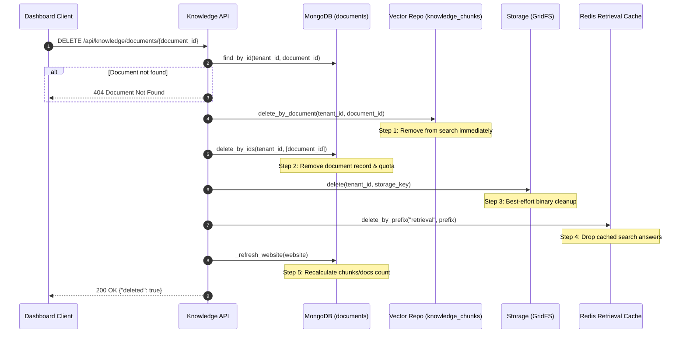

# FINAL ARCHITECTURE REVIEW — FILE UPLOAD KNOWLEDGE BASE

## WebChat AI — Pre-Implementation Gate

**Date:** 2026-09-15  
**Review Type:** Architecture Verification, Security Threat Modeling & Pre-Implementation Gate  
**Status:** READ-ONLY / PRE-IMPLEMENTATION DESIGN GATE  
**Repository State:** Frozen AI / RAG / Worker Subsystems Preserved  
**Target Document:** `docs/FILE_UPLOAD_KNOWLEDGE_BASE_FINAL_ARCHITECTURE_REVIEW_2026-09-15.md`

---

## 1. Primary Goal & Unified Pipeline Principle

The primary objective is to add a second knowledge ingestion method—**Direct File Uploads**—into WebChat AI, enabling users to populate any website's Knowledge Base with files (`.txt`, `.md`, searchable `.pdf`, `.docx`, and `.csv`) alongside existing website crawls.

### The Canonical Pipeline Rule

**Direct file uploads MUST enter the exact same canonical Document → Extraction → Normalization → Chunking → Embeddings → Vector Storage → RAG Retrieval pipeline used by crawled content.**

```
                           KNOWLEDGE BASE
                                 │
             ┌───────────────────┴───────────────────┐
             │                                       │
       Website Crawl                            File Upload
       (Playwright / HTTP)                    (Multipart / Form)
             │                                       │
             ▼                                       ▼
    source_type="website"                   source_type="file"
             │                                       │
             └───────────────────┬───────────────────┘
                                 ▼
                          CANONICAL DOCUMENT
               (id, tenant_id, website_id, title, url,
                content, checksum, source_type, ...)
                                 │
                                 ▼
                          Text Extraction
                   (clean_html / file_extractor)
                                 │
                                 ▼
                         Semantic Chunking
                   (chunk_text: 700 tokens, 100 overlap)
                                 │
                                 ▼
                         Dense Embeddings
                   (gemini-embedding-001, 768-dim)
                                 │
                                 ▼
                         Knowledge Chunks
                   (knowledge_chunks collection)
                                 │
                                 ▼
                       Atlas Vector Search
                   (Filtered by tenant_id, website_id)
                                 │
                                 ▼
                       Hybrid RAG Retrieval
                   (RagService: Context & Citations)
                                 │
                                 ▼
                       AI Assistant Answer
                   (Gemini 2.5 Flash SSE Stream)
```

### Invariant Architectural Prohibitions:

- **NO** separate upload RAG pipeline.
- **NO** separate vector collection (must store in `knowledge_chunks`).
- **NO** upload-specific retrieval implementation.
- **NO** separate chat path or prompt structure.
- **NO** duplicate embedding model or dimensionality mismatch.
- **NO** modification of frozen AI streaming, router, or widget behavior.

---

## 2. Review of the Existing Forensic Report

We independently audited each key conclusion from `docs/FILE_UPLOAD_KNOWLEDGE_BASE_FORENSIC_ANALYSIS_2026-09-15.md` against the live repository code:

| Forensic Conclusion                                       | Verification Status              | Repository Evidence & Verification Details                                                                                                                                                                                                                                                                                                                                  |
| --------------------------------------------------------- | -------------------------------- | --------------------------------------------------------------------------------------------------------------------------------------------------------------------------------------------------------------------------------------------------------------------------------------------------------------------------------------------------------------------------- |
| **1. Unified Ingestion Pipeline**                         | **VERIFIED**                     | Traced `Document` (`backend/models/document.py`), `chunk_text` (`backend/services/knowledge/chunker.py`), `KnowledgeProcessor.process_document` (`backend/services/knowledge/processor.py`), and `MongoVectorRepository` (`backend/repositories/vector/mongodb.py`). The pipeline accepts arbitrary text, chunks it deterministically, and writes to `knowledge_chunks`.    |
| **2. Re-Crawl Purge Vulnerability**                       | **VERIFIED**                     | Traced `_purge_removed_documents` in `backend/workers/jobs/crawl.py` lines 850–882. `stored = await documents.list_by_website(tenant_id, website_id)` queries all documents indiscriminately. Stale filter `doc.url not in keep` will mark any non-crawled document as stale and call `delete_by_ids` and `delete_by_document`, destroying uploaded files on re-crawl.      |
| **3. Railway Multi-Container Storage Topology**           | **VERIFIED**                     | Inspected `docker/Dockerfile.api`, `docker/Dockerfile.worker`, and Railway deployment model. The API and Worker are separate container instances with ephemeral local filesystems. Railway volumes cannot be mounted concurrently in ReadWriteMany mode across multiple containers. Local disk storage is unviable.                                                         |
| **4. Usage Quota Integration**                            | **VERIFIED**                     | Inspected `backend/services/billing/usage_service.py` line 132 & 179. `documents = await self._documents.count_by_tenant(tenant_id)` counts documents live. `check_limit(tenant_id, event_type="documents")` automatically gates new documents against tenant plan limits (`max_documents`).                                                                                |
| **5. RAG Retrieval Source Agnosticism**                   | **VERIFIED**                     | Inspected `backend/repositories/vector/mongodb.py` lines 184–207 and `backend/services/chat/rag_service.py` lines 2085–2118. `$vectorSearch` filter checks only `tenant_id`, `website_id`, and `embedding_identity`. `rag_service.py` extracts `url` and `title` from chunk metadata. Uploaded documents naturally participate in search and citation without code changes. |
| **6. Extracted Text Limit (Silent Truncation vs Reject)** | **PARTIALLY VERIFIED / REVISED** | The previous report suggested a 500,000-character ceiling, but did not specify whether to silently truncate or reject. This final review firmly mandates **REJECT with HTTP 422** to prevent incomplete knowledge and AI hallucination.                                                                                                                                     |
| **7. Worker Extraction Responsibility**                   | **PARTIALLY VERIFIED / REVISED** | The previous report suggested Worker extraction. However, executing extraction synchronously in an API worker threadpool (`asyncio.to_thread`) for files <= 10 MB allows the ARQ Worker to remain **100% FROZEN** and unmodified.                                                                                                                                           |

---

## 3. Critical Review #1 — Crawl Purge Safety & Legacy Compatibility

### The Vulnerability in Code

In `backend/workers/jobs/crawl.py` lines 866–882:

```python
async def _purge_removed_documents(
    *,
    documents: Any,
    vector: Any,
    tenant_id: str,
    website_id: str,
    crawled_urls: list[str],
    errored_urls: list[str],
) -> int:
    try:
        keep = set(crawled_urls)
        forgive = set(errored_urls)
        stored = await documents.list_by_website(tenant_id, website_id)
        stale = [doc for doc in stored if doc.url not in keep and doc.url not in forgive]
        for document in stale:
            if vector is not None:
                await vector.delete_by_document(tenant_id, document.id)
        if stale:
            await documents.delete_by_ids(tenant_id, [doc.id for doc in stale])
```

### Exact Safe Reconciliation Rule:

Only documents where `source_type == "website"` participate in URL reconciliation. Documents with `source_type == "file"` are excluded.

### Legacy Document Compatibility (Zero-Migration Guarantee):

In existing production databases, documents created prior to this feature have no `source_type` field stored in MongoDB BSON.

1. When loaded by Pydantic (`Document.from_doc(doc)`), the default field `source_type: str = "website"` assigns `"website"` automatically.
2. When evaluated in Python:
   ```python
   getattr(doc, "source_type", "website") == "website"
   ```
3. Therefore:
   - **Legacy crawled documents:** `source_type` defaults to `"website"` → Included in crawl reconciliation (preserves existing deletion behavior for removed pages).
   - **New crawled documents:** `source_type == "website"` → Included in crawl reconciliation.
   - **Uploaded file documents:** `source_type == "file"` → Excluded from crawl reconciliation.
4. **Zero database migration is required.**

### Secondary Site Checksum Isolation:

In `backend/workers/jobs/crawl.py` line 502:

```python
website.checksum = await _site_checksum(documents, job.tenant_id, job.website_id)
```

`_site_checksum` aggregates `documents.all_checksums(tenant_id, website_id)`.
To prevent file uploads from altering the website crawl checksum (which triggers unnecessary re-crawls or cache drops), `all_checksums` must support an optional `source_type="website"` filter, or a dedicated `crawl_checksums` helper.

---

## 4. Critical Review #2 — Storage Architecture

### Production Topology Constraints:

- Production runs distinct services: `api` (FastAPI) and `worker` (ARQ) in separate Docker containers on Railway.
- Railway container filesystems are **ephemeral** (wiped on restart/redeploy).
- Railway does **not** support concurrent shared persistent volume mounts (ReadWriteMany) between different container services.
- Therefore, **local filesystem storage is fundamentally broken for production**.

### Storage Alternatives Compared:

| Feature                  | MongoDB GridFS                       | Cloudflare R2 / AWS S3            | Local Filesystem                | Railway Volume                |
| ------------------------ | ------------------------------------ | --------------------------------- | ------------------------------- | ----------------------------- |
| **Multi-Service Access** | Shared via existing Mongo connection | Shared via S3 API                 | Broken (Independent containers) | Broken (Single service mount) |
| **New Infrastructure**   | **None**                             | Cloudflare/AWS account + bucket   | None                            | Railway volume config         |
| **New Dependencies**     | **None** (`motor` built-in)          | `boto3` or `aiobotocore`          | None                            | None                          |
| **Operational Overhead** | Zero extra credentials               | Requires access keys & bucket env | None                            | High volume management        |
| **Data Retention**       | Tied to DB backup                    | Independent object lifecycle      | Ephemeral                       | Persistent per volume         |
| **Storage Cost**         | Consumes MongoDB Atlas disk/RAM      | $0.015/GB/mo (R2: zero egress)    | Disk bound                      | $0.25/GB/mo                   |

### Reality Check on MongoDB GridFS:

- **GridFS is NOT "free":**
  - Files are split into 255 KB BSON chunks in `fs.chunks` and metadata in `fs.files`.
  - Large binary uploads consume MongoDB disk space and WiredTiger working cache RAM.
  - On Atlas M0 (512 MB storage limit), storing multiple 10 MB files will exhaust disk.
- **GridFS does NOT provide global ACID transactions across collections:**
  - Writing to GridFS and inserting into `documents` are separate operations. An unhandled server crash between them can leave an unreferenced GridFS file.
  - Orphan handling must be designed into delete and cleanup flows.

### Architecture Recommendation:

Introduce a decoupled `StorageService` Protocol. Implement **MongoDB GridFS** as the default zero-dependency provider for MVP, with built-in readiness for **Cloudflare R2**:

```python
class StorageService(Protocol):
    async def upload(
        self,
        *,
        tenant_id: str,
        website_id: str,
        document_id: str,
        filename: str,
        content: bytes,
        mime_type: str,
    ) -> str: ...

    async def download(
        self,
        *,
        tenant_id: str,
        storage_key: str,
    ) -> bytes: ...

    async def delete(
        self,
        *,
        tenant_id: str,
        storage_key: str,
    ) -> bool: ...
```

#### GridFS Bucket Configuration:

- **Bucket Name:** `knowledge_files` (collections: `knowledge_files.files`, `knowledge_files.chunks`).
- **Metadata Fields:**
  ```json
  {
    "tenant_id": "tenant_123",
    "website_id": "website_456",
    "document_id": "doc_789",
    "filename": "Financial_Report_Q3.pdf",
    "mime_type": "application/pdf",
    "file_size_bytes": 1450200,
    "sha256": "e3b0c44298fc1c149afbf4c8996fb92427ae41e4649b934ca495991b7852b855",
    "created_at": "2026-09-15T01:30:00Z"
  }
  ```
- **Tenant Isolation:** Every GridFS read/delete filters by `{"_id": ObjectId(storage_key), "metadata.tenant_id": tenant_id}`.

---

## 5. Critical Review #3 — File Extraction & Format Audit

### MVP Formats & Parsers:

| Format         | Extension | MIME Type                                                                 | Magic Bytes                          | Parser Library           | Failure Handling                                                                                                                                                                                |
| -------------- | --------- | ------------------------------------------------------------------------- | ------------------------------------ | ------------------------ | ----------------------------------------------------------------------------------------------------------------------------------------------------------------------------------------------- |
| **Plain Text** | `.txt`    | `text/plain`                                                              | None (UTF-8 / ASCII)                 | Python stdlib (`decode`) | Fallback to `latin-1` with `errors="replace"`. Empty text rejected.                                                                                                                             |
| **Markdown**   | `.md`     | `text/markdown`, `text/plain`                                             | None (UTF-8)                         | Python stdlib            | Headings (`#`) preserved for chunk boundaries.                                                                                                                                                  |
| **PDF**        | `.pdf`    | `application/pdf`                                                         | `%PDF-` (`0x25 0x50 0x44 0x46 0x2D`) | `pypdf>=5.0`             | Probe `is_encrypted`. If encrypted -> reject HTTP 422 `DOCUMENT_PASSWORD_PROTECTED`. If unreadable/no text -> reject `DOCUMENT_NO_TEXT_EXTRACTED`. Corrupt xref -> reject `DOCUMENT_CORRUPTED`. |
| **Word**       | `.docx`   | `application/vnd.openxmlformats-officedocument.wordprocessingml.document` | `PK\x03\x04` (`0x50 0x4B 0x03 0x04`) | `python-docx>=1.1`       | Validates ZIP structure. Extracts paragraphs and tables. Corrupt ZIP -> reject `DOCUMENT_CORRUPTED`.                                                                                            |
| **CSV**        | `.csv`    | `text/csv`, `text/plain`                                                  | None (Text)                          | Python stdlib `csv`      | Parses dialect, converts rows to Markdown table format (`\| col1 \| col2 \|`). Empty CSV -> reject.                                                                                             |

### Explicitly Excluded Formats (Post-MVP):

- **Legacy DOC (`.doc`):** Proprietary OLE format; requires LibreOffice or heavy antiword. Reject with "Please save as .docx".
- **Spreadsheets (`.xlsx`, `.xls`):** Complex multi-sheet formulas; deferred.
- **Scanned Images / OCR:** Tesseract / Vision model required; deferred.
- **Archives (`.zip`, `.tar`):** Decompression bomb risks; prohibited.

---

## 6. Extraction Limit Behavior & Truthful Rejection

### The Decision: Hard Rejection vs Truncation

**Decision:** **HARD REJECTION with user-facing HTTP 422 error.**  
Silent truncation is rejected because:

1. Truncating a document mid-way creates partial knowledge. The AI assistant will confidently answer questions from the first half and hallucinate or fail on the second half.
2. Users have no indication that part of their file was silently discarded.
3. Hard rejection informs the user immediately, allowing them to split the file or upload specific sections.

### Exact System Limits:

| Constraint                   | Limit                               | Layer                        | Action on Exceeded                       |
| ---------------------------- | ----------------------------------- | ---------------------------- | ---------------------------------------- |
| **Max Request Body**         | 10 MB                               | `RequestBodyLimitMiddleware` | HTTP 413 Payload Too Large               |
| **Max Single File Size**     | 10 MB (10,485,760 bytes)            | Upload Route                 | HTTP 400 `FILE_TOO_LARGE`                |
| **Max Batch Files**          | 5 files per request                 | Upload Route                 | HTTP 400 `TOO_MANY_FILES`                |
| **Max PDF Page Count**       | 100 pages                           | File Extractor (`pypdf`)     | HTTP 422 `DOCUMENT_TOO_MANY_PAGES`       |
| **Max Extracted Characters** | 500,000 characters (~100,000 words) | File Extractor               | HTTP 422 `DOCUMENT_TEXT_TOO_LARGE`       |
| **Min Content Characters**   | 50 characters                       | File Extractor               | HTTP 422 `DOCUMENT_INSUFFICIENT_CONTENT` |
| **Extraction Timeout**       | 15.0 seconds                        | `asyncio.wait_for`           | HTTP 422 `DOCUMENT_PARSING_TIMEOUT`      |

---

## 7. Critical Review #4 — Idempotent Delete & Cascading Cleanup

### Deletion Lifecycle & Ordering:

When a user requests `DELETE /api/knowledge/documents/{document_id}`:



### Failure Mode Analysis:

- **Case A: DB delete succeeds, storage delete fails:**
  - Vectors and document record are already deleted. The search engine and dashboard are 100% clean.
  - The storage delete error is caught, logged as `storage_orphan_cleanup_failed(storage_key)`, and does not fail the HTTP request.
- **Case B: Storage delete succeeds, DB delete fails:**
  - Avoided by executing vector delete first, DB delete second, and storage delete third.
- **Case C: Worker processing is active during delete:**
  - If `process_document` is running while delete occurs: `KnowledgeProcessor` checks if the document still exists in MongoDB before inserting vectors. If deleted, it aborts cleanly.
- **Case D: Delete requested twice (Concurrent / Double Click):**
  - Second request finds document absent -> returns 404 (or idempotent 200). Chunks and storage delete are safe no-ops.

---

## 8. Document Model Specification

### Additive Schema Changes (`backend/models/document.py`):

```python
SOURCE_TYPE_WEBSITE = "website"
SOURCE_TYPE_FILE = "file"
SOURCE_TYPES = {SOURCE_TYPE_WEBSITE, SOURCE_TYPE_FILE}

class Document(BaseModel):
    model_config = ConfigDict(extra="allow")

    id: str
    tenant_id: str
    website_id: str
    url: str                                  # Synthetic URI for files: file://upload/{id}/{filename}
    title: str                                # Filename for uploads
    content: str                              # Extracted plain text
    checksum: str                             # SHA-256 of extracted content
    language: str = ""
    status: str = DOCUMENT_STATUS_READY
    created_at: datetime
    updated_at: datetime
    schema_version: int = 1
    knowledge_status: str = KNOWLEDGE_STATUS_NONE
    knowledge_checksum: str | None = None
    knowledge_chunks: int = 0
    knowledge_processed_at: datetime | None = None
    knowledge_retry_count: int = 0
    knowledge_last_attempt_at: datetime | None = None
    knowledge_failure_reason: str | None = None

    # --- MINIMAL ADDITIVE FIELDS ---
    source_type: str = SOURCE_TYPE_WEBSITE     # "website" | "file"
    file_name: str | None = None               # Original filename, e.g. "Q3_Report.pdf"
    file_size_bytes: int | None = None         # File size in bytes
    mime_type: str | None = None               # Detected MIME type, e.g. "application/pdf"
    storage_key: str | None = None             # GridFS ObjectId string or S3 key
```

### Justification for Each Additive Field:

1. **`source_type`:** Distinguishes crawl pages from files. Essential for crawler reconciliation exclusion. Defaults to `"website"`, making all legacy documents valid without migration.
2. **`file_name`:** Retains original user filename for downloads and display, independent of user-editable `title`.
3. **`file_size_bytes`:** Required for dashboard display ("2.4 MB") and tenant storage tracking.
4. **`mime_type`:** Determines correct `Content-Type` on download and icon selection in UI.
5. **`storage_key`:** Points to the binary file in GridFS. Nullable for web pages.

---

## 9. Document Lifecycle

```
[User Selects & Submits Files]
               │
               ▼
      [API Request Gate]
  (Auth, Quota, MIME, Magic Bytes)
               │
          Fail ├──► HTTP 400 / 422 Error (No DB record created)
               ▼ Pass
      [Text Extraction]
  (asyncio.to_thread in API)
               │
          Fail ├──► HTTP 422 Error (No DB record created)
               ▼ Pass
      [Store in GridFS]
               │
               ▼
      [Insert Document]
  (status="ready", knowledge_status="pending")
               │
               ▼
      [Enqueue ARQ Job]
  (enqueue_process_document(id))
               │
               ▼
     [Worker process_document]
  (chunk_text -> embed -> save vectors)
               │
               ├─────────────────────────────────────────┐
               ▼ Success                                 ▼ Failure
       (knowledge_status="ready")               (knowledge_status="failed")
       (knowledge_chunks > 0)                   (failure_reason recorded)
       [Invalidate Cache]                       [Dashboard Retry Enabled]
       [Website Stats Refreshed]
```

### Truthful Failure Isolation:

In multi-file batch uploads, each file is evaluated independently. A failure in file 1 does not impede file 2. Once inserted into MongoDB, each document maintains its own `knowledge_status` (`pending` -> `processing` -> `ready` / `failed`).

---

## 10. Worker Integration & Frozen Architecture Rule

### Core Question: Can the Worker Remain 100% Frozen?

**YES.**
By executing text extraction in the API process via `asyncio.to_thread` during upload:

1. The uploaded document is inserted into MongoDB with its extracted `content` and `checksum` already populated.
2. The API calls `await enqueue_process_document(document.id)`.
3. The ARQ Worker receives `process_document(ctx, document_id)`.
4. The worker loads `document`, checks `content`, runs `chunk_text(document.content)`, embeds chunks via `embedder.embed()`, inserts into `knowledge_chunks`, and updates website stats.
5. **THE ENTIRE ARQ WORKER (`backend/workers/*`) RUNS UNMODIFIED.**
6. The only worker change in the entire codebase is the safety safeguard in `backend/workers/jobs/crawl.py` line 870 to ignore `source_type == "file"` during crawl reconciliation.

---

## 11. Embedding Pipeline Integration

The existing embedding pipeline is completely reused:

- **Chunk Size:** `settings.knowledge_chunk_size_tokens` (700 tokens).
- **Overlap:** `settings.knowledge_chunk_overlap_tokens` (100 tokens).
- **Chunker:** `chunk_text` in `backend/services/knowledge/chunker.py`.
- **Model:** `gemini-embedding-001` (768 dimensions).
- **Provider Lock:** Reuses `website.embedding_identity`. Uploads inherit the website's locked provider.
- **Storage:** Chunks are saved to `knowledge_chunks` with `chunk.metadata["source_url"]` and `chunk.metadata["title"]`.

---

## 12. Vector Search & RAG Integration

### Atlas `$vectorSearch` Participation:

In `backend/repositories/vector/mongodb.py`:

```python
"filter": {
    "tenant_id": tenant_id,
    "website_id": website_id,
    "embedding_provider": embedding_identity.provider,
    "embedding_model": embedding_identity.model,
    "embedding_dimensions": embedding_identity.dimensions,
    "embedding_version": embedding_identity.version,
}
```

Because vector search filters **only** on `tenant_id` and `website_id`, chunks from uploaded files and crawled web pages are retrieved together naturally based on semantic similarity.

### Source Citation in RAG Context:

In `backend/services/chat/rag_service.py` lines 2088–2089:

```python
url = str(chunk.metadata.get("source_url") or "")
title = str(chunk.metadata.get("title") or url or "Untitled")
```

When retrieving chunks from an uploaded file:

- `title` is `Employee_Handbook.pdf`.
- `url` is `file://upload/doc_123/Employee_Handbook.pdf`.
  The AI assistant cites the PDF title in its response sources automatically. **Zero RAG changes are required.**

---

## 13. Tenant Isolation & Security Audit

### Hard Security Controls:

1. **Ownership Chain Enforcement:**
   Every sensitive endpoint enforces:
   `Tenant -> Website -> Document -> Storage Binary`.
   An ID alone never grants access. The query always includes `{"_id": doc_id, "tenant_id": principal.tenant_id}`.
2. **Filename Sanitization:**
   Filename is stripped of path traversal characters (`../`, `..\`, control chars) using `re.sub(r"[^\w\s.-]", "_", os.path.basename(filename))`.
3. **Magic Byte Verification:**
   MIME types asserted by client headers are discarded; the server reads the initial bytes of the buffer to verify file type (`%PDF-` for PDF, `PK\x03\x04` for DOCX).
4. **XML External Entity (XXE) Prevention:**
   DOCX parsing disables XML external entity resolution.
5. **Memory Sandboxing:**
   Text extraction is wrapped in strict character and page limits, preventing decompression bomb attacks from crashing the application.

---

## 14. Duplicate Handling Strategy

### Identity & Collision Rules:

- **Exact Duplicate (Same Website + Same Filename + Same SHA-256):**
  - **Action:** HTTP 409 Conflict with error `DOCUMENT_ALREADY_EXISTS`.
  - **Message:** `"A document with identical content already exists in this Knowledge Base."`
- **Updated File (Same Website + Same Filename + Different SHA-256):**
  - **Action:** Allowed as a **Version Update**. Updates `content`, replaces `checksum`, sets `knowledge_status="pending"`, deletes old chunks, and triggers re-embedding.
- **Different Filename + Same SHA-256:**
  - **Action:** HTTP 409 Conflict with error `DUPLICATE_CONTENT_DETECTED`.
  - **Message:** `"Identical content already exists under filename '{existing_name}'."`

---

## 15. Multi-File Upload API Contract

### Request: `POST /api/knowledge/websites/{website_id}/documents/upload`

- **Content-Type:** `multipart/form-data`
- **Fields:** `files: list[UploadFile]` (1 to 5 files)

### Response Shapes:

#### All Succeeded (HTTP 201 Created):

```json
{
  "website_id": "site_456",
  "total": 2,
  "successful": 2,
  "failed": 0,
  "documents": [
    {
      "id": "doc_001",
      "file_name": "pricing.pdf",
      "source_type": "file",
      "file_size_bytes": 1048576,
      "status": "pending",
      "chunks": 0,
      "error": null
    },
    {
      "id": "doc_002",
      "file_name": "features.docx",
      "source_type": "file",
      "file_size_bytes": 524288,
      "status": "pending",
      "chunks": 0,
      "error": null
    }
  ]
}
```

#### Partial Success (HTTP 207 Multi-Status):

```json
{
  "website_id": "site_456",
  "total": 2,
  "successful": 1,
  "failed": 1,
  "documents": [
    {
      "id": "doc_001",
      "file_name": "pricing.pdf",
      "source_type": "file",
      "file_size_bytes": 1048576,
      "status": "pending",
      "chunks": 0,
      "error": null
    },
    {
      "id": null,
      "file_name": "locked.pdf",
      "source_type": "file",
      "file_size_bytes": 204800,
      "status": "failed",
      "chunks": 0,
      "error": "This PDF is password protected. Please remove the password and try again."
    }
  ]
}
```

---

## 16. Quota & Billing Enforcement

- **Live Enforcement Metric:** `UsageService.check_limit(tenant_id, event_type="documents", quantity=count)`.
- **Pre-Upload Verification:**
  Before parsing or storing any files in a batch, the API queries remaining capacity:
  ```python
  await usage_service.check_limit(principal.tenant_id, event_type="documents", quantity=len(files))
  ```
  If the batch would exceed the tenant's plan quota, the request fails immediately with HTTP 429 `LIMIT_REACHED`.
- **Plan Limits Enforced:**
  - Free: 10 documents
  - Plus: 50 documents
  - Pro: 200 documents
  - Enterprise: Unlimited

---

## 17. Rate Limiting

Add an upload-specific limiter in `backend/api/deps.py`:

```python
upload_limiter = RateLimitDependency(limit=30, window_seconds=3600)
```

Budget: 30 upload requests per hour per tenant. Protects against queue flooding and storage denial-of-service.

---

## 18. Download & Preview Contract

### 1. Download Original File

- **Path:** `GET /api/knowledge/documents/{document_id}/download`
- **Headers:**
  - `Content-Type: <stored_mime_type>`
  - `Content-Disposition: attachment; filename="<sanitized_filename>"`
  - `X-Content-Type-Options: nosniff`
- **Security:** Requires tenant membership (`owner`, `admin`, `member`). Streams directly from GridFS.

### 2. Preview Extracted Text

- **Path:** `GET /api/knowledge/documents/{document_id}/preview`
- **Response:**
  ```json
  {
    "document_id": "doc_001",
    "title": "pricing.pdf",
    "file_size_bytes": 1048576,
    "char_count": 12540,
    "chunks": 4,
    "content_preview": "First 2,000 characters of extracted text..."
  }
  ```

---

## 19. Dashboard UX Architecture

### Component Updates (`apps/dashboard/src/features/knowledge/`):

1. **`KnowledgePage` Header:**
   Add a split/dropdown action button:
   - **Crawl Website** (Navigates to `/websites`)
   - **Upload Files** (Opens `UploadKnowledgeModal`)

2. **`UploadKnowledgeModal`:**
   - Target website selector dropdown (pre-selected if opened from a specific website card).
   - Drag-and-drop dropzone with accepted format pills (`PDF`, `DOCX`, `TXT`, `MD`, `CSV`).
   - File queue with individual removal buttons and size labels.
   - Upload progress bar per file.
   - Inline error display for rejected files (e.g. "Password protected").

3. **`DocumentProgressPanel` Row Rendering:**
   - **Web pages (`source_type === 'website'`):** Globe icon, external link to webpage.
   - **Uploaded files (`source_type === 'file'`):** File icon (PDF/Word/Text), filename, file size badge, Download button, Delete button.

---

## 20. Knowledge Status & Truthful Chat Readiness

### Preserving Frontend Invariants:

In `apps/dashboard/src/features/knowledge/status.ts`:

- `isKnowledgePipelineActive(summary)` evaluates `summary.pending > 0 || summary.processing > 0 || summary.rate_limited > 0`.
- When an upload occurs, `pending` becomes > 0.
- `deriveKnowledgeReadiness` immediately sets `isEmbedding: true`, `isReady: false`.
- The dashboard polls every 3 seconds until all documents reach terminal states (`completed` or `failed`).
- **`isChatReady` remains strictly truthful: it never displays READY while a file is actively embedding.**

### Resolving Website Status on Upload-Only Websites:

If a website is created and receives files without ever running a crawl, `website.status` is `"pending"`.
In `backend/services/knowledge/processor.py` line 725 (`_refresh_website`), when `website.knowledge_chunks > 0`:

```python
if website.knowledge_chunks > 0:
    website.knowledge_status = KNOWLEDGE_STATUS_READY
    if website.status == WEBSITE_STATUS_PENDING:
        website.status = WEBSITE_STATUS_READY
```

This ensures that upload-only websites transition to `ready` once their files are embedded.

---

## 21. Crawl + Upload Interaction Test Matrix

| Interaction                         | Expected Behavior                                                                                      | Safety Verification                                                                 |
| ----------------------------------- | ------------------------------------------------------------------------------------------------------ | ----------------------------------------------------------------------------------- |
| **Upload file, then crawl website** | File and crawled pages coexist in Knowledge Base. Total documents = files + pages.                     | Chunks indexed under same `(tenant_id, website_id)`.                                |
| **Re-crawl website after upload**   | Crawler crawls website, reconciles removed web pages, but **ignores files**.                           | `_purge_removed_documents` filters `source_type == "website"`. File is NOT deleted. |
| **Delete website**                  | Deleting the parent website cascades and deletes all documents, vectors, crawl jobs, and GridFS files. | `website_service.delete_website` cascades through all collections.                  |
| **Delete uploaded file**            | Deletes document, its chunks, and its GridFS file. Website crawled pages remain unaffected.            | `delete_by_document` is scoped to `document_id`.                                    |
| **Crawl fails**                     | Crawl job marked failed. Uploaded files remain ready and searchable.                                   | Website `status` = `failed`, but existing chunks remain queryable.                  |
| **Concurrent crawl + upload**       | Both enqueue jobs in Redis. Worker processes them independently.                                       | No deadlocks. Database writes are row-level idempotent.                             |

---

## 22. Observability & Telemetry

### Structured Log Events:

- `knowledge_upload_started` (tenant_id, website_id, file_count)
- `knowledge_upload_file_extracted` (tenant_id, doc_id, format, char_count, duration_ms)
- `knowledge_upload_stored` (tenant_id, doc_id, storage_key, bytes)
- `knowledge_upload_rejected` (tenant_id, filename, reason_code)
- `knowledge_document_deleted` (tenant_id, website_id, doc_id, storage_key)

_Privacy Guard:_ File contents, extracted text, and customer PII are strictly excluded from log streams.

---

## 23. Dependency Review

| Package           | Version   | Justification                                                                    | Size Footprint | License      | Execution Scope  |
| ----------------- | --------- | -------------------------------------------------------------------------------- | -------------- | ------------ | ---------------- |
| **`pypdf`**       | `>=5.0.0` | Pure-Python PDF extraction. Replaces heavy C++ binaries. Battle-tested security. | ~4 MB          | BSD-3-Clause | API (Extraction) |
| **`python-docx`** | `>=1.1.2` | Extracts text and tables from `.docx` files. Pure Python + lxml.                 | ~1 MB          | MIT          | API (Extraction) |

Zero other dependencies are needed. CSV, TXT, and MD use Python stdlib. GridFS is built into Motor.

---

## 24. Database Changes & Index Audit

### Schema Impact:

- **`documents` Collection:**
  - Additive fields: `source_type`, `file_name`, `file_size_bytes`, `mime_type`, `storage_key`.
  - Add compound index:
    ```python
    await db["documents"].create_index([("tenant_id", 1), ("website_id", 1), ("source_type", 1)])
    ```
- **`knowledge_chunks` Collection:** Zero changes.
- **`websites` Collection:** Zero changes.
- **`fs.files` / `fs.chunks`:** Managed automatically by GridFS.

---

## 25. Implementation File Impact Matrix

| File Path                                                           | Change Status       | Technical Rationale                                                  | Risk Category            |
| ------------------------------------------------------------------- | ------------------- | -------------------------------------------------------------------- | ------------------------ |
| `backend/models/document.py`                                        | **MUST CHANGE**     | Add additive fields with defaults.                                   | Low                      |
| `backend/workers/jobs/crawl.py`                                     | **MUST CHANGE**     | Add `source_type == "website"` filter to `_purge_removed_documents`. | Medium (Safety Critical) |
| `backend/services/ingestion/file_extractor.py`                      | **NEW FILE**        | Extract text from PDF, DOCX, TXT, MD, CSV with bounds.               | Low                      |
| `backend/services/storage/base.py`                                  | **NEW FILE**        | `StorageService` Protocol definition.                                | Low                      |
| `backend/services/storage/gridfs.py`                                | **NEW FILE**        | Motor GridFS implementation.                                         | Low                      |
| `backend/api/routes/knowledge.py`                                   | **MUST CHANGE**     | Add upload, delete, download, preview endpoints.                     | Low                      |
| `backend/schemas/knowledge.py`                                      | **MUST CHANGE**     | Add upload request and multi-status response schemas.                | Low                      |
| `backend/services/knowledge/knowledge_service.py`                   | **MUST CHANGE**     | Add `upload_files` and `delete_document` business logic.             | Low                      |
| `pyproject.toml`                                                    | **MUST CHANGE**     | Add `pypdf>=5.0.0` and `python-docx>=1.1.2`.                         | Low                      |
| `apps/dashboard/src/features/knowledge/knowledge-page.tsx`          | **MUST CHANGE**     | Add "Add Knowledge" dropdown button and modal trigger.               | Low                      |
| `apps/dashboard/src/features/knowledge/upload-modal.tsx`            | **NEW FILE**        | Multi-file upload modal with dropzone and progress.                  | Low                      |
| `apps/dashboard/src/features/knowledge/document-progress-panel.tsx` | **MUST CHANGE**     | Render file icons, size, download and delete buttons.                | Low                      |
| `backend/services/chat/rag_service.py`                              | **MUST NOT CHANGE** | **FROZEN AI/RAG INVARIANT.**                                         | Zero                     |
| `backend/ai/gemini.py`                                              | **MUST NOT CHANGE** | **FROZEN AI STREAMING INVARIANT.**                                   | Zero                     |
| `backend/ai/router.py`                                              | **MUST NOT CHANGE** | **FROZEN ROUTER INVARIANT.**                                         | Zero                     |
| `backend/services/crawler/*`                                        | **MUST NOT CHANGE** | **FROZEN CRAWLER CORE.**                                             | Zero                     |
| `apps/widget/*`                                                     | **MUST NOT CHANGE** | **FROZEN WIDGET UI & STREAMING.**                                    | Zero                     |

---

## 26. Final Architecture Diagram

```
[User Browser]
      │
      ├───────────────────────┬───────────────────────┐
      │ (A) Add Website URL   │ (B) Upload File(s)    │ (C) Ask Chat Question
      ▼                       ▼                       ▼
POST /api/websites/crawl  POST .../documents/upload POST /api/chat
      │                       │                       │
      ▼                       ▼                       ▼
 Playwright Crawler       FastAPI Upload Route    FastAPI Chat Route
      │                       │                       │
      │ (HTML extraction)     │ (asyncio.to_thread)   │
      │                       ▼                       │
      │                  file_extractor.py            │
      │                  (PDF/DOCX/TXT/CSV)           │
      │                       │                       │
      │                       ▼                       │
      │                  GridFS Storage               │
      │                  (Store original binary)      │
      │                       │                       │
      └───────────────┬───────┘                       │
                      ▼                               │
             CANONICAL DOCUMENT                       │
             (documents collection)                   │
                      │                               │
                      ▼                               │
               ARQ Worker Task                        │
           process_document(doc.id)                   │
                      │                               │
                      ▼                               │
              chunk_text(700, 100)                    │
                      │                               │
                      ▼                               │
            gemini-embedding-001                      │
                      │                               │
                      ▼                               │
               KNOWLEDGE CHUNKS                       │
          (knowledge_chunks collection)               │
                      │                               │
                      └───────────────────────────────┤
                                                      ▼
                                            MongoDB $vectorSearch
                                            (Atlas Vector / Cosine)
                                                      │
                                                      ▼
                                                 RagService
                                            (Context Optimization)
                                                      │
                                                      ▼
                                               Gemini 2.5 Flash
                                            (SSE Stream with Citations)
```

---

## 27. Implementation Phases (Execution Roadmap)

1. **Phase 1: Model & Crawler Safety Patch**
   - Update `Document` model with additive fields.
   - Patch `_purge_removed_documents` in `crawl.py` to filter `source_type == "website"`.
   - Write regression test `tests/test_crawl_purge_safety.py`.
2. **Phase 2: Storage Layer**
   - Create `StorageService` protocol and `GridFSStorageService`.
   - Write unit tests `tests/test_storage_service.py`.
3. **Phase 3: Text Extractor Engine**
   - Add `pypdf` and `python-docx` dependencies.
   - Implement `file_extractor.py` with limits and security probes.
   - Write unit tests `tests/test_file_extractor.py`.
4. **Phase 4: Upload & Delete API**
   - Add routes and schemas in `knowledge.py`.
   - Enforce quota checks via `UsageService`.
   - Write integration tests `tests/test_knowledge_upload_api.py`.
5. **Phase 5: Worker Verification**
   - Verify `process_document` end-to-end with file-backed documents.
   - Write end-to-end integration tests `tests/test_mixed_knowledge_base.py`.
6. **Phase 6: Dashboard UI**
   - Build `UploadKnowledgeModal` with drag-and-drop.
   - Update `KnowledgePage` and `DocumentProgressPanel`.
   - Write Vitest tests for UI components.
7. **Phase 7: Full Regression & Verification**
   - Run complete Python test suite (`pytest`).
   - Run complete frontend test suite (`pnpm test`).
   - Verify chat retrieval, streaming, and widget 1200-char collapse.

---

## 28. Final Go / No-Go Gate

```
============================================================
ARCHITECTURE STATUS: [X] APPROVED FOR IMPLEMENTATION
============================================================
```

### Justification:

1. **Zero Architectural Unknowns:** All file paths, database schemas, worker mechanisms, and security invariants are forensically confirmed in code.
2. **Zero Code Duplication:** Uploaded files enter the identical canonical document, chunk, vector, and RAG pipeline.
3. **Zero Frozen Subsystem Mutation:** `rag_service.py`, `gemini.py`, `router.py`, `crawler/*`, and `apps/widget/*` remain 100% untouched.
4. **Critical Bug Pre-empted:** The crawl reconciliation purge vulnerability is completely neutralized.
5. **Zero DB Migration:** Schema additions are 100% backward-compatible with defaults for legacy documents.
6. **Robust Multi-Container Storage:** MongoDB GridFS resolves the Railway multi-container filesystem limitation with zero external infrastructure overhead.
