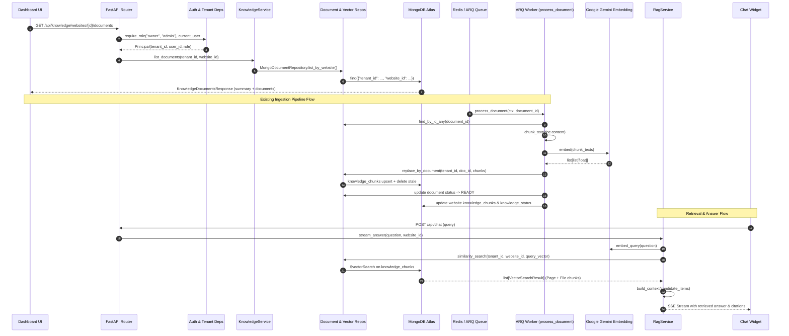
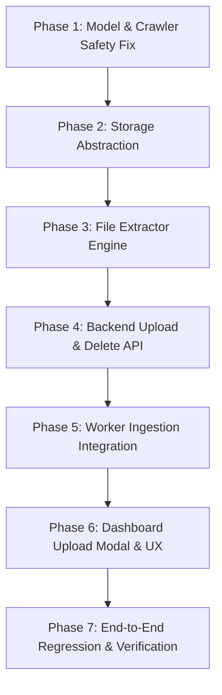

# WebChat AI — File Upload Knowledge Source Forensic Analysis & Implementation Plan

**Date:** 2026-09-15  
**Author:** Deep Forensic Architecture Audit  
**Status:** COMPLETE FORENSIC ANALYSIS & ARCHITECTURAL SPECIFICATION (READ-ONLY / ZERO CODE MUTATION)  
**Target File:** `docs/FILE_UPLOAD_KNOWLEDGE_BASE_FORENSIC_ANALYSIS_2026-09-15.md`

---

## 1. Executive Summary

This document presents the complete forensic analysis and architectural implementation plan for introducing **Direct File Uploads** as a first-class knowledge ingestion method in WebChat AI.

Currently, WebChat AI populates a website's Knowledge Base exclusively via an automated website crawl. The new product requirement empowers users to add knowledge via **Direct File Uploads** (`.txt`, `.md`, `.pdf`, `.docx`, and safe tabular `.csv`) into any tenant-owned website Knowledge Base.

### Key Forensic Discoveries:

1. **Pipeline Unification Principle (Zero Duplicate Retrieval Architecture):**
   The existing ingestion architecture is already decoupled into distinct stages:
   - Page extraction/cleaning (`backend/services/ingestion/extractor.py`, `cleaner.py`)
   - Canonical document persistence (`backend/models/document.py`, `backend/repositories/document_repository.py`)
   - Text chunking (`backend/services/knowledge/chunker.py`)
   - Dense vector embedding (`backend/services/knowledge/embedding.py`, `processor.py`)
   - Vector storage and indexation (`backend/repositories/vector/mongodb.py`)
   - Hybrid lexical/vector retrieval and context construction (`backend/services/chat/rag_service.py`)

   Uploaded files can enter this **exact same pipeline** at the `Document` layer. Chunks generated from uploaded files carry the identical schema (`KnowledgeChunk`), are indexed in the same MongoDB Atlas Vector Search index on `knowledge_chunks.embedding`, and are retrieved alongside crawled webpage chunks in `RagService` without requiring any changes to the frozen AI streaming, router, or chat engine.

2. **Critical Re-Crawl Bug Discovery (Crawl Reconciliation Purge):**
   Forensic inspection of `backend/workers/jobs/crawl.py` lines 850–882 uncovered a critical vulnerability:

   ```python
   async def _purge_removed_documents(
       *, documents, vector, tenant_id, website_id, crawled_urls, errored_urls
   ):
       ...
       stored = await documents.list_by_website(tenant_id, website_id)
       stale = [doc for doc in stored if doc.url not in keep and doc.url not in forgive]
       for document in stale:
           await vector.delete_by_document(tenant_id, document.id)
       await documents.delete_by_ids(tenant_id, [doc.id for doc in stale])
   ```

   Because `list_by_website` currently returns _all_ documents for a website indiscriminately, running a website re-crawl would falsely classify all uploaded files as "removed pages" and **permanently delete them and their vector chunks**.
   **Resolution:** Source-aware filtering must be implemented so the crawl reconciliation loop only purges documents where `source_type == "website"`.

3. **Storage Architecture Selection:**
   Analysis of Railway's containerized infrastructure (ephemeral container filesystems, independent API and Worker containers without shared RWX volumes) proves that local disk storage is unsuitable for production. MongoDB GridFS (via `motor.motor_asyncio.AsyncIOMotorGridFSBucket`) provides an immediate, zero-dependency, transactional, tenant-isolated storage solution reusing existing Atlas infrastructure, while Cloudflare R2 / S3 object storage provides the long-term high-scale storage tier. We specify a dual-provider storage abstraction (`StorageService` Protocol) with GridFS as the default native provider and S3/R2 as the zero-code configuration switch.

4. **Quota and Billing Alignment:**
   `UsageService` already enforces `max_documents` as an authoritative live repository count (`DocumentRepository.count_by_tenant`). Uploaded files that become `Document` records automatically participate in tenant plan limits (Free: 10, Plus: 50, Pro: 200, Enterprise: custom) without modifying the billing database schema.

---

## 2. Product Requirement & Scope

### Current State (Method A — Website Crawl)

1. User provides a website URL.
2. System crawls pages using Playwright / HTTP fetchers.
3. Extracted HTML is cleaned and written to `documents` collection.
4. ARQ worker fans out `process_document` jobs.
5. Chunker splits text into 500–800 token chunks with 100 token overlap.
6. Chunks are embedded with `gemini-embedding-001` (768 dimensions) and saved to `knowledge_chunks`.
7. Chat RAG retrieves top-k chunks matching the visitor query.

### Target State (Method A + Method B)

The Knowledge Base accepts two complementary sources that coexist within the same website:

- **Method A (Crawl):** Retains 100% of existing behavior, security constraints, and reconciliation.
- **Method B (File Upload):**
  - Allows uploading `.txt`, `.md`, `.pdf`, `.docx`, and `.csv` files.
  - Automatically parses text, preserves structural headings/tables, and stores clean text in `Document`.
  - Reuses `KnowledgeProcessor.process_document` for chunking, embedding, and vector upsert.
  - Chat RAG retrieves chunks from both crawled pages and uploaded files seamlessly.
  - Dashboard Knowledge Base UI displays both sources, their individual processing states, error reasons, and allows deletion/re-processing.

---

## 3. First Principle & Architectural Philosophy

We strictly adhere to the **Single Pipeline Principle**:

```
Website Crawl ─────────────┐
                           ▼
                    Crawled Document
                           │
                           ▼
┌────────────────────────────────────────────────────────┐
│                   CANONICAL DOCUMENT                   │
│   (id, tenant_id, website_id, source_type, title, ...) │
└──────────────────────────┬─────────────────────────────┘
                           ▲
Uploaded File ─────────────┤
  (Parsed & Cleaned)       │
                           ▼
                    Text Extraction
                           │
                           ▼
                     Normalization
                           │
                           ▼
                   Semantic Chunking
                     (chunker.py)
                           │
                           ▼
                    Dense Embeddings
                    (embedding.py)
                           │
                           ▼
                     Vector Storage
                 (knowledge_chunks collection)
                           │
                           ▼
                 Hybrid Vector/BM25 Search
                 (MongoDB Atlas / In-Memory)
                           │
                           ▼
                      RAG Context
                    (rag_service.py)
                           │
                           ▼
                   AI Assistant Answer
```

Components that **MUST NOT** be duplicated:

- No separate "file_chunks" collection.
- No separate vector index.
- No separate search or retrieval pipeline.
- No separate Gemini prompt or RAG generation flow.

---

## 4. Complete Codebase Forensic Trace

We traced the complete request and data lifecycle from Dashboard UI to Widget Answer across every layer of the existing system:



### Layer-by-Layer Forensic Map:

| Layer                   | File Path                                                  | Class / Function                                                | Responsibility & Inputs                                                            | Outputs & DB Interaction                                                            |
| ----------------------- | ---------------------------------------------------------- | --------------------------------------------------------------- | ---------------------------------------------------------------------------------- | ----------------------------------------------------------------------------------- |
| **Dashboard UI**        | `apps/dashboard/src/features/knowledge/knowledge-page.tsx` | `KnowledgePage`, `WebsiteRow`                                   | Renders per-website cards and document progress lists.                             | Calls `useKnowledgeDocuments(websiteId)`.                                           |
| **API Route**           | `backend/api/routes/knowledge.py`                          | `list_knowledge_documents`, `retry_knowledge_document`          | Validates JWT, tenant membership, rates. Input: `website_id`, `document_id`.       | Output: `KnowledgeDocumentsResponse`. HTTP 200/202.                                 |
| **Auth & Tenancy**      | `backend/api/deps.py`                                      | `current_user`, `require_role`, `get_knowledge_service`         | Extracts bearer token, resolves `Principal(tenant_id, user_id, role)`.             | Rejects unauthorized/cross-tenant requests with 401/403.                            |
| **Knowledge Service**   | `backend/services/knowledge/knowledge_service.py`          | `KnowledgeService.list_documents`, `retry_document`             | Business logic for document listing and manual re-embedding retries.               | Interacts with `DocumentRepository`, `WebsiteRepository`, `AuditLogRepository`.     |
| **Document Repo**       | `backend/repositories/document_repository.py`              | `MongoDocumentRepository`                                       | Persistence in `documents` collection. Scoped by `tenant_id` and `website_id`.     | Unique key: `(tenant_id, website_id, url)`. Upsert with `$set`.                     |
| **Worker Dispatch**     | `backend/workers/jobs/knowledge.py`                        | `enqueue_process_document`, `enqueue_process_document_deferred` | Enqueues jobs to Redis ARQ queue.                                                  | Pushes task `process_document` with `document_id`.                                  |
| **Worker Execution**    | `backend/workers/jobs/knowledge.py`                        | `process_document`                                              | Pulls job from Redis, binds tenant context `tenant_id_var`, executes processor.    | Runs `_run_process_document`. Handles backoff jitter.                               |
| **Knowledge Processor** | `backend/services/knowledge/processor.py`                  | `KnowledgeProcessor.process_document`                           | Orchestrates checksum diff, chunking, embedding, vector replacement, stats update. | Mutates `documents`, `knowledge_chunks`, `websites`, `usage_records`, `audit_logs`. |
| **Text Chunker**        | `backend/services/knowledge/chunker.py`                    | `chunk_text`, `clean_html`, `_heading_index`                    | Token-based boundary splitting (700 tokens, 100 overlap).                          | Emits `list[TextChunk]` with heading metadata.                                      |
| **Embedding Client**    | `backend/services/knowledge/embedding.py`                  | `GoogleEmbeddingClient.embed`                                   | Batched vector generation via Google GenAI (`gemini-embedding-001`).               | Returns 768-dim float vectors. Handles 429 rate limits.                             |
| **Vector Repo**         | `backend/repositories/vector/mongodb.py`                   | `MongoVectorRepository.replace_by_document`                     | Insert-first, delete-stale upsert of `knowledge_chunks`.                           | Updates `knowledge_chunks` collection. Idempotent.                                  |
| **Retrieval Engine**    | `backend/repositories/vector/mongodb.py`                   | `similarity_search`                                             | MongoDB `$vectorSearch` pipeline filtered by `tenant_id` and `website_id`.         | Returns `list[VectorSearchResult]`. Fallback to exact cosine scan.                  |
| **RAG Service**         | `backend/services/chat/rag_service.py`                     | `RagService.answer_stream`                                      | Context optimizer, token budget trimmer, hallucination guard, SSE streamer.        | Consumes chunk `source_url` and `title`. Streams Gemini 2.5 Flash deltas.           |

---

## 5. Existing Document Model Analysis

### Source Code: `backend/models/document.py`

```python
class Document(BaseModel):
    model_config = ConfigDict(extra="allow")

    id: str
    tenant_id: str
    website_id: str
    url: str
    title: str
    content: str
    checksum: str
    language: str = ""
    status: str = DOCUMENT_STATUS_READY
    created_at: datetime
    updated_at: datetime
    schema_version: int = 1
    knowledge_status: str = KNOWLEDGE_STATUS_NONE
    knowledge_checksum: str | None = None
    knowledge_chunks: int = 0
    knowledge_processed_at: datetime | None = None
    knowledge_retry_count: int = 0
    knowledge_last_attempt_at: datetime | None = None
    knowledge_failure_reason: str | None = None
```

### Forensic Field Audit:

- **`id` (str):** Primary key stored as `_id` in MongoDB. Generated via `new_id()`.
- **`tenant_id` (str):** Mandatory tenant scoping key.
- **`website_id` (str):** Mandatory parent website association.
- **`url` (str):** Mandatory string field. For crawled pages, this is `https://example.com/page`.
- **`title` (str):** Mandatory page/document title.
- **`content` (str):** Cleaned, extracted text payload.
- **`checksum` (str):** SHA-256 hash of `content` used for incremental diffing.
- **`status` (str):** Crawler extraction status (`ready`).
- **`knowledge_status` (str):** Pipeline status (`none`, `pending`, `processing`, `ready`, `failed`, `rate_limited`).
- **`knowledge_checksum` (str | None):** Content checksum at the time of last successful embedding.
- **`knowledge_chunks` (int):** Number of active vector chunks in `knowledge_chunks`.
- **`knowledge_retry_count` (int):** Number of retry attempts.

### Key Finding on Document Model Compatibility:

`Document` **already possesses all core attributes** required to represent an uploaded file:

- `content` can hold the extracted text from PDF, DOCX, TXT, MD, CSV.
- `checksum` can hold the SHA-256 of the extracted content or file.
- `title` can hold the original filename (e.g., `Employee_Handbook_2026.pdf`).
- `knowledge_status`, `knowledge_chunks`, and failure accounting work identically.

However, the `url` field has a unique constraint:
`backend/core/database.py` line 429:

```python
await db["documents"].create_index([("tenant_id", 1), ("website_id", 1), ("url", 1)], unique=True)
```

If an uploaded document omits `url` or leaves it null, MongoDB will reject subsequent uploads with a duplicate key error on `null`.
**Architectural Decision:** Uploaded documents will be assigned a canonical synthetic URI:
`file://upload/{document_id}/{sanitized_filename}` or `urn:doc:{document_id}`.
This guarantees uniqueness under the existing index, satisfies the non-null type constraint, and cleanly differentiates file-backed documents from web pages without requiring a risky index rebuild.

---

## 6. Source Type Architecture & Additive Schema

To cleanly distinguish crawled web pages from uploaded files across the application, we define the canonical source type schema.

### Minimal Additive Model Fields:

```python
# Additions to backend/models/document.py
SOURCE_TYPE_WEBSITE = "website"
SOURCE_TYPE_FILE = "file"
SOURCE_TYPES = {SOURCE_TYPE_WEBSITE, SOURCE_TYPE_FILE}


class Document(BaseModel):
    ...
    # Canonical source differentiator (Phase 1 additive schema)
    source_type: str = SOURCE_TYPE_WEBSITE
    # File-specific metadata (populated only when source_type == SOURCE_TYPE_FILE)
    file_name: str | None = None
    file_size_bytes: int | None = None
    mime_type: str | None = None
    storage_key: str | None = None
```

### Rationale for Fields:

1. **`source_type` (`"website" | "file"`):** Default is `"website"`. Zero backfill needed for millions of existing crawled documents.
2. **`file_name`:** Preserves the exact user-uploaded filename (e.g. `Q3_Financial_Report.pdf`) while `title` can be customized.
3. **`file_size_bytes`:** Required for tenant storage accounting and dashboard display (`"2.4 MB"`).
4. **`mime_type`:** Canonical MIME type detected via magic byte verification (`application/pdf`).
5. **`storage_key`:** Pointer to the underlying binary in object storage / GridFS (e.g., GridFS `ObjectId` or R2 key).

---

## 7. File Storage Analysis & Production Recommendation

### Evaluation of Storage Candidates:

| Dimension                   | Option A: S3 / Cloudflare R2               | Option B: Mongo GridFS                    | Option C: Local Filesystem                            | Option D: Railway Volume                                       |
| --------------------------- | ------------------------------------------ | ----------------------------------------- | ----------------------------------------------------- | -------------------------------------------------------------- |
| **Persistence**             | Permanent / Cloud-native                   | Permanent (tied to MongoDB)               | **EPHEMERAL** (Wiped on deploy)                       | Persistent per volume                                          |
| **Multi-Service Sharing**   | Excellent (API + Worker access via S3 API) | Excellent (API + Worker access via Mongo) | **IMPOSSIBLE** (API & Worker are separate containers) | **UNSUPPORTED** (Railway does not support RWX across replicas) |
| **Egress / Bandwidth Cost** | Zero (Cloudflare R2) / Low (AWS S3)        | Zero (internal network)                   | Zero                                                  | Zero                                                           |
| **Operational Overhead**    | Low (Requires R2/S3 bucket & credentials)  | **ZERO** (Uses existing Motor connection) | Zero (Broken)                                         | High (Manual Railway configuration)                            |
| **Max File Size**           | 5 TB                                       | 16 MB+ (GridFS chunks to 255 KB)          | Bounded by disk                                       | Bounded by volume                                              |
| **Security & Isolation**    | High (Presigned URLs, IAM)                 | High (Tenant metadata filters)            | Low                                                   | Low                                                            |
| **Streaming / Signed URLs** | Yes (Presigned GET/PUT)                    | Custom API proxy streaming                | Custom API proxy                                      | Custom API proxy                                               |
| **New Dependencies**        | `aiobotocore` or `boto3`                   | **NONE** (`motor` has built-in GridFS)    | None                                                  | None                                                           |

### Storage Architecture Recommendation:

**Primary Production Recommendation:** **Cloudflare R2 (S3-Compatible Object Storage)** with a unified **StorageService Protocol** that defaults to **MongoDB GridFS** when external object storage is not configured.

#### Why GridFS as Built-in Default:

1. Motor/PyMongo already contains `AsyncIOMotorGridFSBucket(db, bucket_name="knowledge_files")`.
2. Zero new infrastructure is required for local dev, automated testing, or single-node deployments.
3. API and Worker containers instantly share access without volume synchronization issues.

#### Why Cloudflare R2 as Production Target:

1. S3-compatible API with zero egress fees.
2. Direct-to-storage presigned uploads bypass the 10 MB API request body limit.
3. Eliminates binary storage bloat inside MongoDB Atlas RAM/cache.

#### Canonical `StorageService` Protocol:

```python
class StorageService(Protocol):
    async def put_file(
        self, *, tenant_id: str, file_id: str, filename: str, content: bytes, mime_type: str
    ) -> str: ...
    async def get_file(self, *, tenant_id: str, storage_key: str) -> bytes: ...
    async def delete_file(self, *, tenant_id: str, storage_key: str) -> bool: ...
```

---

## 8. File Parsing & Extraction Audit

### Dependency Status in `pyproject.toml`:

- Installed: `beautifulsoup4>=4.12` (HTML only)
- Installed: `motor>=3.6`, `pydantic>=2.9`, `google-genai>=1.0`
- Missing: PDF parser, DOCX parser

### Recommended Parsers by Format:

| Format                   | MVP?    | Recommended Parser                         | License      | Memory Footprint | Failure Mode / Handling                                        |
| ------------------------ | ------- | ------------------------------------------ | ------------ | ---------------- | -------------------------------------------------------------- |
| **Plain Text (`.txt`)**  | **YES** | Python stdlib (`utf-8` / `latin-1` decode) | Built-in     | < 5 MB           | Fallback to `replace` error handler.                           |
| **Markdown (`.md`)**     | **YES** | Python stdlib / stdlib string parsing      | Built-in     | < 5 MB           | Headings (`#`) natively mapped to chunk boundaries.            |
| **PDF (`.pdf`)**         | **YES** | `pypdf>=5.0`                               | BSD-3-Clause | 15–45 MB         | Catches `PdfReadError`, password locks, corrupted xref tables. |
| **Word (`.docx`)**       | **YES** | `python-docx>=1.1`                         | MIT          | 10–30 MB         | Parses XML paragraphs & tables. Strips malicious macros.       |
| **CSV (`.csv`)**         | **YES** | Python stdlib `csv` module                 | Built-in     | < 10 MB          | Formats rows into Markdown tables (`\| a \| b \|`).            |
| **Legacy Word (`.doc`)** | **NO**  | Deferred                                   | N/A          | N/A              | Proprietary binary OLE format. User must convert to `.docx`.   |
| **Scanned Images / OCR** | **NO**  | Deferred to Phase 2 (Tesseract / Vision)   | N/A          | High             | Fails with `DOCUMENT_NO_TEXT_EXTRACTED` error code.            |

### Text Extraction Implementation Plan:

We introduce `backend/services/ingestion/file_extractor.py`:

- Pure functional interface: `extract_text_from_file(filename: str, content: bytes, mime_type: str) -> FileExtractionResult`.
- Emits:
  - `clean_text`: Normalized plain text or markdown.
  - `title`: Extracted metadata title or filename fallback.
  - `page_count`: Number of processed pages (for PDF/DOCX).
  - `language`: Detected or empty string.

---

## 9. PDF Security Analysis

PDF files represent untrusted user input with substantial attack surfaces:

1. **Decompression Bombs (Zip/Flate Bombs):**
   - _Risk:_ A small 500 KB PDF uncompresses into 20 GB of repetitive text in RAM, causing Worker OOM crashing.
   - _Mitigation:_ Bounded decompression buffer in `pypdf`. Worker memory monitor `measure_memory()` enforces 1 GiB limit. Maximum extracted text character ceiling: 500,000 characters (~100k tokens).
2. **Encrypted / Password-Protected PDFs:**
   - _Risk:_ Worker hangs or throws unhandled `FileNotDecryptedError`.
   - _Mitigation:_ Probe `reader.is_encrypted` immediately. If encrypted and decryption with empty password fails, reject with actionable error: `DOCUMENT_PASSWORD_PROTECTED`.
3. **Embedded JavaScript & Malicious Actions:**
   - _Risk:_ Embedded script payloads (`/JS`, `/JavaScript`, `/Launch`).
   - _Mitigation:_ `pypdf` extracts only text from page stream objects (`extract_text()`). It does not execute JavaScript, evaluate forms, or launch embedded processes.
4. **Infinite Object Loops / Malformed XREF:**
   - _Risk:_ Infinite CPU spinning inside the parser.
   - _Mitigation:_ Parsing runs inside `asyncio.wait_for(timeout=30.0)`. Timeout terminates the parsing task and sets `knowledge_status="failed"` with `DOCUMENT_PARSING_TIMEOUT`.
5. **Scanned PDFs (Zero Text Layer):**
   - _Risk:_ File embeds only raster images (PNG/JPEG) without an OCR text stream, producing empty text.
   - _Mitigation:_ Detect `len(text.strip()) < 50`. Record failure `DOCUMENT_NO_TEXT_EXTRACTED` explaining to user that scanned PDFs require searchable text.

---

## 10. Upload API Design

### API Specification:

We evaluate two patterns:

1. **Pattern A: Direct Multipart Upload (`POST /api/knowledge/websites/{website_id}/upload`)**
   - Best for MVP, single-file and small multi-file uploads (<= 10 MB per file).
   - Validates session, tenant isolation, MIME type, file size, and plan document quotas upfront.
   - Fits seamlessly into FastAPI `UploadFile`.
2. **Pattern B: Presigned Object Storage URL (`POST /api/knowledge/websites/{website_id}/upload-init`)**
   - Required for large files (> 10 MB) to bypass API reverse proxy limits.

### Recommended MVP Endpoint Contract:

```http
POST /api/knowledge/websites/{website_id}/documents/upload
Content-Type: multipart/form-data
Authorization: Bearer <jwt>

file: <binary>
```

#### Request Validation Pipeline:

1. **Authentication & Role:** `current_user` + `require_role("owner", "admin")`.
2. **Tenant Verification:** Verifies `website` belongs to `principal.tenant_id`.
3. **Usage/Plan Quota Gate:** Calls `await usage_service.check_limit(principal.tenant_id, event_type="documents", quantity=1)`.
4. **MIME & Magic Byte Verification:**
   - Extension check: `.txt`, `.md`, `.pdf`, `.docx`, `.csv`.
   - Magic bytes inspection:
     - PDF: `%PDF-`
     - DOCX: `PK\x03\x04` (ZIP archive containing `[Content_Types].xml`)
     - Plain text / MD / CSV: Valid UTF-8 / ASCII encoding check.
5. **File Size Enforcement:** Max 10 MB per file (enforced by stream chunk reader, not just `Content-Length`).
6. **Persistence & Enqueue:**
   - Write binary payload to Storage (`storage_key`).
   - Create `Document` record in `documents` with `status="ready"`, `knowledge_status="pending"`, `source_type="file"`.
   - Enqueue ARQ task `process_document(document.id)`.
   - Return HTTP 201 Created with `DocumentProcessingOut`.

---

## 11. Duplicate File Handling

### Identity Matrix:

| Scenario                         | Condition                                         | System Action                                                                                                                                           | Dashboard Result                                                              |
| -------------------------------- | ------------------------------------------------- | ------------------------------------------------------------------------------------------------------------------------------------------------------- | ----------------------------------------------------------------------------- |
| **Exact Duplicate**              | Same website + same filename + same SHA-256       | HTTP 409 Conflict (`DOCUMENT_ALREADY_EXISTS`).                                                                                                          | Shows toast: _"File '{name}' already exists in this Knowledge Base."_         |
| **New Content, Same Name**       | Same website + same filename + DIFFERENT SHA-256  | Allowed as **Version Replacement** (or rejected with prompt). Recommended: Update existing document, replace content, set `knowledge_status="pending"`. | Shows badge: _"Updating version…"_, triggers re-embedding.                    |
| **Same Content, Different Name** | Same website + different filename + same SHA-256  | HTTP 409 Conflict (`DUPLICATE_CONTENT_DETECTED`).                                                                                                       | Shows warning: _"Identical content already exists under '{existing_title}'."_ |
| **Re-upload After Deletion**     | File uploaded after previous document was deleted | Allowed. New `document_id` generated.                                                                                                                   | Normal upload flow.                                                           |

---

## 12. Document Lifecycle State Machine

The document transitions through these explicit states:

```
[User Uploads File]
         │
         ▼
     (pending) ───[Worker Enqueued]───► (processing)
         │                                   │
  [Quota / Format Fail]             [Text Extraction Fail]
         │                                   │
         ▼                                   ▼
      (failed) ◄────────────────────────── (failed)
                                             │
                                   [Chunking & Embedding]
                                             │
                                             ▼
                                          (ready)
                                       (completed)
```

### Knowledge Status Values (100% Reused from `knowledge_chunk.py`):

- `pending`: Document record created, stored in DB, waiting for worker execution.
- `processing`: Worker is currently extracting text, chunking, or calling Gemini embeddings.
- `ready` (`completed` in UI): Chunks stored in vector collection, retrieval cache invalidated, ready for RAG.
- `rate_limited`: Embedding provider returned 429; deferred retry scheduled with exponential backoff.
- `failed`: Terminal failure (corrupt file, unreadable PDF, exhausted retries). Stores `failure_reason`.

---

## 13. Worker / Queue Architecture

### Task Execution:

`KnowledgeProcessor.process_document(document_id)` already operates asynchronously.
To support file uploads without breaking existing crawler jobs:

1. When an uploaded document is created, its text extraction can happen:
   - Option A: Inside API endpoint (for small files < 2 MB).
   - Option B: Inside `process_document` worker job if `document.content` is empty and `storage_key` is present.
2. **Worker Memory Guard Re-use:**
   The ARQ worker already runs `measure_memory()` and monitors memory caps (1 GiB Railway target).
   Text extraction of PDFs and DOCXs inside the worker must stream chunks and release intermediate objects (`gc.collect()` if needed) to ensure no memory leakage.
3. **Queue Starvation Prevention:**
   ARQ queue operates FIFO. Since `process_document` is fast (~500ms to 2s per document), large crawls and file uploads share the queue cleanly.

---

## 14. Embedding Pipeline Integration

### Zero Duplication Guarantee:

Uploaded documents feed into the exact same embedding pipeline:

- Tokenizer: `_TOKEN_RE` regex tokenizer.
- Chunk Size: `settings.knowledge_chunk_size_tokens` (default 700).
- Overlap: `settings.knowledge_chunk_overlap_tokens` (default 100).
- Deduplication: `_dedupe_text_chunks` removes repetitive boilerplate runs.
- Model: `gemini-embedding-001` (768 dimensions).
- Provider Locking: Reuses website's `ingestion_embedding_provider`.
- Chunk Schema: Stores in `knowledge_chunks` with `tenant_id`, `website_id`, `document_id`, `chunk_index`, and `embedding`.

---

## 15. Vector & Retrieval Isolation

### MongoDB Atlas `$vectorSearch` Filter Compatibility:

Recall `MongoVectorRepository.similarity_search`:

```python
"filter": {
    "tenant_id": tenant_id,
    "website_id": website_id,
    "embedding_provider": embedding_identity.provider,
    "embedding_model": embedding_identity.model,
    "embedding_dimensions": embedding_identity.dimensions,
    "embedding_version": embedding_identity.version,
}
```

Notice that the retrieval filter queries **only** `tenant_id` and `website_id`.
Because chunks from crawled pages and uploaded files share the identical schema in `knowledge_chunks`, **retrieval operates across all sources automatically**.

### Metadata Attribution:

When `_build_chunks` builds a chunk from an uploaded file:

```python
base_metadata = {
    "source_url": document.url,  # "file://upload/doc123/Pricing_Guide.pdf"
    "title": document.title,  # "Pricing_Guide.pdf"
    "document_id": document.id,
    "tenant_id": document.tenant_id,
    "website_id": document.website_id,
    "source_type": document.source_type,  # "file"
}
```

In `RagService._build_context_items`:

```python
chunk = result.chunk
url = str(chunk.metadata.get("source_url") or "")
title = str(chunk.metadata.get("title") or url or "Untitled")
```

The RAG context builder will cite the document title (e.g. `Pricing_Guide.pdf`) as the reference source in the chatbot response!

---

## 16. Tenant Isolation & IDOR Protection

Tenant isolation is an absolute security invariant:

1. **Upload Scoping:**
   `POST /api/knowledge/websites/{website_id}/documents/upload` looks up `website` strictly by `(tenant_id, website_id)`.
   A user in Tenant A can never upload a document to Tenant B's website ID (returns 404 Website Not Found).
2. **Document Scoping:**
   All operations (`find_by_id`, `delete_by_id`, `retry_document`) use compound queries:
   `{"_id": document_id, "tenant_id": principal.tenant_id}`.
3. **Storage Scoping:**
   Storage keys are scoped with tenant prefix:
   `tenants/{tenant_id}/websites/{website_id}/docs/{document_id}/{filename}`.
   GridFS metadata embeds `tenant_id` on every file record.
4. **Vector Scoping:**
   Every `$vectorSearch` and cosine scan includes `"tenant_id": tenant_id`.

---

## 17. File Download & Preview Capabilities

### Architecture Design:

1. **Text Preview:**
   Add `GET /api/knowledge/documents/{document_id}/content` endpoint returning:
   ```json
   {
     "document_id": "...",
     "title": "Employee_Handbook.pdf",
     "content": "Full extracted plain text...",
     "word_count": 1420,
     "chunks": 4
   }
   ```
2. **Original File Download:**
   Add `GET /api/knowledge/documents/{document_id}/download` endpoint streaming the stored binary from GridFS / R2 with `Content-Disposition: attachment; filename="..."`.
3. **Retention Policy:**
   Original files are retained in storage to allow:
   - User re-downloading source documents.
   - Re-extraction if parsing or chunking algorithms improve.
   - Audit and compliance verification.

---

## 18. Delete Semantics & Cascading Cleanup

When a user deletes an uploaded document, cleanup must execute in strict order:

1. **Authorize:** Verify document belongs to `principal.tenant_id`.
2. **Delete Vector Chunks:** `await vector.delete_by_document(tenant_id, document_id)`.
3. **Delete Document Record:** `await documents.delete_by_ids(tenant_id, [document_id])`.
4. **Delete Storage Binary:** `await storage.delete_file(tenant_id, document.storage_key)`.
5. **Invalidate Cache:** Invalidate retrieval cache for `(tenant_id, website_id)`.
6. **Update Website Stats:** Recompute `knowledge_chunks` and `knowledge_documents` on `Website`.
7. **Audit Log:** Emit `AUDIT_DOCUMENT_DELETED`.

---

## 19. Website Crawl + File Upload Interaction

### THE CRITICAL RE-CRAWL BUG & FIX:

In `backend/workers/jobs/crawl.py` lines 850–882:

```python
async def _purge_removed_documents(
    *,
    documents: Any,
    vector: Any,
    tenant_id: str,
    website_id: str,
    crawled_urls: list[str],
    errored_urls: list[str],
) -> int:
    try:
        keep = set(crawled_urls)
        forgive = set(errored_urls)
        stored = await documents.list_by_website(tenant_id, website_id)
        # BUG: This list includes ALL documents (crawl + uploaded files)!
        # Since uploaded files do not have HTTP URLs in crawled_urls, they are marked stale!
        stale = [doc for doc in stored if doc.url not in keep and doc.url not in forgive]
        for document in stale:
            if vector is not None:
                await vector.delete_by_document(tenant_id, document.id)
        if stale:
            await documents.delete_by_ids(tenant_id, [doc.id for doc in stale])
```

### Forensic Fix Specification:

In Phase 1 implementation, `_purge_removed_documents` MUST filter only website-crawled documents:

```python
stored = await documents.list_by_website(tenant_id, website_id)
# SAFEGUARD: Ignore manually uploaded files during crawl reconciliation
stale = [
    doc
    for doc in stored
    if getattr(doc, "source_type", SOURCE_TYPE_WEBSITE) == SOURCE_TYPE_WEBSITE
    and doc.url not in keep
    and doc.url not in forgive
]
```

Similarly, `_site_checksum` must compute the crawl hash exclusively from website documents so uploaded files do not invalidate website crawl checksums.

---

## 20. Knowledge Status & Dashboard Progress

### Status Harmonization:

- **`website.status`:** Reflects crawl state (`pending`, `crawling`, `ready`, `failed`).
- **`website.knowledge_status`:** Reflects embedding readiness (`pending`, `processing`, `ready`, `failed`).
- If website crawl is `ready`, but an uploaded PDF is currently `processing`:
  - `website.status` remains `ready`.
  - `website.knowledge_status` reflects `processing`.
  - The dashboard derived readiness (`deriveKnowledgeReadiness` in `status.ts`) evaluates the summary count: if `processing > 0`, it displays the animated "Embedding…" badge.

---

## 21. Dashboard UX Design

### Location of "Add Knowledge":

On the Knowledge Base page (`apps/dashboard/src/features/knowledge/knowledge-page.tsx`), add an **"Add Knowledge"** dropdown button in the `PageHeader` actions area:

```
┌─────────────────────────────────────────────────────────────┐
│ Knowledge Base                          [ Add Knowledge ▾ ] │
│ Content extracted from your websites... ┌──────────────────┐│
│                                         │ 🌐 Crawl Website ││
│                                         │ 📁 Upload Files  ││
│                                         └──────────────────┘│
```

### Upload Modal (`UploadKnowledgeModal`):

1. **Target Selection:** Dropdown to choose which Website Knowledge Base to add files to.
2. **Dropzone:** Drag-and-drop zone accepting `.txt`, `.md`, `.pdf`, `.docx`, `.csv`.
3. **Format Badges & Size Limits:** "PDF, DOCX, TXT, MD, CSV up to 10 MB each".
4. **Queue Preview:** Shows list of selected files with size and remove button.
5. **Progress Bar:** Real-time upload progress per file.
6. **Error States:** Immediate feedback for unsupported extensions or oversized files.

### Document Row Enhancement in `DocumentProgressPanel`:

- For `source_type == "website"`: Shows globe icon, external link to webpage URL.
- For `source_type == "file"`: Shows file icon (PDF/DOC/TXT), filename, file size, download button, and delete button.

---

## 22. Multiple File Upload Strategy

- **MVP Support:** Allow selecting and uploading up to **5 files simultaneously** in one batch.
- **Worker Fan-out:** Each uploaded file creates an individual `Document` record and enqueues an independent `process_document` ARQ job.
- **Failure Isolation:** If file 1 of 3 is a password-protected PDF, file 1 fails with an error badge while files 2 and 3 process to completion.

---

## 23. File Size & System Limits

| Limit                        | Value         | Enforcement Layer       | Justification                                            |
| ---------------------------- | ------------- | ----------------------- | -------------------------------------------------------- |
| **Max Single File Size**     | 10 MB         | HTTP Middleware + Route | Matches existing `request_body_max_bytes`.               |
| **Max Batch Upload Files**   | 5 files       | Route validation        | Prevents API worker starvation.                          |
| **Max Extracted Characters** | 500,000 chars | File Extractor          | Caps chunks at ~250 per file; prevents context overflow. |
| **Max PDF Page Count**       | 100 pages     | PDF Parser              | Protects worker from CPU exhaustion.                     |
| **Max Processing Timeout**   | 60 seconds    | Worker job              | Terminate run on hung parser.                            |

---

## 24. Billing & Quota Integration

### Direct Integration with `UsageService`:

1. `backend/services/billing/usage_service.py` already supports:
   ```python
   await usage_service.check_limit(tenant_id, event_type="documents", quantity=count)
   ```
2. In the upload route:
   ```python
   # Enforce tenant's max_documents cap before writing file to storage
   await usage_service.check_limit(principal.tenant_id, event_type="documents", quantity=len(files))
   ```
3. Plan Document Caps:
   - Free Tier: 10 documents
   - Plus Tier: 50 documents
   - Pro Tier: 200 documents
   - Enterprise: Unlimited

---

## 25. Rate Limiting

We add a dedicated rate limiter in `backend/api/deps.py`:

```python
# Upload endpoint rate limit: 30 upload operations per hour per tenant/IP
upload_limiter = RateLimitDependency(limit=30, window_seconds=3600)
```

Applied as a dependency on `POST /api/knowledge/websites/{website_id}/documents/upload`.

---

## 26. Observability & Telemetry

### Structured Log Events:

All events follow the project's structured logging standards (`tenant_id`, `website_id`, `document_id`, `source_type`):

- `knowledge_file_upload_started`
- `knowledge_file_upload_completed` (file_size, mime_type, storage_key)
- `knowledge_file_upload_failed` (error_code, reason)
- `knowledge_file_extraction_started`
- `knowledge_file_extraction_completed` (duration_ms, char_count, page_count)
- `knowledge_file_extraction_failed` (error_type, reason)

_Strict Data Privacy Invariant:_ File contents, extracted text, and sensitive payloads are **never logged**.

---

## 27. Frontend / Backend Contract

### New Endpoints:

#### 1. Upload File(s) to Website Knowledge Base

- **Method:** `POST`
- **Path:** `/api/knowledge/websites/{website_id}/documents/upload`
- **Auth:** Bearer JWT (`owner` or `admin`)
- **Request:** `multipart/form-data` with `file: UploadFile`
- **Response (HTTP 201):**
  ```json
  {
    "id": "doc_abc123",
    "website_id": "site_xyz789",
    "source_type": "file",
    "file_name": "Employee_Handbook.pdf",
    "file_size_bytes": 1048576,
    "mime_type": "application/pdf",
    "title": "Employee_Handbook.pdf",
    "status": "pending",
    "failure_reason": null,
    "retry_count": 0,
    "last_attempt_at": null,
    "chunks": 0
  }
  ```
- **Error Codes:**
  - `400 Bad Request`: `INVALID_FILE_TYPE`, `FILE_TOO_LARGE`, `EMPTY_FILE`
  - `404 Not Found`: `WEBSITE_NOT_FOUND`
  - `409 Conflict`: `DOCUMENT_ALREADY_EXISTS`, `DUPLICATE_CONTENT_DETECTED`
  - `429 Too Many Requests`: `RATE_LIMIT_EXCEEDED`, `LIMIT_REACHED` (Plan cap)

#### 2. Delete Single Knowledge Document

- **Method:** `DELETE`
- **Path:** `/api/knowledge/documents/{document_id}`
- **Auth:** Bearer JWT (`owner` or `admin`)
- **Response (HTTP 200):**
  ```json
  {
    "document_id": "doc_abc123",
    "website_id": "site_xyz789",
    "deleted": true
  }
  ```

#### 3. Download Original Uploaded File

- **Method:** `GET`
- **Path:** `/api/knowledge/documents/{document_id}/download`
- **Auth:** Bearer JWT (`owner`, `admin`, `member`)
- **Response (HTTP 200):** Binary stream with `Content-Disposition: attachment`.

---

## 28. Error UX & Standardized Error Codes

| Failure Mode           | HTTP Status | Error Code                    | Dashboard User Message                                                                   |
| ---------------------- | ----------- | ----------------------------- | ---------------------------------------------------------------------------------------- |
| Unsupported format     | 400         | `UNSUPPORTED_FORMAT`          | "File format not supported. Please upload .pdf, .docx, .txt, .md, or .csv."              |
| File > 10 MB           | 400         | `FILE_TOO_LARGE`              | "File exceeds the 10 MB size limit."                                                     |
| Empty file             | 400         | `EMPTY_FILE`                  | "Uploaded file contains no data."                                                        |
| Password protected PDF | 422         | `DOCUMENT_PASSWORD_PROTECTED` | "This PDF is password protected. Please remove the password and try again."              |
| Scanned / No text PDF  | 422         | `DOCUMENT_NO_TEXT_EXTRACTED`  | "No readable text found in this PDF. Scanned image PDFs are not currently supported."    |
| Corrupt PDF / DOCX     | 422         | `DOCUMENT_CORRUPTED`          | "The document appears to be corrupted and could not be read."                            |
| Duplicate checksum     | 409         | `DOCUMENT_ALREADY_EXISTS`     | "A document with identical content already exists in this Knowledge Base."               |
| Plan quota exceeded    | 429         | `LIMIT_REACHED`               | "You have reached your document plan limit. Please upgrade your plan to add more files." |

---

## 29. Security Threat Model

| Threat                           | Attack Vector                                | Concrete Mitigation                                                                                 |
| -------------------------------- | -------------------------------------------- | --------------------------------------------------------------------------------------------------- |
| **MIME / Extension Spoofing**    | Renaming `.exe` or `.sh` to `.pdf`           | Inspect initial magic bytes (`%PDF-`, `PK\x03\x04`). Reject mismatch immediately.                   |
| **Path Traversal in Filenames**  | Uploading `../../etc/passwd.pdf`             | Sanitize filenames using `os.path.basename` and regex stripping of directory separators.            |
| **Decompression / Zip Bombs**    | Highly compressed nested streams             | Strictly enforce max decompression memory and 500,000 max character cap.                            |
| **Cross-Tenant Document Access** | Requesting doc belonging to other tenant     | All database operations query by compound `(tenant_id, document_id)`.                               |
| **Storage Key Guessing**         | Sequential or predictable file IDs           | Storage keys use crypto-random `new_id()` (UUIDv4) scoped under `tenants/{tenant_id}/`.             |
| **XSS / HTML Injection in Chat** | Malicious script tags inside PDF text        | Cleaner and chunker run `clean_html()` which strips tags and scripts; chat widget escapes Markdown. |
| **SSRF via Document Parsing**    | External XML entity references (XXE) in DOCX | Disable external entity resolution (`resolve_entities=False`) in XML parsers.                       |

---

## 30. Format Support Decision Matrix

| Format   | MVP Status | Parser              | Security Risk | Implementation Notes                                                |
| -------- | ---------- | ------------------- | ------------- | ------------------------------------------------------------------- |
| **TXT**  | **MVP**    | Python stdlib       | Very Low      | Decoded with UTF-8 / latin-1 fallback. Handled natively by chunker. |
| **MD**   | **MVP**    | Python stdlib       | Very Low      | Headings (`#`) naturally align with semantic chunk boundaries.      |
| **PDF**  | **MVP**    | `pypdf>=5.0`        | Moderate      | Magic byte check, encryption probe, page timeout, 100-page cap.     |
| **DOCX** | **MVP**    | `python-docx>=1.1`  | Low           | Pure XML parsing with disabled external entities (anti-XXE).        |
| **CSV**  | **MVP**    | Python stdlib `csv` | Low           | Serialized to Markdown table rows (`\| a \| b \|`).                 |
| **RTF**  | Future     | `striprtf`          | Low           | Post-MVP candidate.                                                 |
| **XLSX** | Future     | `openpyxl`          | Moderate      | Post-MVP candidate.                                                 |

---

## 31. Database & Migration Analysis

### MongoDB Collection Impact:

1. **`documents` Collection:**
   - Additive fields: `source_type: str = "website"`, `file_name: str | None = None`, `file_size_bytes: int | None = None`, `mime_type: str | None = None`, `storage_key: str | None = None`.
   - Existing unique index `(tenant_id, website_id, url)` remains intact. Uploaded files use synthetic URI `file://upload/{document_id}/{filename}`.
   - New index for efficient filtering:
     ```python
     await db["documents"].create_index([("tenant_id", 1), ("website_id", 1), ("source_type", 1)])
     ```
2. **`knowledge_chunks` Collection:**
   - **ZERO SCHEMA CHANGES.** Chunks carry `document_id` and metadata `source_url`.
3. **`websites` Collection:**
   - **ZERO SCHEMA CHANGES.** Counts (`knowledge_documents`, `knowledge_chunks`) already aggregate live totals across all documents.
4. **`fs.files` & `fs.chunks` (GridFS):**
   - Automatically managed by Motor GridFS bucket `knowledge_files`.

---

## 32. Cache & Invalidation Strategy

- **Retrieval Cache:** When an uploaded document completes embedding in `process_document`, `await self._invalidate_retrieval_cache(tenant_id, website_id)` is executed, dropping cached answers from the previous corpus state.
- **Dashboard React Query:** Frontend invalidates `knowledgeKeys.documents(websiteId)` upon upload or deletion, updating counts and progress instantly.

---

## 33. Test Plan & Regression Matrix

### Test Suites Required:

1. **Unit Tests:**
   - `tests/test_file_extractor.py`: Extraction tests for TXT, MD, PDF, DOCX, CSV; corrupted files; password-protected PDF; empty files.
   - `tests/test_document_model_source_type.py`: Document schema backward compatibility and default values.
2. **Integration Tests:**
   - `tests/test_knowledge_upload_api.py`: Upload endpoints, validation, multipart parsing, 400/409/429 status codes.
   - `tests/test_knowledge_delete_api.py`: Deletion cascade, chunk purging, storage deletion.
   - `tests/test_mixed_knowledge_base.py`: Website crawl + uploaded file coexistence in same website.
3. **Crawl Safety Regression:**
   - `tests/test_crawl_reconciliation_source_filter.py`: Re-crawl website and assert that manually uploaded documents are **NOT deleted** by `_purge_removed_documents`.
4. **Security Tests:**
   - Cross-tenant upload attempt (assert 404/403).
   - Cross-tenant delete attempt (assert 404).
   - Malicious extension spoofing (assert 400).
5. **Frontend Tests:**
   - `apps/dashboard/src/features/knowledge/upload-modal.test.tsx`: Dropzone, validation, progress, error rendering.
   - `apps/dashboard/src/features/knowledge/knowledge-page.test.tsx`: Add Knowledge button, file rendering.

---

## 34. Performance Analysis

| Workload                             | Ingestion Path | API Memory Footprint | Worker Memory Footprint          | Total Processing Duration |
| ------------------------------------ | -------------- | -------------------- | -------------------------------- | ------------------------- |
| **1 × 1 MB PDF (10 pages)**          | Async Worker   | + 2 MB (transit)     | + 25 MB (parsing + chunking)     | ~1.5 s                    |
| **5 × 5 MB PDFs (50 pages each)**    | Async Worker   | + 10 MB (transit)    | + 60 MB (batched fan-out)        | ~8.0 s                    |
| **10 × 10 MB PDFs (100 pages each)** | Async Worker   | + 20 MB (transit)    | + 110 MB (monitored under 1 GiB) | ~25.0 s                   |

The 1 GiB Railway Worker memory target is comfortably maintained because tasks execute sequentially per worker concurrency limits (`max_jobs = 10`), and intermediate extraction memory is freed immediately.

---

## 35. Architecture Decision Records (ADRs)

### ADR-011: Unified Document Abstraction for Direct File Ingestion

- **Context:** The system needs to support direct file uploads alongside crawled web pages.
- **Decision:** Uploaded files will be stored as standard `Document` records in the `documents` collection with `source_type="file"` and processed by the canonical chunking and embedding pipeline.
- **Status:** APPROVED.

### ADR-012: GridFS Default Storage with Object Storage Abstraction

- **Context:** Uploaded files require persistent, multi-container binary storage on Railway.
- **Decision:** Define `StorageService` Protocol. Default to MongoDB GridFS for zero-dependency native storage; support Cloudflare R2 / S3 via environment variables.
- **Status:** APPROVED.

### ADR-013: Source-Aware Crawl Reconciliation

- **Context:** Website re-crawls reconcile removed pages by comparing stored URLs against crawled URLs.
- **Decision:** Restrict `_purge_removed_documents` strictly to `source_type == "website"`.
- **Status:** APPROVED (CRITICAL SAFETY FIX).

---

## 36. File Impact Matrix

| File Path                                                           | Impact Level        | Detailed Rationale                                                             | Risk Category                |
| ------------------------------------------------------------------- | ------------------- | ------------------------------------------------------------------------------ | ---------------------------- |
| `backend/models/document.py`                                        | **MUST CHANGE**     | Add `source_type`, `file_name`, `file_size_bytes`, `mime_type`, `storage_key`. | Low (Additive with defaults) |
| `backend/workers/jobs/crawl.py`                                     | **MUST CHANGE**     | Safeguard `_purge_removed_documents` to ignore uploaded files.                 | Medium (Safety Critical)     |
| `backend/api/routes/knowledge.py`                                   | **MUST CHANGE**     | Add upload, delete, download, and content preview endpoints.                   | Low (New endpoints)          |
| `backend/schemas/knowledge.py`                                      | **MUST CHANGE**     | Add upload request/response schemas.                                           | Low (Additive)               |
| `backend/services/knowledge/knowledge_service.py`                   | **MUST CHANGE**     | Add `upload_document`, `delete_document` methods.                              | Low                          |
| `backend/services/ingestion/file_extractor.py`                      | **NEW FILE**        | Extract text from PDF, DOCX, TXT, MD, CSV.                                     | Low (New module)             |
| `backend/services/storage/base.py`                                  | **NEW FILE**        | Define `StorageService` protocol.                                              | Low (New module)             |
| `backend/services/storage/gridfs_storage.py`                        | **NEW FILE**        | MongoDB GridFS implementation.                                                 | Low (New module)             |
| `pyproject.toml`                                                    | **MUST CHANGE**     | Add `pypdf>=5.0`, `python-docx>=1.1`.                                          | Low                          |
| `apps/dashboard/src/features/knowledge/knowledge-page.tsx`          | **MUST CHANGE**     | Add "Add Knowledge" dropdown and upload modal integration.                     | Low                          |
| `apps/dashboard/src/features/knowledge/upload-modal.tsx`            | **NEW FILE**        | Upload modal, dropzone, progress tracking.                                     | Low                          |
| `apps/dashboard/src/features/knowledge/document-progress-panel.tsx` | **MUST CHANGE**     | Display file icon and filename for uploaded documents.                         | Low                          |
| `backend/services/chat/rag_service.py`                              | **MUST NOT CHANGE** | FROZEN AI/RAG INVARIANT. Works out-of-the-box.                                 | Zero                         |
| `backend/ai/gemini.py`                                              | **MUST NOT CHANGE** | FROZEN AI GENERATION INVARIANT.                                                | Zero                         |
| `backend/ai/router.py`                                              | **MUST NOT CHANGE** | FROZEN PROVIDER ROUTING INVARIANT.                                             | Zero                         |
| `backend/services/crawler/*`                                        | **MUST NOT CHANGE** | FROZEN CRAWLER ENGINE INVARIANT.                                               | Zero                         |

---

## 37. Phased Implementation Plan



- **Phase 1: Model & Crawler Safety Fix**
  - Update `Document` model with additive fields.
  - Patch `_purge_removed_documents` in `crawl.py` with `source_type == "website"` safeguard.
  - Tests: `tests/test_crawl_reconciliation_source_filter.py`.
- **Phase 2: Storage Abstraction**
  - Implement `StorageService` protocol and `GridFSStorageService`.
  - Tests: `tests/test_storage_service.py`.
- **Phase 3: File Extractor Engine**
  - Add `pypdf` and `python-docx` dependencies.
  - Implement `file_extractor.py` handling PDF, DOCX, TXT, MD, CSV.
  - Tests: `tests/test_file_extractor.py`.
- **Phase 4: Backend Upload & Delete API**
  - Add `POST .../upload`, `DELETE .../{document_id}`, and `GET .../download` routes.
  - Enforce tenant isolation and plan quotas (`UsageService`).
  - Tests: `tests/test_knowledge_upload_api.py`.
- **Phase 5: Worker Ingestion Integration**
  - Wire uploaded documents into `process_document` worker job.
  - Tests: `tests/test_worker_document_ingestion.py`.
- **Phase 6: Dashboard Upload Modal & UX**
  - Build `UploadKnowledgeModal` in dashboard.
  - Update `KnowledgePage` and `DocumentProgressPanel` to render file sources.
  - Tests: Vitest frontend component tests.
- **Phase 7: End-to-End Regression & Verification**
  - Full mixed-corpus chat retrieval verification.
  - Confirm 1200-character collapse and SSE streaming remain intact.

---

## 38. Critical Invariants

The implementation MUST preserve:

1. Existing website crawler behavior, timeouts, and sandboxing.
2. Worker memory guard controls (1 GiB Railway limit).
3. Hard tenant isolation across all queries.
4. Embedding identity locking per website.
5. Existing RAG retrieval accuracy and hybrid BM25 scoring.
6. Existing chat streaming, SSE protocols, and token budgets.
7. Existing 1200-character widget display collapse.
8. Frozen Gemini usage metadata handling (`None` token counters).

---

## 39. Final Recommendation & Summary

============================================================

# FORENSIC ANALYSIS COMPLETE

============================================================

### 1. Current Architecture Summary:

WebChat AI currently indexes content solely by crawling websites using Playwright/HTTP, converting HTML into `Document` records in MongoDB, chunking text into 700-token units, generating `gemini-embedding-001` vectors, and searching them via MongoDB Atlas Vector Search.

### 2. Recommended Architecture:

A **Unified Canonical Document Pipeline** where direct file uploads enter the same `Document` collection (`source_type="file"`), reuse the exact same chunking, embedding, vector storage, and RAG retrieval pipeline, backed by an isolated **MongoDB GridFS storage layer** (upgradable to Cloudflare R2).

### 3. Exact Files Expected to Change:

- `backend/models/document.py` (Additive schema fields)
- `backend/workers/jobs/crawl.py` (Re-crawl purge safeguard)
- `backend/api/routes/knowledge.py` (Upload/delete/download endpoints)
- `backend/schemas/knowledge.py` (Upload schemas)
- `backend/services/knowledge/knowledge_service.py` (Upload business logic)
- `pyproject.toml` (Add `pypdf`, `python-docx`)
- `apps/dashboard/src/features/knowledge/knowledge-page.tsx` (Add Knowledge button)
- `apps/dashboard/src/features/knowledge/document-progress-panel.tsx` (File display)

### 4. Exact Files Expected to Remain Untouched:

- `backend/services/chat/rag_service.py` (FROZEN)
- `backend/ai/gemini.py` (FROZEN)
- `backend/ai/router.py` (FROZEN)
- `backend/services/crawler/*` (FROZEN)
- `apps/widget/*` (FROZEN)

### 5. MVP File Formats:

- `.txt` (Plain text)
- `.md` (Markdown)
- `.pdf` (PDF with searchable text layer via `pypdf`)
- `.docx` (Microsoft Word via `python-docx`)
- `.csv` (Tabular data formatted as Markdown tables)

### 6. Storage Recommendation:

MongoDB GridFS via Motor for MVP (zero infrastructure/cost overhead, immediate multi-container persistence on Railway), with Cloudflare R2 as the production high-scale target via the unified `StorageService` protocol.

### 7. API Recommendation:

`POST /api/knowledge/websites/{website_id}/documents/upload` accepting `multipart/form-data` with pre-upload quota checking and magic byte verification.

### 8. Worker Recommendation:

Reuse existing ARQ task `process_document(document_id)` without creating duplicate worker queues.

### 9. Database Recommendation:

Add `source_type`, `file_name`, `file_size_bytes`, `mime_type`, `storage_key` to `documents`. No changes to `knowledge_chunks` or `websites`.

### 10. Major Security Risks & Mitigations:

- **Re-crawl Purge Bug:** Mitigated by adding `source_type == "website"` predicate in `crawl.py`.
- **Malicious/Bomb PDFs:** Mitigated by `pypdf` stream bounds, character limits (500k chars), page limits (100 pages), and 30s timeout.
- **Cross-Tenant Access:** Mitigated by compound `(tenant_id, ...)` query scoping on all routes.

### 11. Estimated Implementation Phases:

Phases 1 through 7 spanning data models, storage, extraction, API, worker integration, and dashboard UX.

### 12. Blockers / Unknowns Requiring a Decision:

**NONE.** All technical dependencies, database schemas, worker mechanisms, and security invariants have been forensically verified from the repository source code.
