# WebChat AI — Production Deployment

Docker Compose is the production deployment target. Images are built in GitHub
Actions (CI for validation, CD for publish), scanned with Trivy, tagged with the
git SHA for immutability, and pulled by `scripts/deploy.sh` onto the deploy host.

> Kubernetes is explicitly **out of scope**. There is one deployment path: the
> Docker Compose stack below.

## Architecture

```mermaid
flowchart LR
  subgraph CD["GitHub Actions (CI/CD)"]
    CI["ci.yml — lint · typecheck · test · compose validation · Trivy"]
    CDPUB["cd.yml / publish — build sha-tagged images"]
    TRIVY["cd.yml / scan — Trivy HIGH/CRITICAL gate"]
    DEPLOY["cd.yml / deploy — SSH deploy.sh (manual dispatch)"]
    CI --> CDPUB --> TRIVY --> DEPLOY
  end

  subgraph GHCR["ghcr.io (immutable tags: sha-<git-sha>)"]
    API_IMG["webchat-ai-api"]
    WORKER_IMG["webchat-ai-worker"]
    DASH_IMG["webchat-ai-dashboard"]
    WIDGET_IMG["webchat-ai-widget"]
  end

  CDPUB --> GHCR

  subgraph HOST["Deploy host — docker compose (base + compose.prod.yml)"]
    API["api — uvicorn :8000<br/>read_only + no-new-privileges"]
    WORKER["worker — ARQ jobs<br/>read_only + no-new-privileges"]
    DASH["dashboard — Next.js :3000"]
    WIDGET["widget — nginx :8080"]
  end

  API_IMG --> API
  WORKER_IMG --> WORKER
  DASH_IMG --> DASH
  WIDGET_IMG --> WIDGET

  subgraph EXTERNAL["English / managed services"]
    MONGO[("MongoDB Atlas")]
    REDIS[("Managed Redis (RESP/TLS)")]
    MAILPIT2["Resend (email)"]
  end

  API --> MONGO
  WORKER --> MONGO
  API --> REDIS
  WORKER --> REDIS
  API --> MAILPIT2

  BROWSER["Browser"] -->|HTTPS| RP["Reverse proxy"]
  RP --> DASH
  RP --> API
  RP --> WIDGET
  RP --> API

  style MONGO fill:#0b3d2e
  style REDIS fill:#3d200b
```



Services started by production deploy: **api, worker, dashboard, widget**. The
local `mongo` / `redis` / `mailpit` dev services are **not** started — the stack
targets managed MongoDB/Redis.

## Artifacts

| Path                       | Purpose                                                                                                                                           |
| -------------------------- | ------------------------------------------------------------------------------------------------------------------------------------------------- |
| `docker/compose.yml`       | Single env-driven compose file (development + production settings; `${VAR-default}` interpolation so empty values in the env file are preserved). |
| `docker/compose.prod.yml`  | Production overlay: immutable `image:` refs, `init: true`, read-only root FS (`api`/`worker`), bounded json-file logs.                            |
| `scripts/deploy.sh`        | `deploy` / `migrate` / `rollback` / `status` with a production preflight (fail-fast on placeholders).                                             |
| `.github/workflows/ci.yml` | Backend + frontend + infra validation + cached image builds + Trivy SARIF.                                                                        |
| `.github/workflows/cd.yml` | Publish (GHCR, sha tags) → Trivy gate → deploy (manual dispatch, SSH host).                                                                       |
| `.env.example`             | Full tracked template with safe placeholders; documents all config fields.                                                                        |
| `.env.production.example`  | Production template that must be parameterized before boot.                                                                                       |

## Production prerequisites

- **MongoDB** — managed (Atlas). Authenticated URI embedded in `MONGODB_URI`, or
  `MONGO_USERNAME`/`MONGO_PASSWORD`. Backups: `docs/DATABASE_BACKUP_RESTORE.md`.
- **Redis** — managed, RESP/TLS (`rediss://...`). Password embedded in
  `REDIS_URL` or via `REDIS_PASSWORD`.
- **Secrets** — generate with `openssl rand -hex 32` (JWT_SECRET, etc.). Never
  commit them; `.env.production` is gitignored.
- **Reverse proxy** producing HTTPS in front of `:3000` (dashboard), `:8000`
  (api) and `:8080` (widget). Set `TRUST_PROXY=true` and `ALLOWED_HOSTS` to the
  public API hostname.
- **Build-time frontend origin** — repo variables `NEXT_PUBLIC_API_URL` and
  `VITE_WIDGET_API_BASE_URL` must be the public HTTPS API origin, or CD's
  dashboard/widget builds fail (the loopback/placeholder guard is enforced).

## Environment setup on the deploy host

```bash
cp .env.production.example .env.production   # then replace every placeholder
openssl rand -hex 32                        # for JWT_SECRET
```

`config.py` **fails fast** on any leftover placeholder (e.g. a `CHANGEME`-style
`JWT_SECRET`), on loopback `ALLOWED_HOSTS`, or on unauthenticated
MongoDB/Redis. `scripts/deploy.sh` re-validates the env file at deploy time.

## Build & local production test

```bash
# Full local production stack including dev Mongo/Redis/Mailpit:
docker compose --env-file .env.production -f docker/compose.yml up -d --build

# Smoke tests (10 checks against the running stack):
./scripts/local-production-smoke-test.sh
./scripts/check-production-docker.sh
./scripts/check-docker-security.sh
./scripts/check-secrets.sh
```

## Deploying

### Automated (recommended)

```bash
# 1. Push to main (or tag v1.2.0) → cd.yml / publish + scan run automatically.
# 2. Deploy the published SHA to production:
gh workflow run cd.yml --ref <sha-or-tag>        # = manual "deploy" dispatch
```

The deploy job (protect it with an environment / reviewer rule) SSHes to the
host and runs, in order:

1. **preflight** — env file is production, no placeholders, no
   `LOCAL_PRODUCTION_TEST=true`;
2. **pull** — the four immutable `sha-<git-sha>` images;
3. **migrate** — `python -m backend.migrations` as a one-shot container
   (**before** the rollout, idempotent, exit 0/1);
4. **rollout** — `docker compose up -d api worker dashboard widget`;
5. **health wait** — poll `http://127.0.0.1:8000/api/health/ready` for up to
   180s; on failure it prints the rollback command and exits non-zero.

### Manual

```bash
./scripts/deploy.sh deploy --env-file .env.production --tag sha-<git-sha> \
    --namespace your-org/repo
./scripts/deploy.sh status  --env-file .env.production
```

## Rolling back

Immutable sha tags make rollback a single re-point — no rebuild:

```bash
./scripts/deploy.sh rollback --env-file .env.production --tag sha-<previous-good-sha>
```

The old image is still in GHCR. Re-run migrations only if the older release
contains index/migration changes newer than the running schema (migrations are
idempotent, so re-running is safe). A failed health check does **not** start the
new containers automatically; operators roll back deliberately.

## Health checks & observability

| Service   | Probe                                      | Meaning                                                    |
| --------- | ------------------------------------------ | ---------------------------------------------------------- |
| api       | `/api/health/live`                         | process alive, no dependency I/O (orchestrator liveness)   |
| api       | `/api/health/ready`                        | live + MongoDB/Redis ping; **503 fail-closed** (readiness) |
| worker    | Redis `PING`                               | broker reachable (no HTTP server)                          |
| dashboard | `wget :3000`                               | server responds                                            |
| widget    | `wget --spider webchat-widget.iife.min.js` | bundle served                                              |

Logs are JSON (`LOG_LEVEL`), bounded (`max-size 10m`, 3 files). Follow a
service: `docker compose logs -f api`. Container introspection:
`docker container inspect webchat-api` (read-only FS, `no-new-privileges`,
`cap_drop: ALL`).

## Production checklist

- [ ] `.env.production`, copies as `.env.production` only (gitignored)
- [ ] Real secrets everywhere; `./scripts/check-secrets.sh` passes
- [ ] `ENVIRONMENT=production`, `DEBUG=false`, `ENABLE_DOCS=false`
- [ ] `COOKIE_SECURE=true`, `RATE_LIMIT_ENABLED=true`, `TRUST_PROXY=true`
- [ ] `ALLOWED_HOSTS` = public API hostname; no loopback, no `*`
- [ ] MongoDB + Redis authenticated (managed)
- [ ] `LOCAL_PRODUCTION_TEST` unset / not `true`
- [ ] Repo variables `NEXT_PUBLIC_API_URL` / `VITE_WIDGET_API_BASE_URL` = real HTTPS API origin
- [ ] AI spend protection limits set (non-zero daily/monthly token budgets)
- [ ] Deploy host has `SSH_HOST` / `SSH_USER` / `SSH_KEY` secrets + repo checkout
- [ ] Trivy passes on all four images (ci.yml + cd.yml)
- [ ] Nightly/documented MongoDB backup procedure (see DATABASE_BACKUP_RESTORE.md)
- [ ] Reverse proxy terminates TLS → `:3000`/`:8000`/`:8080`

## Troubleshooting

- **Containers never become healthy** — `docker compose logs api`; verify
  MongoDB/Redis reachable from inside the container
  (`docker compose exec api python -c "from backend.core.database import MongoDB; import asyncio; print(asyncio.run(MongoDB.ping()))"`).
- **Outbound TLS through a VPN drops** — set `DOCKER_BRIDGE_MTU` (e.g. `1280`).
- **Migration fails** — MongoDB unreachable or index creation failed: fix
  connectivity and re-run `scripts/deploy.sh migrate` (idempotent).
- **Dashboard built with loopback baked in** — the guard rejects it; set
  `NEXT_PUBLIC_API_URL` (repo variable) to the HTTPS API origin and rebuild.
