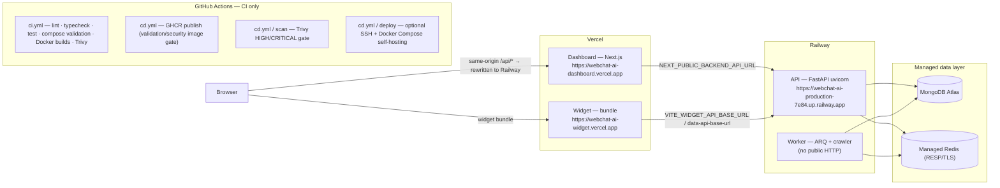

# WebChat AI — Production Deployment

The **current production deployment** is split between **Vercel** and **Railway**,
with managed MongoDB and Redis. GitHub Actions is the CI / validation / security
/ build-verification layer; it does **not** deploy the production system.

Docker Compose remains supported for **local development** and **optional
self-hosting** (see the Docker Compose section below), but it is no longer the
primary production deployment path.

## Current production architecture



### Responsibilities

| Component       | Platform | Responsibility                                                            |
| --------------- | -------- | ------------------------------------------------------------------------- |
| Dashboard       | Vercel   | Next.js marketing site + tenant dashboard + same-origin `/api/*` proxy    |
| Widget          | Vercel   | Hosts `webchat-widget.iife.min.js` production bundle                      |
| API             | Railway  | FastAPI: auth, RAG, billing, streaming, widget API (`/api/widget/v1`)     |
| Worker          | Railway  | ARQ jobs: crawling (HTTP-first + Playwright), embeddings, email           |
| Database        | Managed  | MongoDB Atlas: documents, chunks, vectors, tenant data                    |
| Cache / Queue   | Managed  | Redis: caching, rate limits, ARQ queue, provider health                   |
| CI / validation | GitHub   | `ci.yml` + `cd.yml` — quality, security, container scans (no prod deploy) |

### Production URL architecture

Browser API calls to the Dashboard are **same-origin** under `/api/*`. The
Next.js rewrite in `apps/dashboard/next.config.ts` proxies them server-side to
Railway using `NEXT_PUBLIC_BACKEND_API_URL`. The Dashboard build-time origin
`NEXT_PUBLIC_API_URL` is therefore the **Dashboard** URL, not the API URL.

| Variable                        | Production value                                                  | Purpose                                             |
| ------------------------------- | ----------------------------------------------------------------- | --------------------------------------------------- |
| `NEXT_PUBLIC_API_URL`           | `https://webchat-ai-dashboard.vercel.app`                         | Origin the **browser** calls (same-origin `/api/*`) |
| `NEXT_PUBLIC_BACKEND_API_URL`   | `https://webchat-ai-production-7e84.up.railway.app`               | Origin the Dashboard **server** proxies to          |
| `VITE_WIDGET_API_BASE_URL`      | `https://webchat-ai-production-7e84.up.railway.app`               | Widget API base baked into the widget bundle        |
| `WIDGET_API_BASE_URL` (backend) | `https://webchat-ai-production-7e84.up.railway.app`               | Runtime `data-api-base-url` in embed snippets       |
| `WIDGET_SCRIPT_URL` (backend)   | `https://webchat-ai-widget.vercel.app/webchat-widget.iife.min.js` | Widget bundle URL in embed snippets                 |
| `CORS_ORIGINS` (backend)        | `["https://webchat-ai-dashboard.vercel.app"]`                     | Backend CORS allow-list                             |
| `ALLOWED_HOSTS` (backend)       | `webchat-ai-production-7e84.up.railway.app`                       | Trusted `Host` headers (API)                        |

### Auth / cookie model (ADR-003)

Auth cookies are host-only (`SameSite=Strict`, no `Domain`, `Secure` in
production) and only attach to the Railway API origin. Keeping browser API
calls same-origin through the Dashboard `/api/*` rewrite preserves the cookie
security model and lets the Next.js middleware gate `/dashboard`.

---

## Deployment

### Vercel (Dashboard + Widget)

Vercel deploys directly from the GitHub repository (`apps/dashboard`,
`apps/widget`). No Docker images are involved.

Set the following **environment variables** in the Vercel project settings
(preferably for the production environment):

**Dashboard:**

| Variable                        | Production value                                                  |
| ------------------------------- | ----------------------------------------------------------------- |
| `NEXT_PUBLIC_API_URL`           | `https://webchat-ai-dashboard.vercel.app`                         |
| `NEXT_PUBLIC_BACKEND_API_URL`   | `https://webchat-ai-production-7e84.up.railway.app`               |
| `NEXT_PUBLIC_SITE_URL`          | `https://webchat-ai-dashboard.vercel.app`                         |
| `NEXT_PUBLIC_WIDGET_SCRIPT_URL` | `https://webchat-ai-widget.vercel.app/webchat-widget.iife.min.js` |
| `NEXT_PUBLIC_WIDGET_API_URL`    | `https://webchat-ai-production-7e84.up.railway.app/api/widget/v1` |
| `NEXT_PUBLIC_DASHBOARD_URL`     | `https://webchat-ai-dashboard.vercel.app`                         |

**Widget:**

| Variable                   | Production value                                    |
| -------------------------- | --------------------------------------------------- |
| `VITE_WIDGET_API_BASE_URL` | `https://webchat-ai-production-7e84.up.railway.app` |

### Railway (API + Worker)

Railway deploys the Docker images built from `docker/Dockerfile.api` and
`docker/Dockerfile.worker` directly from the GitHub repository.

**API service:**

- Command: `uvicorn backend.main:app --host 0.0.0.0 --port ${PORT:-8000}`
  (`docker/Dockerfile.api` already respects the Railway-injected `PORT`).
- Health check: `https://webchat-ai-production-7e84.up.railway.app/api/health/live`
  for liveness; `/api/health/ready` for readiness (fail-closed 503).
- Set `TRUST_PROXY=true` (Railway is a trusted proxy) and the public
  `ALLOWED_HOSTS`.

**Worker service:**

- Command: `python -m backend.workers` (no public HTTP).
- Set the same backend environment as the API (MongoDB, Redis, AI keys,
  payments). Keep the crawler settings aligned with the production profile:
  `CRAWL_MAX_CONCURRENT=1`, `EMBEDDING_MAX_CONCURRENT_BATCHES=1`,
  `CRAWL_NO_SANDBOX=true`, `CRAWL_HTTP_FIRST=true`.

### Railway environment (both API and Worker)

Set these in the Railway project environment (container env vars — no env file
is shipped):

```
ENVIRONMENT=production
DEBUG=false
ENABLE_DOCS=false
LOCAL_PRODUCTION_TEST=false
COOKIE_SECURE=true
TRUST_PROXY=true
RATE_LIMIT_ENABLED=true
PUBLIC_BASE_URL=https://webchat-ai-dashboard.vercel.app
CORS_ORIGINS=["https://webchat-ai-dashboard.vercel.app"]
ALLOWED_HOSTS=webchat-ai-production-7e84.up.railway.app
JWT_SECRET=<real >=32-byte secret>
MONGODB_URI=<authenticated Atlas URI>
MONGODB_DB=webchat_ai
REDIS_URL=<authenticated managed Redis URL>
RESEND_API_KEY=<real key>
EMAIL_FROM=<verified custom-domain sender>
GEMINI_API_KEY=<real key>
PAYMENT_PROVIDER=razorpay            # or stripe, with matching keys
WIDGET_API_BASE_URL=https://webchat-ai-production-7e84.up.railway.app
WIDGET_SCRIPT_URL=https://webchat-ai-widget.vercel.app/webchat-widget.iife.min.js
SUPER_ADMIN_EMAILS=["<your email>"]
```

---

## CI/CD — what GitHub Actions does (and does not)

GitHub Actions is the **CI / validation / security / build-verification** layer.

- `ci.yml` runs on every push/PR: ruff, mypy, pytest, frontend lint/typecheck/
  build/test, secret scan, Docker security posture, compose validation,
  production-env validation, DB migrations against a real MongoDB, Docker image
  builds (cached) scanned with Trivy, and the widget E2E (when `GEMINI_API_KEY`
  is configured).
- `cd.yml` publishes immutable `sha-<git-sha>` images to GHCR and scans them
  with Trivy. This is retained as a validation/security gate and as the
  artifact source for **optional self-hosting**; it is **not** how the current
  Vercel/Railway production is deployed.
- `cd.yml` also keeps a manual-dispatch SSH + Docker Compose deploy job as an
  **optional self-hosting** path (see below). It self-skips when the SSH
  secrets are not configured.

Vercel and Railway deploy straight from the GitHub repository on push to
`main`. No GHCR/SSH step fronts those deployments.

### GitHub Actions variables

Public build-time configuration lives in GitHub repository **Variables**
(Settings → Secrets and variables → Actions → Variables):

| Variable                   | Value                                               | Why CI needs it                               | Visibility |
| -------------------------- | --------------------------------------------------- | --------------------------------------------- | ---------- |
| `NEXT_PUBLIC_API_URL`      | `https://webchat-ai-dashboard.vercel.app`           | Dashboard Docker build gate (CI + CD publish) | public     |
| `VITE_WIDGET_API_BASE_URL` | `https://webchat-ai-production-7e84.up.railway.app` | Widget Docker build gate (CI + CD publish)    | public     |

Optional Dashboard embed origins (only required when the dashboard/embed generates snippets
in CI builds — the app derives sensible defaults, so they are optional):

| Variable                        | Value                                                             | Why                                                    | Visibility |
| ------------------------------- | ----------------------------------------------------------------- | ------------------------------------------------------ | ---------- |
| `NEXT_PUBLIC_SITE_URL`          | `https://webchat-ai-dashboard.vercel.app`                         | derived embed/SEO origins (optional)                   | public     |
| `NEXT_PUBLIC_WIDGET_SCRIPT_URL` | `https://webchat-ai-widget.vercel.app/webchat-widget.iife.min.js` | embed snippet origin (optional)                        | public     |
| `NEXT_PUBLIC_WIDGET_API_URL`    | `https://webchat-ai-production-7e84.up.railway.app/api/widget/v1` | embed snippet origin (optional)                        | public     |
| `NEXT_PUBLIC_DASHBOARD_URL`     | `https://webchat-ai-dashboard.vercel.app`                         | embed snippet origin (optional)                        | public     |
| `NEXT_PUBLIC_BACKEND_API_URL`   | `https://webchat-ai-production-7e84.up.railway.app`               | server rewrite target (optional; has built-in default) | public     |

Secrets (config -> masked, private): `GEMINI_API_KEY` (widget E2E),
`SSH_HOST` / `SSH_USER` / `SSH_KEY` (optional self-hosting only).

---

## Optional self-hosting with Docker Compose

Docker Compose remains a first-class path for local development and optional
self-hosting. Images are built locally or pulled as immutable `sha-<git-sha>`
GHCR tags; the `compose.prod.yml` overlay pins `image:` refs, read-only root
FS, `init: true`, and bounded logs.

### Build & local production test

Running a full local stack is a common source of accidental production writes.
Use the right environment file per intent:

| Environment file          | Purpose                                 | Data plane                                                             | Worker safety                                         |
| ------------------------- | --------------------------------------- | ---------------------------------------------------------------------- | ----------------------------------------------------- |
| `.env.development`        | ordinary local dev (`docker-up.sh`)     | local docker Mongo/Redis/Mailpit                                       | safe (local ARQ namespace `webchat_ai`)               |
| `.env.production.sandbox` | SAFE production-STYLE local smoke tests | local docker Mongo/Redis/Mailpit, `MOCK` payments, zero external spend | safe (separate ARQ namespace `webchat_ai_sandbox`)    |
| `.env.production`         | the REAL live configuration             | **MongoDB Atlas, Upstash Redis, live payments, real AI/Resend**        | **DANGER: worker consumes the real production queue** |

> **WARNING**
> `.env.production` contains REAL production credentials. It must NEVER be used
> for ordinary local development. A worker started against it consumes the real
> production ARQ queue. The smoke test and operator scripts REFUSE it unless you
> opt in explicitly (`--prod` / `--allow-production` / explicit `--env-file`).

```bash
# SAFE local production-STYLE stack incl. local Mongo/Redis/Mailpit (no prod access):
docker compose --env-file .env.production.sandbox -f docker/compose.yml up -d --build

# Smoke tests (10 checks against the running stack):
#   (defaults to .env.production.sandbox; refuses .env.production without --prod)
./scripts/local-production-smoke-test.sh
./scripts/check-production-docker.sh
./scripts/check-docker-security.sh
./scripts/check-secrets.sh
```

> **Sandbox limitation (honest note)**
> `.env.production.sandbox` is `ENVIRONMENT=development` with `MOCK` payments and
> empty AI keys because `backend/core/config.py` rejects a keyless production
> mode (`PAYMENT_PROVIDER=mock` and missing generation keys fail fast; see
> `tests/test_config.py::test_local_production_test_still_rejects_mock_payments`).
> It therefore cannot be byte-identical to the real production mode. To run a
> true `ENVIRONMENT=production` local sim, an operator must manually supply:
> a disposable MongoDB/Redis, a TEST-mode payment gateway key, one real AI
> generation key, and set `ENVIRONMENT=production` + `LOCAL_PRODUCTION_TEST=true`
> (+ the real public URLs). `LOCAL_PRODUCTION_TEST=true` only relaxes loopback /
> URL validators; payment, AI, JWT, host and rate-limit checks still apply.

### Self-hosted deploy (optional, manual)

```bash
# 1. Publish immutable sha-<git-sha> images (GHCR) via cd.yml / publish, or
#    build locally.
# 2. Deploy a published SHA to your own host:
gh workflow run cd.yml --ref <sha-or-tag>        # = manual "deploy" dispatch
#    (or run scripts/deploy.sh on the host directly)
./scripts/deploy.sh deploy --env-file .env.production --tag sha-<git-sha> \
    --namespace your-org/repo
```

The deploy job SSHes to the host and runs: preflight → pull → migrate →
rollout → health wait (poll `http://127.0.0.1:8000/api/health/ready`).

### Rolling back (self-hosted)

Immutable sha tags make rollback a single re-point — no rebuild:

```bash
./scripts/deploy.sh rollback --env-file .env.production --tag sha-<previous-good-sha>
```

### Health checks & observability

| Service   | Probe                                      | Meaning                                                    |
| --------- | ------------------------------------------ | ---------------------------------------------------------- |
| api       | `/api/health/live`                         | process alive, no dependency I/O (orchestrator liveness)   |
| api       | `/api/health/ready`                        | live + MongoDB/Redis ping; **503 fail-closed** (readiness) |
| worker    | Redis `PING`                               | broker reachable (no HTTP server)                          |
| dashboard | `wget :3000`                               | server responds                                            |
| widget    | `wget --spider webchat-widget.iife.min.js` | bundle served                                              |

The API exposes Prometheus text format at `/metrics` (root path, no `/api`
prefix). Reference scraping + alerting config ships in `docker/prometheus/`.

---

## Production checklist

- [ ] Vercel Dashboard env vars set (`NEXT_PUBLIC_API_URL` = Dashboard URL,
      `NEXT_PUBLIC_BACKEND_API_URL` = Railway API URL)
- [ ] Vercel Widget env var set (`VITE_WIDGET_API_BASE_URL` = Railway API URL)
- [ ] Railway API + Worker env vars set (`ENVIRONMENT=production`,
      `LOCAL_PRODUCTION_TEST` unset, `COOKIE_SECURE=true`, `TRUST_PROXY=true`)
- [ ] `ALLOWED_HOSTS` = Railway API hostname; no loopback, no `*`
- [ ] MongoDB + Redis authenticated (managed)
- [ ] Real secrets everywhere; `./scripts/check-secrets.sh` passes
- [ ] Repo variables `NEXT_PUBLIC_API_URL` (Dashboard URL) /
      `VITE_WIDGET_API_BASE_URL` (Railway API URL) set in GitHub Actions
- [ ] AI spend protection limits set (non-zero daily/monthly token budgets)
- [ ] Trivy passes on the built images (ci.yml + cd.yml)
- [ ] Health checks reachable: `/api/health/live` + `/api/health/ready`

## Troubleshooting

- **CI fails on `NEXT_PUBLIC_API_URL`** — set the GitHub Actions repository
  variable `NEXT_PUBLIC_API_URL` to `https://webchat-ai-dashboard.vercel.app`
  (the Dashboard origin — not the Railway API URL). The Dashboard build guard
  rejects loopback/placeholder values by design.
- **Dashboard `/api/*` not proxying** — verify `NEXT_PUBLIC_BACKEND_API_URL`
  (database origin to Railway) and that the rewrite is 1:1 (no `/api/api`).
- **Widget cannot reach the API from a customer site** — verify
  `VITE_WIDGET_API_BASE_URL` at build time and `data-api-base-url` at runtime;
  allow the API origin in the customer-page CSP `connect-src`.
- **Containers never become healthy (self-hosted)** — `docker compose logs
api`; verify MongoDB/Redis reachable from inside the container.
- **Outbound TLS through a VPN drops (self-hosted)** — set
  `DOCKER_BRIDGE_MTU` (e.g. `1280`).
- **Migration fails (self-hosted)** — MongoDB unreachable or index creation
  failed: fix connectivity and re-run `scripts/deploy.sh migrate` (idempotent).
